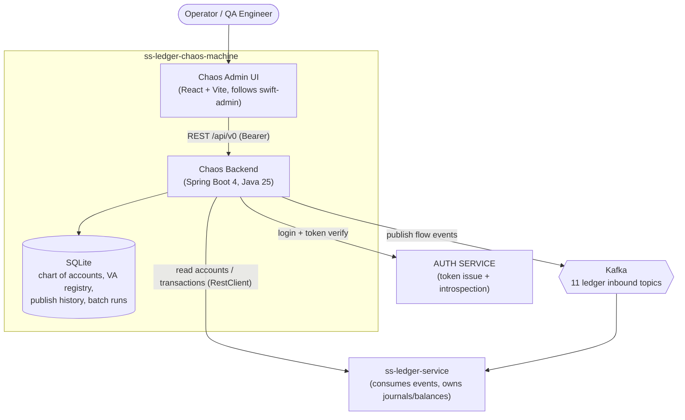

# ss-ledger-chaos-machine — Architecture

> Single source of truth for the overall design. Each phase has its own `DESIGN.md`
> (linked below) and per-task specs. Update this file whenever a phase is added or revised.

## 1. Purpose

The **ledger chaos machine** is a controlled resilience-testing harness for
[`ss-ledger-service`](../ss-ledger-service). It lets an operator drive the ledger through
its Kafka event surface from a UI — issuing well-formed transaction flows **or**
deliberately malformed/duplicated/out-of-order/high-volume traffic — and observe how the
ledger copes (idempotency, validation, DLT routing, backpressure, balance integrity).

It is **not** a ledger. It owns no journals or balances. It is a *driver* + *gateway*:

- **Driver** — formulates and publishes the exact Kafka events the ledger consumes,
  individually or from CSV, with optional chaos injection.
- **Gateway** — the React UI talks only to this backend, which proxies login to the
  **AUTH SERVICE** and proxies account/transaction **reads** from the ledger.

## 2. Targets & Conventions

| Concern | Decision | Source |
|---|---|---|
| Backend language | **Java 25** | mirrors ledger ([ADR-001](decisions/001-target-java-25-and-spring-boot-4.md)) |
| Backend framework | **Spring Boot 4.0.6**, Gradle, group `com.softspark` | mirrors ledger |
| Backend base package | `com.softspark.chaos` | new |
| Persistence | **SQLite** via JPA + Hibernate community dialect + Flyway | manifest ([ADR-002](decisions/002-sqlite-persistence-with-jpa-and-flyway.md)) |
| API style | REST under `/api/v0`, records as DTOs, `record-builder` (no Lombok) | mirrors ledger |
| API docs | springdoc OpenAPI + Swagger UI with a **`bearerAuth`** HTTP security scheme | mirrors ledger |
| Chart of accounts | **Provisioned in the ledger over HTTP**; VA ids are ledger-assigned (not config) | [Phase 025](phases/025-chart-of-accounts-http-bootstrap/DESIGN.md) |
| Topology | Backend is the **single gateway** for the UI | user-confirmed ([ADR-003](decisions/003-backend-as-single-api-gateway.md)) |
| Eventing | `EventEnvelope<T>` snake_case + `KafkaTemplate` producer | mirrors ledger ([ADR-004](decisions/004-event-envelope-and-kafka-publishing.md)) |
| Auth | Token introspection via external **AUTH SERVICE** (no local JWT signing) | mirrors ledger ([ADR-006](decisions/006-auth-via-external-auth-service.md)) |
| Frontend | **React 19 + Vite 6 + react-router 7 + react-query 5 + Tailwind + shadcn/ui** | mirrors swift-admin ([ADR-005](decisions/005-react-vite-shadcn-frontend.md)) |
| Batch execution | Bounded async workers on **virtual threads** | [ADR-007](decisions/007-csv-batch-execution-model.md) |

## 3. C4 — System Context & Containers



## 4. Backend module map (`com.softspark.chaos`)

Feature-first with layer subpackages (mirrors ledger):

```
com.softspark.chaos
├── Application
├── config            # security, openapi, async/virtual-threads, web
├── advice            # GlobalExceptionHandler, ApiError, ErrorDescription
├── base              # shared records, pagination, ids (ULID), clock
├── kafka             # EventEnvelope, EventMetadata, ProducerConfiguration, TopicCatalog, ChaosEventPublisher
├── account           # chart of accounts + virtual account registry
│   ├── controller / dto / service / repository / model / enumeration / bootstrap
│   └── bootstrap     # Phase 025: catalog config, ledger HTTP provisioning, runner
├── flow              # transaction flow engine
│   ├── controller / dto / service / model(payloads v1) / chaos / registry
├── batch             # CSV ingest + batch run execution
│   ├── controller / dto / service / model / repository / csv
├── history           # publish records + query API
│   ├── controller / dto / service / model / repository
├── auth              # login proxy + AccessTokenFilter + TokenVerifier (AUTH SERVICE)
└── ledgerproxy       # RestClient read-through to ss-ledger-service
```

## 5. Frontend module map (`src/`, follows swift-admin)

```
src
├── app               # router.tsx (createBrowserRouter), error boundary
├── main.tsx          # QueryClientProvider, RouterProvider
├── lib               # api.ts (fetch + Bearer + ApiError), env.ts (appConfig), auth.ts
├── components
│   ├── layout        # app-shell.tsx (sidebar nav), page primitives
│   └── ui            # shadcn primitives (button, card, dialog, select, table, input…)
└── features
    ├── auth          # login-page, session-provider, protected-route
    ├── chart-of-accounts
    ├── virtual-accounts   # list, create, detail (+ per-VA transactions)
    ├── transactions       # search by VA id + filters
    └── chaos              # single flow runner + CSV upload + run results
```

## 6. The 12 ledger flows (event surface the chaos machine drives)

All published as `EventEnvelope<T>` (snake_case) to the topic named by `event_type`.
Full schemas live in [Phase 003 / task 002](phases/003-transaction-flow-engine/002-single-transaction-publishing-api.md).

| Flow | Topic / `event_type` | `source` |
|---|---|---|
| Organization onboarded | `organization.onboarded` | organization-service |
| VA updated | `organization.va.updated` | organization-service |
| Top-up confirmed | `organization.topup.confirmed` | payments-service |
| Inter-VA transfer | `organization.transfer.requested` | transfers-service |
| Treasury prefund | `organization.treasury.prefund.completed` | treasury-service |
| Treasury sweep | `organization.treasury.sweep.completed` | treasury-service |
| Treasury transfer | `organization.treasury.transfer.completed` | treasury-service |
| Settlement initiated | `organization.va.settlement.initiated` | settlements-service |
| Settlement completed | `organization.va.settlement.completed` | settlements-service |
| Settlement failed | `organization.va.settlement.failed` | settlements-service |
| Collection completed | `collection.completed` | payments-service |
| **Disbursement completed** | `disbursement.completed` ² | disbursements-service |

² `DISBURSEMENT` is a first-class ledger `TransactionTypeEnum`/`EntryTypeEnum` (with
`BATCH_DISBURSEMENT`) but has **no published sample yet** — the inbound contract is the proposed
symmetric counterpart to `collection.completed` (money out). See open questions §10.
Batch disbursement/settlement (`BATCH_*`) are driven via the CSV batch runner, not separate flows.

## 7. Chart of accounts (system accounts provisioned in the ledger)

Friendly **account roles** → a ledger SYSTEM account, referenced when filling the
`source_va_id` / `destination_va_id` / fee slots of flows. On startup the chaos machine reads
the role/code catalog from YAML and **provisions each account in the ledger over HTTP**; the
ledger-assigned `accountId` becomes the role's VA id (stored in the chaos DB). Account **codes
are unique**. Editable via API. (See
[Phase 025](phases/025-chart-of-accounts-http-bootstrap/DESIGN.md), which supersedes the
config-seeded approach of Phase 002 / task 001.)

| Role | Account code (unique) | Category |
|---|---|---|
| `SETTLEMENT_ACCOUNT` | `ASSET.BANK.SETTLEMENT.0000000000001.GHS` | ASSET |
| `PLATFORM_FLOAT` | `ASSET.PLATFORM.FLOAT` | ASSET |
| `PLATFORM_FLOAT_MTN` | `ASSET.PLATFORM.FLOAT.MTN` ¹ | ASSET |
| `PLATFORM_FLOAT_TELECEL` | `ASSET.PLATFORM.FLOAT.TELECEL` | ASSET |
| `PLATFORM_FEE` | `REVENUE.PLATFORM.FEE` | REVENUE |
| `PROVIDER_FEE` | `REVENUE.PROVIDER.FEE` ¹ | REVENUE |

¹ Corrected from the MANIFEST (duplicate / missing codes). See open questions §10. VA UUIDs are
**not** in config — they come from the ledger at provisioning time.

## 8. Phases

| # | Phase | Outcome |
|---|---|---|
| 001 | [Foundations](phases/001-foundations/DESIGN.md) | Build, SQLite persistence, web conventions, Kafka envelope + producer |
| 002 | [Accounts & Chart of Accounts](phases/002-accounts-chart-of-accounts/DESIGN.md) | CoA config, VA registry via API & Kafka |
| 025 | [Chart of Accounts HTTP Bootstrap](phases/025-chart-of-accounts-http-bootstrap/DESIGN.md) | Provision SYSTEM accounts in the ledger over HTTP; store ledger-assigned VA ids (supersedes 002/task 001 seeding) |
| 003 | [Transaction Flow Engine](phases/003-transaction-flow-engine/DESIGN.md) | Single + CSV publishing, chaos injection, publish history |
| 004 | [Gateway: Auth & Ledger Proxy](phases/004-gateway-auth-ledger-proxy/DESIGN.md) | Login proxy + resilient ledger read proxy |
| 005 | [Frontend Admin](phases/005-frontend-admin/DESIGN.md) | React/Vite UI: auth, CoA, VAs, transactions, chaos runner |
| 006 | [Testing & Verification](phases/006-testing-and-verification/DESIGN.md) | Final phase: backend unit + integration, frontend, and e2e chaos verification |

Build order: 001 → 002 → 025 → (003, 004 in parallel) → 005 → **006 (testing, last)**. Phase 025
slots logically between 002 and 003 (the `025` label denotes "phase 2.5"); 006 is the final phase.

## 9. Cross-cutting non-functional posture

- **Resilience (of the harness itself):** idempotent Kafka producer (`acks=all`,
  `enable.idempotence=true`), bounded batch concurrency with backpressure, ledger-proxy
  timeouts + retries + circuit breaker. The harness must stay healthy while *deliberately*
  stressing the ledger.
- **Observability:** Actuator + Micrometer/Prometheus, structured JSON logs
  (`logstash-logback-encoder`), correlation-id propagation into every published event.
- **Security:** all `/api/v0/**` require a verified AUTH SERVICE token; CSRF disabled
  (stateless); secrets via env. The destructive "chaos" endpoints sit behind the same auth.
- **Safety rails:** chaos runs are explicit, bounded (max rate / max count), and target a
  configurable Kafka cluster so production is never an accidental target.

## 10. Open questions & documented assumptions

1. **MANIFEST is truncated** (ends mid-sentence). Transactions search is assumed to filter
   by VA id, flow/event type, correlation id, date range, and status.
2. **Account-code fixes:** `PROVIDER_FEE` code was blank → assumed `REVENUE.PROVIDER.FEE`;
   `PLATFORM_FLOAT_MTN` duplicated the TELECEL code → assumed `ASSET.PLATFORM.FLOAT.MTN`.
3. **VA creation "via Kafka"** has no dedicated inbound topic; modeled as publishing
   `organization.onboarded` (system/org bootstrap) and `organization.va.updated`. See
   [Phase 002 / task 004](phases/002-accounts-chart-of-accounts/004-virtual-account-creation-via-kafka.md).
4. **`disbursement.completed` is a proposed contract.** `DISBURSEMENT` exists in the ledger's
   `TransactionTypeEnum`/`EntryTypeEnum` but has no published payload sample or consumer yet. We
   model it symmetric to `collection.completed` (money out: org VA debited → platform float
   credited, fees to revenue, invariant `gross = net + Σfees`, `source = disbursements-service`).
   Confirm topic name + field set against the ledger when its disbursement consumer lands.
5. **Chart of accounts is provisioned via the ledger HTTP API** ([Phase 025](phases/025-chart-of-accounts-http-bootstrap/DESIGN.md));
   VA ids are ledger-assigned. If the ledger seeds its own SYSTEM accounts, set
   `chaos.bootstrap.provision-on-startup=false` and the chaos machine adopts existing ids by code.

These are safe-to-proceed defaults; revise here if the complete MANIFEST / ledger contract differs.
