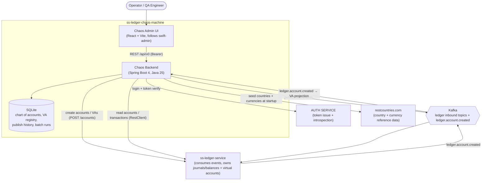

# ss-ledger-chaos-machine — Architecture

> Single source of truth for the overall design. Each phase has its own `DESIGN.md`
> (linked below) and per-task specs. Update this file whenever a phase is added or revised.

## 1. Purpose

The **ledger chaos machine** is a controlled resilience-testing harness for
[`ss-ledger-service`](../ss-ledger-service). It lets an operator drive the ledger through
its Kafka event surface from a UI — issuing well-formed transaction flows **or**
deliberately malformed/duplicated/out-of-order/high-volume traffic — and observe how the
ledger copes (idempotency, validation, DLT routing, backpressure, balance integrity).

It is **not** a ledger. It owns no journals or balances. It is a *driver* + *gateway*:

- **Driver** — formulates and publishes the exact Kafka events the ledger consumes,
  individually or from CSV, with optional chaos injection.
- **Gateway** — the React UI talks only to this backend, which proxies login to the
  **AUTH SERVICE** and proxies account/transaction **reads** from the ledger.

## 2. Targets & Conventions

| Concern | Decision | Source |
|---|---|---|
| Backend language | **Java 25** | mirrors ledger ([ADR-001](decisions/001-target-java-25-and-spring-boot-4.md)) |
| Backend framework | **Spring Boot 4.0.6**, Gradle, group `com.softspark` | mirrors ledger |
| Backend base package | `com.softspark.chaos` | new |
| Persistence | **SQLite** via JPA + Hibernate community dialect + Flyway | manifest ([ADR-002](decisions/002-sqlite-persistence-with-jpa-and-flyway.md)) |
| API style | REST under `/api/v0`, records as DTOs, `record-builder` (no Lombok) | mirrors ledger |
| API docs | springdoc OpenAPI + Swagger UI with a **`bearerAuth`** HTTP security scheme | mirrors ledger |
| Chart of accounts | **Provisioned in the ledger over HTTP**; VA ids are ledger-assigned (not config) | [Phase 007](phases/007-chart-of-accounts-http-bootstrap/DESIGN.md) |
| **Virtual accounts** | **The ledger owns VAs**; the chaos `virtual_account` table is a **projection** of the `ledger.account.created` Kafka event (chaos's first consumer). VA creation + CoA bootstrap issue HTTP to the ledger and never persist VAs directly | [Phase 009](phases/009-ledger-owned-virtual-accounts/DESIGN.md) ([ADR-011](decisions/011-ledger-owned-virtual-accounts-via-kafka-consumer.md)) |
| Org reference data | **Countries & org types** are first-class tables (UUID v4 ids); orgs FK them. **Currencies** are a managed table (UUID id + ISO-4217 code); `country` has a `primary_currency`; **supported countries** are a separate curated table driving the onboarding form | [Phase 008](phases/008-organization-onboarding/DESIGN.md) + [Phase 010](phases/010-currencies-and-supported-countries/DESIGN.md) ([ADR-008](decisions/008-organization-onboarding-domain-model.md), [ADR-010](decisions/010-uuid-v4-ids-for-organization-domain.md), [ADR-012](decisions/012-currency-and-supported-country-reference-model.md)) |
| Reference-data seeding | **Countries + currencies pre-seeded at startup from the external [restcountries.com](https://restcountries.com/) API** (async, seed-if-empty, degrade-on-failure); manual entries + `POST /countries/refresh` | [Phase 010](phases/010-currencies-and-supported-countries/DESIGN.md) ([ADR-013](decisions/013-seed-countries-and-currencies-from-restcountries-api.md)) |
| Org onboarding | Creating an org writes a **transactional outbox** row → relay publishes `organization.onboarded` (now incl. top-level `currency {id, code}` from the country's primary currency) | [Phase 008](phases/008-organization-onboarding/DESIGN.md) + [Phase 010](phases/010-currencies-and-supported-countries/DESIGN.md) ([ADR-009](decisions/009-transactional-outbox-for-organization-onboarded.md), [ADR-012](decisions/012-currency-and-supported-country-reference-model.md)) |
| Topology | Backend is the **single gateway** for the UI | user-confirmed ([ADR-003](decisions/003-backend-as-single-api-gateway.md)) |
| Eventing (out) | `EventEnvelope<T>` snake_case + `KafkaTemplate` producer | mirrors ledger ([ADR-004](decisions/004-event-envelope-and-kafka-publishing.md)) |
| Eventing (in) | **Kafka consumer** for `ledger.account.created` (+ `.dlt`): `ErrorHandlingDeserializer` + retry/back-off + `DeadLetterPublishingRecoverer` | [Phase 009](phases/009-ledger-owned-virtual-accounts/DESIGN.md) ([ADR-011](decisions/011-ledger-owned-virtual-accounts-via-kafka-consumer.md)) |
| Auth | Token introspection via external **AUTH SERVICE** (no local JWT signing) | mirrors ledger ([ADR-006](decisions/006-auth-via-external-auth-service.md)) |
| Frontend | **React 19 + Vite 6 + react-router 7 + react-query 5 + Tailwind + shadcn/ui** | mirrors swift-admin ([ADR-005](decisions/005-react-vite-shadcn-frontend.md)) |
| Batch execution | Bounded async workers on **virtual threads** | [ADR-007](decisions/007-csv-batch-execution-model.md) |

## 3. C4 — System Context & Containers



## 4. Backend module map (`com.softspark.chaos`)

Feature-first with layer subpackages (mirrors ledger):

```
com.softspark.chaos
├── Application
├── config            # security, openapi, async/virtual-threads, web
├── advice            # GlobalExceptionHandler, ApiError, ErrorDescription
├── base              # shared records, pagination, ids (ULID), clock
├── kafka             # out: EventEnvelope, EventMetadata, ProducerConfiguration, TopicCatalog, ChaosEventPublisher
│                     # in (Phase 009): ConsumerConfiguration, ConsumerProperties (ErrorHandlingDeserializer + DLT)
├── account           # chart of accounts + virtual account registry (a *projection* of ledger.account.created)
│   ├── controller / dto / service / repository / model / enumeration / bootstrap / consumer
│   ├── bootstrap     # Phase 007/009: catalog config, ledger HTTP provisioning, non-blocking runner
│   └── consumer      # Phase 009: LedgerAccountCreatedConsumer + mirror payload → VA projection
├── organization      # Phase 008/010: countries + org types + currencies + supported countries, org onboarding
│   ├── controller / dto / service / repository / model / enumeration  # incl. Currency, SupportedCountry
│   ├── seed          # Phase 010: RestCountriesClient + ReferenceDataSeeder (startup seed from restcountries.com)
│   └── outbox        # OutboxEvent entity + polling relay → organization.onboarded (incl. currency {id,code})
├── flow              # transaction flow engine
│   ├── controller / dto / service / model(payloads v1) / chaos / registry
│   └── chaos         # duplicate/outOfOrder/malformed/unbalanced/burst/delay
│                     #   + Phase 013: NTimesOptions (Pacing/ExecutionMode) + NTimesExpander
│                     #   (1 request → N distinct requests) for the /flows/{type}/n-times route
├── batch             # CSV ingest + batch run execution
│   ├── controller / dto / service / model / repository / csv
│                     # Phase 013: batch_run gains a `kind` (CSV | N_TIMES) discriminator so the
│                     #   reused runner/tables also track async N-Times runs (pacing/mode columns)
├── history           # publish records + query API
│   ├── controller / dto / service / model / repository
├── auth              # login proxy + AccessTokenFilter + TokenVerifier (AUTH SERVICE)
└── ledgerproxy       # RestClient read-through to ss-ledger-service (accounts, transactions,
                      #   + Phase 012: reporting/trial-balance via LedgerReadController + LedgerClient)
```

## 5. Frontend module map (`src/`, follows swift-admin)

```
src
├── app               # router.tsx (createBrowserRouter), error boundary
├── main.tsx          # QueryClientProvider, RouterProvider
├── lib               # api.ts (fetch + Bearer + ApiError), env.ts (appConfig), auth.ts
├── components
│   ├── layout        # app-shell.tsx (sidebar nav), page primitives
│   └── ui            # shadcn primitives (button, card, dialog, select, table, input…)
└── features
    ├── auth          # login-page, session-provider, protected-route
    ├── chart-of-accounts
    ├── virtual-accounts   # list, create, detail (+ per-VA transactions)
    ├── transactions       # search by VA id + filters
    ├── trial-balance      # Phase 012: read-only trial-balance report (period + currency filters, totals, per-account table)
    └── chaos              # Single Flow Run (radio + catalog-driven form + chaos widget) + CSV upload + run results
                           #   Phase 011: transaction-type-form, va-picker, chaos-options-panel (two-column)
```

## 6. The 12 ledger flows (event surface the chaos machine drives)

All published as `EventEnvelope<T>` (snake_case) to the topic named by `event_type`.
Full schemas live in [Phase 003 / task 002](phases/003-transaction-flow-engine/002-single-transaction-publishing-api.md).

As of [Phase 008](phases/008-organization-onboarding/DESIGN.md), `organization.onboarded` has **two
producers**: the manual chaos flow runner (for fault injection — malformed/duplicate/out-of-order)
*and* the organization onboarding API, which emits a clean event via the transactional outbox. Both
publish the identical `EventEnvelope<OrganizationOnboardedEventData>` shape.

| Flow | Topic / `event_type` | `source` |
|---|---|---|
| Organization onboarded | `organization.onboarded` | organization-service |
| VA updated | `organization.va.updated` | organization-service |
| Top-up confirmed | `organization.topup.confirmed` | payments-service |
| Inter-VA transfer | `organization.transfer.requested` | transfers-service |
| Treasury prefund | `organization.treasury.prefund.completed` | treasury-service |
| Treasury sweep | `organization.treasury.sweep.completed` | treasury-service |
| Treasury transfer | `organization.treasury.transfer.completed` | treasury-service |
| Settlement initiated | `organization.va.settlement.initiated` | settlements-service |
| Settlement completed | `organization.va.settlement.completed` | settlements-service |
| Settlement failed | `organization.va.settlement.failed` | settlements-service |
| Collection completed | `collection.completed` | payments-service |
| **Disbursement completed** | `disbursement.completed` ² | disbursements-service |

² `DISBURSEMENT` is a first-class ledger `TransactionTypeEnum`/`EntryTypeEnum` (with
`BATCH_DISBURSEMENT`) but has **no published sample yet** — the inbound contract is the proposed
symmetric counterpart to `collection.completed` (money out). See open questions §10.
Batch disbursement/settlement (`BATCH_*`) are driven via the CSV batch runner, not separate flows.

## 7. Chart of accounts (system accounts provisioned in the ledger)

Friendly **account roles** → a ledger SYSTEM account, referenced when filling the
`source_va_id` / `destination_va_id` / fee slots of flows. On startup the chaos machine reads
the role/code catalog from YAML and **provisions each account in the ledger over HTTP**; the
ledger-assigned `accountId` becomes the role's VA id (stored in the chaos DB). Account **codes
are unique**. Editable via API. (See
[Phase 007](phases/007-chart-of-accounts-http-bootstrap/DESIGN.md), which supersedes the
config-seeded approach of Phase 002 / task 001.)

| Role | Account code (unique) | Category |
|---|---|---|
| `SETTLEMENT_ACCOUNT` | `ASSET.BANK.SETTLEMENT.0000000000001.GHS` | ASSET |
| `PLATFORM_FLOAT` | `ASSET.PLATFORM.FLOAT` | ASSET |
| `PLATFORM_FLOAT_MTN` | `ASSET.PLATFORM.FLOAT.MTN` ¹ | ASSET |
| `PLATFORM_FLOAT_TELECEL` | `ASSET.PLATFORM.FLOAT.TELECEL` | ASSET |
| `PLATFORM_FEE` | `REVENUE.PLATFORM.FEE` | REVENUE |
| `PROVIDER_FEE` | `REVENUE.PROVIDER.FEE` ¹ | REVENUE |

¹ Corrected from the MANIFEST (duplicate / missing codes). See open questions §10. VA UUIDs are
**not** in config — they come from the ledger at provisioning time.

## 8. Phases

| # | Phase | Outcome |
|---|---|---|
| 001 | [Foundations](phases/001-foundations/DESIGN.md) | Build, SQLite persistence, web conventions, Kafka envelope + producer |
| 002 | [Accounts & Chart of Accounts](phases/002-accounts-chart-of-accounts/DESIGN.md) | CoA config, VA registry via API & Kafka |
| 007 | [Chart of Accounts HTTP Bootstrap](phases/007-chart-of-accounts-http-bootstrap/DESIGN.md) | Provision SYSTEM accounts in the ledger over HTTP; store ledger-assigned VA ids (supersedes 002/task 001 seeding). *Formerly numbered 025.* |
| 003 | [Transaction Flow Engine](phases/003-transaction-flow-engine/DESIGN.md) | Single + CSV publishing, chaos injection, publish history |
| 004 | [Gateway: Auth & Ledger Proxy](phases/004-gateway-auth-ledger-proxy/DESIGN.md) | Login proxy + resilient ledger read proxy |
| 005 | [Frontend Admin](phases/005-frontend-admin/DESIGN.md) | React/Vite UI: auth, CoA, VAs, transactions, chaos runner |
| 006 | [Testing & Verification](phases/006-testing-and-verification/DESIGN.md) | Backend unit + integration, frontend, and e2e chaos verification |
| 008 | [Organization Onboarding](phases/008-organization-onboarding/DESIGN.md) | Countries + org types master data, organization onboarding API, transactional outbox publishing `organization.onboarded` |
| 009 | [Ledger-Owned Virtual Accounts](phases/009-ledger-owned-virtual-accounts/DESIGN.md) | The ledger owns VAs; chaos's **first Kafka consumer** projects `ledger.account.created` into the VA registry; VA-create API + CoA bootstrap become HTTP-only/non-blocking; manual CoA trigger in UI (supersedes VA ownership of 002/004 + sync persistence of 007) |
| 010 | [Currencies & Supported Countries](phases/010-currencies-and-supported-countries/DESIGN.md) | Managed `currency` table (seeded + manual), `country.primary_currency`, separate `supported_country` table driving the onboarding form, `organization.onboarded` carries `currency {id, code}` |
| 011 | [Single Flow Run Redesign](phases/011-single-flow-run-redesign/DESIGN.md) | Reworks the chaos Single-Flow runner into **Single Flow Run**: nav rename, **radio** of 5 transaction types (drops onboarded + va-updated; settlement/collection/disbursement deferred), two-column layout (form left / chaos right), field-descriptor catalog (`fields[]` + `runnerVisible`), required-shown/advanced-collapsed form, autogen UUID request ids, account-kind VA pickers, **client-side** org/currency/tenant inference ([ADR-014](decisions/014-flow-catalog-field-descriptors-and-client-side-inference.md)) |
| 012 | [Trial Balance Reporting](phases/012-trial-balance-reporting/DESIGN.md) | Adds a **Trial Balance** nav item + read-only report page (period + currency filters, debit/credit totals, balanced indicator, per-account breakdown), backed by a thin read-proxy of the ledger's `GET /api/v0/reporting/trial-balance` exposed as `GET /api/v0/ledger/reporting/trial-balance` — reusing the existing ledger proxy machinery; no new tables/Kafka ([ADR-015](decisions/015-trial-balance-via-ledger-read-proxy.md)) |
| 013 | [N-Times Chaos Strategy](phases/013-n-times-chaos-strategy/DESIGN.md) | Adds an **N Times** chaos strategy: run a flow N times against the **same** source/destination accounts as N **distinct** transactions (fresh event id → idempotency key + fresh payload `*_request_id` per iteration, shared correlation id) — *distinct from* the duplicate-keyed **Burst**. Three pacings (BURST/LINEAR/RANDOM) and two execution modes: **SYNC** (in-line, sequential, capped) and **ASYNC** (run-tracked, reusing the Phase 003 batch runner; BURST fans out concurrently). Dedicated `POST /api/v0/flows/{flowType}/n-times`; reuses the `autogen` descriptors and the batch run tables behind a `kind` discriminator ([ADR-016](decisions/016-n-times-distinct-transaction-chaos-strategy.md)) |

Build order: 001 → 002 → 007 → (003, 004 in parallel) → 005 → 006 → **008** → **(009 ‖ 010)** → **011** → **012** → **013**.
Phase 007 (formerly `025`, a "phase 2.5" label) slots logically between 002 and 003; 006 verifies
phases 001–007. Phases 009 and 010 are the latest increment (idea `002_countries_va_via_kafka.md`)
and run largely in parallel — they converge where the org-VA create form (009) consumes the
`currency` table (010); their tests fold back into the 006 suites. Phase 011 (idea
`004_single_flow_run.md`) is a UX-focused redesign of the Phase 003/005 single-flow runner: an
additive field-descriptor catalog ([ADR-014](decisions/014-flow-catalog-field-descriptors-and-client-side-inference.md))
plus a reworked frontend; it changes no Kafka surface, table, or publish contract. Phase 012
(idea `005_trial_balance.md`) adds the **Trial Balance** report: a read-only page over a thin
read-proxy of the ledger's reporting endpoint — additive within the existing `ledgerproxy`
package ([ADR-015](decisions/015-trial-balance-via-ledger-read-proxy.md)), no new tables, Kafka,
or persistence. Phase 013 (idea `006_N_TIMES_chaos_strategy.md`) adds the **N Times** chaos
strategy — N *distinct* transactions between the same accounts (vs Burst's duplicate event) — in
the `flow.chaos` package, with a SYNC in-line path and an ASYNC path that **reuses the Phase 003
batch runner / run tables** behind a `kind` discriminator (one additive Flyway migration); it
reuses the Phase 011 `autogen` descriptors for per-iteration id re-rolling and changes no ledger
flow contract ([ADR-016](decisions/016-n-times-distinct-transaction-chaos-strategy.md)).

## 9. Cross-cutting non-functional posture

- **Resilience (of the harness itself):** idempotent Kafka producer (`acks=all`,
  `enable.idempotence=true`), bounded batch concurrency with backpressure, ledger-proxy
  timeouts + retries + circuit breaker. The harness must stay healthy while *deliberately*
  stressing the ledger.
- **Observability:** Actuator + Micrometer/Prometheus, structured JSON logs
  (`logstash-logback-encoder`), correlation-id propagation into every published event.
- **Security:** all `/api/v0/**` require a verified AUTH SERVICE token; CSRF disabled
  (stateless); secrets via env. The destructive "chaos" endpoints sit behind the same auth.
- **Safety rails:** chaos runs are explicit, bounded (max rate / max count), and target a
  configurable Kafka cluster so production is never an accidental target.

## 10. Open questions & documented assumptions

1. **MANIFEST is truncated** (ends mid-sentence). Transactions search is assumed to filter
   by VA id, flow/event type, correlation id, date range, and status.
2. **Account-code fixes:** `PROVIDER_FEE` code was blank → assumed `REVENUE.PROVIDER.FEE`;
   `PLATFORM_FLOAT_MTN` duplicated the TELECEL code → assumed `ASSET.PLATFORM.FLOAT.MTN`.
3. ~~**VA creation "via Kafka"** has no dedicated inbound topic; modeled as publishing
   `organization.onboarded` and `organization.va.updated`.~~ **Superseded by
   [Phase 009](phases/009-ledger-owned-virtual-accounts/DESIGN.md) ([ADR-011](decisions/011-ledger-owned-virtual-accounts-via-kafka-consumer.md)):**
   the ledger *does* publish a dedicated **`ledger.account.created`** event (+ `.dlt`) — verified in
   `ss-ledger-service` (`account/events/v1/AccountCreatedEventData`,
   `account/events/AccountCreatedEventFactory`). The chaos machine now **consumes** it (its first
   Kafka consumer) to materialize VAs; the ledger owns VAs. VA-create + CoA bootstrap issue
   `POST /api/v0/accounts` to the ledger and never persist VAs directly.
4. **`disbursement.completed` is a proposed contract.** `DISBURSEMENT` exists in the ledger's
   `TransactionTypeEnum`/`EntryTypeEnum` but has no published payload sample or consumer yet. We
   model it symmetric to `collection.completed` (money out: org VA debited → platform float
   credited, fees to revenue, invariant `gross = net + Σfees`, `source = disbursements-service`).
   Confirm topic name + field set against the ledger when its disbursement consumer lands.
5. **Chart of accounts is provisioned via the ledger HTTP API** ([Phase 007](phases/007-chart-of-accounts-http-bootstrap/DESIGN.md));
   VA ids are ledger-assigned. If the ledger seeds its own SYSTEM accounts, set
   `chaos.bootstrap.provision-on-startup=false` and the chaos machine adopts existing ids by code.
6. **`organization.onboarded` `country` object carries `status` + `modified_date`** in the
   authoritative ss-ledger-service sample (`bin/publish-organization-onboarded.sh`), which the
   current `OrganizationOnboardedEventData.Country` record omits. [Phase 008](phases/008-organization-onboarding/DESIGN.md)
   extends that record to match. The sample also uses an **ISO 3166-1 alpha-2** `iso_code` (`GH`),
   so the country `iso_code` column is widened/relaxed from the prior 3-char assumption. Verified
   against the sibling repo; re-confirm if the ledger contract changes.

7. **`organization.onboarded` carries currency, the ledger does not read it yet.**
   [Phase 010](phases/010-currencies-and-supported-countries/DESIGN.md) ([ADR-012](decisions/012-currency-and-supported-country-reference-model.md))
   adds a top-level `currency {id, code}` to the payload from the country's primary currency. The
   ledger's `OnboardedEventData` has **no** currency field and its org-VA provisioner hardcodes
   `GHS` (verified in `ss-ledger-service`); the extra field is safe while the ledger keeps Jackson's
   default `fail-on-unknown-properties=false`. Coordinate when the ledger starts honouring currency.
8. **Deletion of organizations is deferred.** The idea (`002_countries_va_via_kafka.md`) lists
   "support deletion of organizations"; per product decision this is **deferred to a future phase
   that handles virtual-account statuses/lifecycle** (since orgs drive VAs the ledger owns). Not in
   Phase 009/010.
9. **Currency representation:** chaos models currency as a managed table with a **UUID id + ISO-4217
   `code`** ([ADR-012](decisions/012-currency-and-supported-country-reference-model.md)); the
   ledger stores account currency as a plain ISO-4217 string. They reconcile by `code`. The
   `ledger.account.created` projection stores the ledger's currency code as-is and does not require
   a matching `currency` row to exist.
10. **External reference-data dependency:** countries + currencies are **seeded at startup from
    [restcountries.com](https://restcountries.com/)** (`/v3.1/all?fields=name,cca2,cca3,currencies`)
    per [ADR-013](decisions/013-seed-countries-and-currencies-from-restcountries-api.md). The fetch
    is async + seed-if-empty + degrade-on-failure, so a slow/unreachable API never blocks or breaks
    boot; a cold first boot with no network leaves the country list empty until a retry or
    `POST /api/v0/countries/refresh`. Base URL is configurable to a mirror/self-host; the API
    requires the `fields` param and returns the first-of-many currency as a country's primary.

These are safe-to-proceed defaults; revise here if the complete MANIFEST / ledger contract differs.
