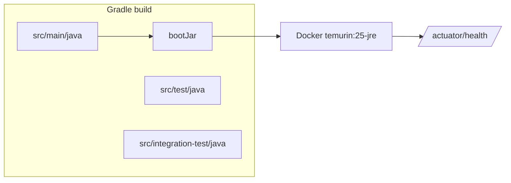

# Task 001 - Project Scaffold & Build

## Functional Requirements
- A Gradle + Spring Boot 4 project targeting Java 25, group `com.softspark`, base package
  `com.softspark.chaos`, that boots a web server, exposes Actuator health + Swagger UI, and
  honors profile-based configuration — mirroring `ss-ledger-service`'s build conventions.

## Acceptance Criteria
- [ ] `./gradlew build` succeeds on a JDK 25 toolchain.
- [ ] `./gradlew bootRun` starts the app; `GET /actuator/health` returns `UP`.
- [ ] Swagger UI is served (springdoc) and lists an empty/sample API.
- [ ] Swagger declares a **`bearerAuth`** HTTP security scheme (JWT) so the UI/operators can
      authorize requests with a token; an "Authorize" button is present and secured operations
      send `Authorization: Bearer …`.
- [ ] `record-builder` annotation processing works (a sample `@RecordBuilder` compiles).
- [ ] A separate `integration-test` source set + `integrationTest` task exist (mirrors ledger).
- [ ] Multi-stage Dockerfile builds a runnable image on `eclipse-temurin:25-*`.
- [ ] Profiles `dev`, `staging`, `prod` resolve config from env with sane local defaults.

## Technical Design
Reproduce the ledger's `build.gradle` shape, trimmed to chaos-machine needs.

Plugins: `java`, `jacoco`, `org.springframework.boot` 4.0.6, `io.spring.dependency-management`.
Toolchain: `JavaLanguageVersion.of(25)`. `springBoot { buildInfo() }`.

Dependencies (starters):
- `spring-boot-starter-webmvc`, `-actuator`, `-validation`
- `spring-boot-starter-data-jpa`, `spring-boot-starter-flyway`
- `spring-boot-starter-kafka`
- `spring-boot-starter-security`
- `springdoc-openapi-starter-webmvc-ui:3.0.2`
- `com.github.f4b6a3:ulid-creator`, `net.logstash.logback:logstash-logback-encoder`
- `org.xerial:sqlite-jdbc`, `org.hibernate.orm:hibernate-community-dialects`, `org.flywaydb:flyway-core`
- `record-builder` (annotationProcessor + compileOnly), `micrometer-registry-prometheus` (runtimeOnly)
- test: `spring-boot-starter-*-test`, `junit-platform-launcher`; integrationTest: Testcontainers BOM + `kafka`, `spring-boot-testcontainers`, `spring-boot-restclient`

Config layout (`application.yml` + `application-<profile>.yml`):

```yaml
spring:
  application.name: ledger-chaos-machine
  threads.virtual.enabled: true        # Java 25 virtual threads (ADR-001)
  datasource:
    url: jdbc:sqlite:${chaos.datasource.path:./data/chaos.db}
    hikari.maximum-pool-size: 1
  jpa.properties.hibernate.dialect: org.hibernate.community.dialect.SQLiteDialect
  kafka.bootstrap-servers: ${KAFKA_BOOTSTRAP_SERVERS:127.0.0.1:9092}
server.port: ${SERVER_PORT:27100}
chaos:
  kafka.cluster-label: ${CHAOS_TARGET_LABEL:local}   # safety: visible target name
auth-service:
  base-url: ${AUTH_SERVICE_BASE_URL:}
  login-uri: ${AUTH_SERVICE_LOGIN_URI:}
  token-verification-uri: ${AUTH_SERVICE_TOKEN_VERIFICATION_URI:}
  client-auth.enabled: ${AUTH_CLIENT_AUTH_ENABLED:true}
ledger:
  base-url: ${LEDGER_BASE_URL:http://localhost:27000}
```



## Implementation Notes
Files to create:
- `build.gradle`, `settings.gradle` (`rootProject.name = 'ledger-chaos-machine'`), `gradle/`, `gradlew*`, `.java-version` = `25`
- `src/main/java/com/softspark/chaos/Application.java` (`@SpringBootApplication`)
- `src/main/resources/application.yml` (+ `-dev`, `-staging`, `-prod`)
- `src/main/resources/logback-spring.xml` (console in dev/test, JSON via logstash encoder in prod)
- `config/OpenApiConfiguration.java` — `@OpenAPIDefinition` + `@SecurityScheme(name="bearerAuth",
  type=HTTP, scheme="bearer", bearerFormat="JWT")` (mirrors the ledger); `config/AsyncConfiguration.java` (virtual-thread executor)
- `Dockerfile` (multi-stage, non-root `chaos` user, EXPOSE 27100, healthcheck `/actuator/health`)
- `.dockerignore`, `.gitignore` (ignore `data/`, `build/`, `.idea/`)
Reuse the ledger's `build.gradle` jacoco/integrationTest task wiring; drop Postgres-only bits.

## Non-Functional Requirements
- Cold boot < 5s locally. Image size kept small via JRE-only runtime stage.
- No secrets in the image or `application.yml`; all via env.

## Dependencies
None (first task). Unblocks every other task.

## Risks & Mitigations
- *Spring Boot 4 starter coordinates differ from Boot 3 docs* → copy exact coordinates from
  `ss-ledger-service/build.gradle` (already verified).
- *JDK 25 unavailable on a dev box* → Gradle toolchain auto-provisioning + documented in HELP.md.

## Testing Strategy
- `ApplicationContextLoads` `@SpringBootTest` smoke test.
- A trivial `@RecordBuilder` record compiled + built via builder in a unit test.
- CI runs `./gradlew build` on JDK 25.

## Deployment Strategy
Foundation only; image published by CI. No runtime toggle.
