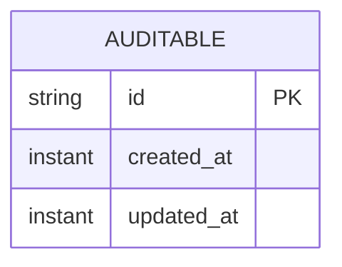

# Task 002 - SQLite Persistence Foundation

## Functional Requirements
- Provide a JPA + Flyway persistence layer backed by a single SQLite file, with shared base
  conventions (ULID string ids, audit timestamps, snake_case columns) reused by all later
  domain entities. (See [ADR-002](../../decisions/002-sqlite-persistence-with-jpa-and-flyway.md).)

## Acceptance Criteria
- [ ] App boots, Flyway creates `chaos.db` and runs the baseline migration.
- [ ] A repository can persist + read back an entity through Hibernate's SQLite dialect.
- [ ] WAL mode + `busy_timeout` are applied on every connection.
- [ ] Hikari pool size is 1; concurrent writes serialize without `SQLITE_BUSY` errors under a
      small contention test.
- [ ] `chaos.datasource.path` relocates the DB file; parent dir auto-created.

## Technical Design
- Datasource: `org.xerial:sqlite-jdbc`; dialect
  `org.hibernate.community.dialect.SQLiteDialect`. Hikari `maximum-pool-size=1`,
  `connection-init-sql` to set `PRAGMA journal_mode=WAL; PRAGMA busy_timeout=5000;`
  (applied via a `DataSource` post-processor or Hikari `connectionInitSql`).
- Flyway: `spring-boot-starter-flyway` + `flyway-core`; migrations in
  `src/main/resources/db/migration` named `V1__baseline.sql`. SQLite-safe DDL only
  (additive columns, no unsupported `ALTER`).
- Base conventions package `base`:
  - `@MappedSuperclass AuditableEntity` with `createdAt`, `updatedAt` (`Instant`,
    `@PrePersist/@PreUpdate`).
  - `Ids` utility wrapping `ulid-creator` for string primary keys.
  - `ChaosClock` (`java.time.Clock` bean) for testable timestamps.

## Implementation Notes
- `base/AuditableEntity.java`, `base/Ids.java`, `config/PersistenceConfiguration.java`
  (Clock bean, optional `DataSource` init), `db/migration/V1__baseline.sql` (may be empty
  baseline or create a `flyway_schema_history` anchor + a `app_metadata` table).
- Keep entity ids as `String` (ULID) for portability and lexical sortability.
- Do **not** rely on DB-generated identity; assign ULIDs in `@PrePersist` or service layer.
- Document in HELP.md: delete `data/chaos.db` to reset local state.

## Non-Functional Requirements
- Durable across restarts (file persists). Backup = copy the file.
- Single-writer model acceptable; heavy write paths (history) funnel through one writer (Phase 003).

## Dependencies
Task 001 (build + config).

## Risks & Mitigations
- *Flyway SQLite community limitations* → additive migrations; a migration test runs the full
  chain against a fresh temp file in CI.
- *`SQLITE_BUSY` under concurrency* → pool size 1 + WAL + busy_timeout; verified by a contention test.

## Testing Strategy
- `@DataJpaTest`-style slice against a temp SQLite file: persist/read an entity.
- Migration test: run Flyway on an empty file; assert `flyway_schema_history` and schema objects.
- Contention test: N virtual-thread writers; assert no `SQLITE_BUSY`.

## Deployment Strategy
DB file at a mounted volume path in containers (`CHAOS_DATASOURCE_PATH`). Foundation only.
