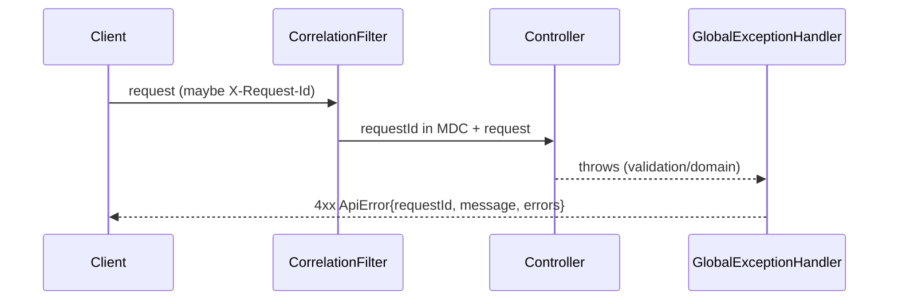

# Task 003 - Web Conventions & Error Handling

## Functional Requirements
- Establish the REST conventions every controller follows: `/api/v0` versioning, bean
  validation on request records, a global exception handler producing the ledger's
  `ApiError` shape, and a standard pagination contract.

## Acceptance Criteria
- [ ] All endpoints are served under `/api/v0/...`.
- [ ] Validation failures return `400` with `ApiError{requestId, message, errors[]}` where
      each `errors[]` is `ErrorDescription{field, message}`.
- [ ] Domain/conflict errors return `409`, not-found `404`, auth denied `403`, unhandled `500`
      — all as `ApiError`.
- [ ] A reusable `PageResponse<T>` + page request params (`page`, `per_page`) exist and are
      documented in OpenAPI.
- [ ] Every response carries/echoes a `requestId` (correlation id) usable in logs and events.

## Technical Design
Mirror `ss-ledger-service/advice` + `base`:
- `advice/GlobalExceptionHandler` (`@RestControllerAdvice`) mapping:
  - `MethodArgumentNotValidException` / `ConstraintViolationException` → 400 (+ field errors)
  - `ResourceNotFoundException` → 404
  - `ConflictException` / `IllegalStateException` (domain) → 409
  - `AccessDeniedException` → 403
  - fallback `Exception` → 500 (message redacted in prod)
- `base/ApiError(String requestId, String message, List<ErrorDescription> errors)`
- `base/ErrorDescription(String field, String message)`
- `base/PageResponse<T>(List<T> items, int page, int perPage, long total)`
- Custom validation annotations reused from the ledger style: `@IsInEnum`, `@ISO4217`
  (currency), `@PositiveOrZeroAmount`.
- Correlation: a `RequestCorrelationFilter` assigns/propagates `requestId` (also fed into
  `EventMetadata.correlationId` by the flow engine in Phase 003) and into MDC for logs.

## Implementation Notes
- Package `advice`, `base`, `config`.
- `config/WebConfiguration.java` registers the correlation filter; OpenAPI documents `ApiError`
  as the default error schema.
- Keep messages safe: never leak stack traces or downstream URLs in `ApiError.message` (prod).
- Validation annotations live in `base/validation`.

## Non-Functional Requirements
- Consistent error contract enables uniform UI error handling (swift-admin `ApiError` parity).
- `requestId` present on 100% of responses for traceability.

## Dependencies
Task 001.

## Risks & Mitigations
- *Inconsistent error shapes creep in per-controller* → all controllers rely solely on the
  global handler; a test asserts the shape for each error family.

## Testing Strategy
- WebMvc slice tests (`@WebMvcTest`) for a sample controller covering 400/404/409/403/500.
- Validation unit tests for `@ISO4217`, `@IsInEnum`, amount constraints.
- Pagination contract test.

## Deployment Strategy
Foundation only; no flag.
