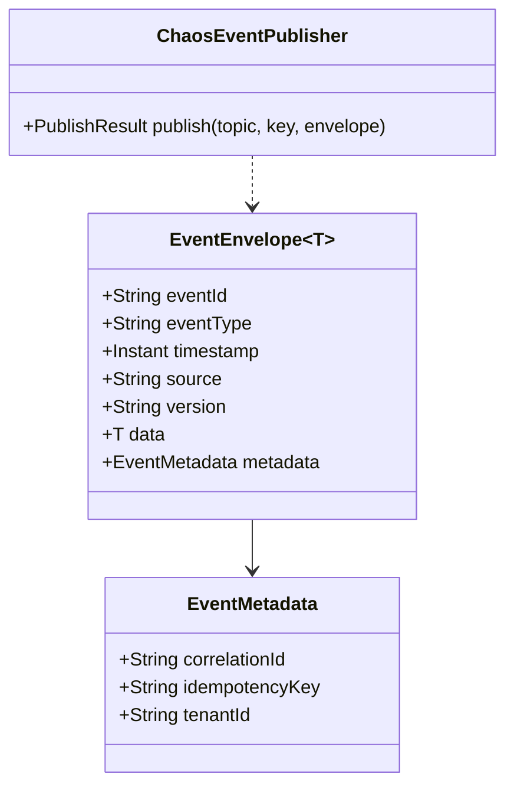

# Task 004 - Kafka Event Envelope & Producer

## Functional Requirements
- Provide the byte-compatible `EventEnvelope<T>` contract the ledger consumes, a configured
  durable Kafka producer, a typed topic catalog for all 12 inbound topics, and a thin
  `ChaosEventPublisher` used by Phase 003. (See [ADR-004](../../decisions/004-event-envelope-and-kafka-publishing.md).)

## Acceptance Criteria
- [ ] Publishing an `EventEnvelope` produces JSON **identical** (key order aside) to
      `bin/kafka-payload-samples.md` for the same inputs — verified against fixtures.
- [ ] JSON is snake_case; no Jackson type headers are written
      (`spring.json.add.type.headers=false`).
- [ ] Producer uses `acks=all`, `enable.idempotence=true`, bounded `delivery.timeout.ms`.
- [ ] `TopicCatalog` exposes typed constants for all 12 topics; topic names match the ledger's
      `_local-dev-common.sh` defaults (plus the proposed `disbursement.completed`) and are
      overridable via config.
- [ ] `ChaosEventPublisher.publish(topic, key, envelope)` returns a result with the broker
      offset/partition and surfaces failures as a typed exception.

## Technical Design
- `kafka/EventEnvelope<T>` record + `kafka/EventMetadata` record, annotated
  `@JsonNaming(PropertyNamingStrategies.SnakeCaseStrategy.class)`:

```java
@JsonNaming(SnakeCaseStrategy.class)
public record EventEnvelope<T>(
    String eventId, String eventType, Instant timestamp,
    String source, String version, T data, EventMetadata metadata) {}

@JsonNaming(SnakeCaseStrategy.class)
public record EventMetadata(String correlationId, String idempotencyKey, String tenantId) {}
```

- `kafka/ProducerConfiguration`: `ProducerFactory` with `StringSerializer` key +
  `JsonSerializer` value (`ADD_TYPE_INFO_HEADERS=false`), an `ObjectMapper` configured with
  `JavaTimeModule` + `WRITE_DATES_AS_TIMESTAMPS=false` (ISO-8601), a
  `KafkaTemplate<String, Object>` bean.
- `kafka/TopicCatalog`: typed constants + `@ConfigurationProperties(prefix="chaos.topics")`
  binding so each topic name is overridable; defaults match the ledger:
  `organization.onboarded`, `organization.va.updated`, `organization.topup.confirmed`,
  `organization.transfer.requested`, `organization.treasury.{prefund,sweep,transfer}.completed`,
  `organization.va.settlement.{initiated,completed,failed}`, `collection.completed`, and the
  proposed `disbursement.completed` (Phase 003).
- `kafka/ChaosEventPublisher`: wraps `KafkaTemplate`, sets the key (aggregate id), measures
  with Micrometer, maps send failures to `EventPublishException`.
- Time: `timestamp` serialized as `2026-05-24T10:00:00Z` (matches samples). `eventId`/ids via ULID.



## Implementation Notes
- Package `com.softspark.chaos.kafka`.
- Do **not** weaken durability to simulate chaos — chaos is layered above the publisher in
  Phase 003. The publisher is always reliable.
- Topic provisioning: optionally create topics on startup (guarded; off by default in prod) —
  mirror the ledger's `KafkaBootstrapConfiguration` lightly, but the chaos machine usually
  targets a broker where the ledger already created topics.
- Build a `JsonFixtures` test helper that loads the JSON blocks from
  `ss-ledger-service/bin/kafka-payload-samples.md` to assert contract parity.

## Non-Functional Requirements
- Zero event loss for acknowledged sends (idempotent producer).
- Serialization throughput adequate for burst chaos (thousands/min); `JsonSerializer` reuses one `ObjectMapper`.

## Dependencies
Task 001 (build/config). Payload records themselves are defined in Phase 003.

## Risks & Mitigations
- *Schema drift vs. ledger* → fixture-based contract tests derived from the bin samples fail on drift.
- *Timestamp/locale formatting mismatch* → pin ISO-8601 `Z` formatting; assert against fixtures.

## Testing Strategy
- Unit: round-trip serialize a sample envelope; assert equals the fixture JSON (snake_case, no type headers).
- Integration (`@Tag("integration")`, Testcontainers Kafka): publish + consume via console
  consumer; assert payload equality and producer config (`acks=all`, idempotence).

## Deployment Strategy
Foundation only. Broker address + topic overrides via env. Safety: `chaos.kafka.cluster-label`
echoed in logs/health so operators see which broker is targeted.
