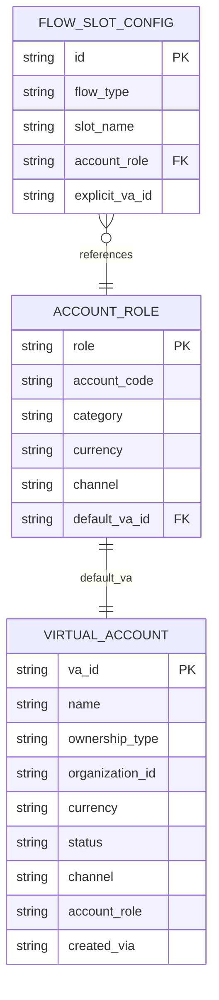

# Task 001 - Chart of Accounts Bootstrap

> ⚠️ **Superseded by [Phase 007](../007-chart-of-accounts-http-bootstrap/DESIGN.md).** This task
> (config-seeded VA UUIDs) shipped with Phase 002. The VA ids are now **provisioned in and
> returned by the ledger over HTTP** rather than seeded from config; account codes must be
> **unique**. Treat the role/code catalog and flow-slot seeding below as still valid, but read
> Phase 007 for the authoritative bootstrap mechanism and persistence.

## Functional Requirements
- On startup, seed a preconfigured **chart of accounts**: the system **account roles**, each
  with an account code, category, currency, and a default virtual-account UUID — plus the
  default **flow-slot configuration** that references those roles. Seeding is idempotent.

## Acceptance Criteria
- [ ] First boot on an empty DB creates the six roles below, a SYSTEM `virtual_account` row per
      role, and default `flow_slot_config` rows.
- [ ] Re-boot performs no duplication (upsert by `role` / `account_code`).
- [ ] Default VA UUIDs are stable across reboots (seeded, not random) so flows are reproducible.
- [ ] Seed values come from `chaos-bootstrap.yml` and can be overridden per environment.
- [ ] Bootstrap runs after Flyway and before the app reports `UP`.

## Technical Design
Account roles (enum `AccountRole`) and seeded codes (MANIFEST, with §10 corrections):

| Role | `account_code` | `category` | `channel` |
|---|---|---|---|
| `SETTLEMENT_ACCOUNT` | `ASSET.BANK.SETTLEMENT.0000000000001.GHS` | ASSET | — |
| `PLATFORM_FLOAT` | `ASSET.PLATFORM.FLOAT` | ASSET | — |
| `PLATFORM_FLOAT_MTN` | `ASSET.PLATFORM.FLOAT.MTN` | ASSET | MTN |
| `PLATFORM_FLOAT_TELECEL` | `ASSET.PLATFORM.FLOAT.TELECEL` | ASSET | TELECEL |
| `PLATFORM_FEE` | `REVENUE.PLATFORM.FEE` | REVENUE | — |
| `PROVIDER_FEE` | `REVENUE.PROVIDER.FEE` | REVENUE | — |

Enums (mirror ledger naming): `AccountCategory{ASSET,LIABILITY,REVENUE,EXPENSE,CONTRA}`,
`AccountOwnershipType{SYSTEM,ORGANIZATION}`, `AccountStatus{ACTIVE,SUSPENDED,FROZEN,DORMANT,CLOSED}`,
`Channel{BANK,MTN,TELECEL,MOMO}`.

Data model:

Default flow-slot seed (examples; full set in Task 002):
- `COLLECTION_COMPLETED.source` → `PLATFORM_FLOAT`; `COLLECTION_COMPLETED.fee` → `PLATFORM_FEE`
- `SETTLEMENT_COMPLETED.destination` → `SETTLEMENT_ACCOUNT`

Bootstrap mechanism: a `@Component` `ChartOfAccountsBootstrap` implementing
`ApplicationRunner` (ordered after Flyway). Reads `chaos-bootstrap.yml`
(`@ConfigurationProperties(prefix="chaos.bootstrap")`), upserts roles/VAs/slots in one
transaction. ULID for `virtual_account.va_id` only when not seeded; seeded UUIDs win.

## Implementation Notes
- Package: `account/model` (`AccountRoleEntity`, `VirtualAccount`, `FlowSlotConfig`,
  `Organization`), `account/enumeration`, `account/bootstrap/ChartOfAccountsBootstrap`,
  `account/repository`.
- `src/main/resources/chaos-bootstrap.yml` holds role codes + stable default VA UUIDs +
  default slot mapping. Keep UUIDs in config so QA can pin them to ledger fixtures.
- Idempotent upserts via repository `findByRole` / `findByAccountCode`.

## Non-Functional Requirements
- Bootstrap completes in < 500ms. Failure aborts startup (fail fast) with a clear log.

## Dependencies
Phase 001 (persistence). Enums reused by Tasks 002–004 and Phase 003.

## Risks & Mitigations
- *Seed drift vs. ledger account codes* → codes live in one config file; documented as the
  contract; a test asserts the six roles + codes.
- *Random VA ids breaking reproducibility* → seeded stable UUIDs.

## Testing Strategy
- Fresh-DB test asserts six roles, six SYSTEM VAs, default slots created.
- Idempotency test: run bootstrap twice; row counts unchanged.
- Config-override test: a profile overrides a code/UUID and it takes effect.

## Deployment Strategy
Ships with the image; runs every boot (idempotent). Override seed via mounted
`chaos-bootstrap.yml` or env.
