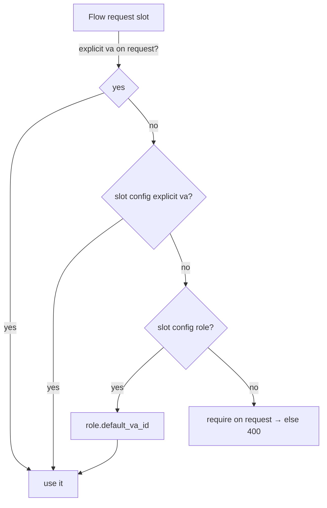

# Task 002 - Chart of Accounts Configuration API

## Functional Requirements
- Expose APIs to **view and edit** the chart of accounts (account roles, their codes and
  default VAs) and to **configure which account fills each slot of each transaction flow**
  ("configuring which accounts to use in which transaction flows").

## Acceptance Criteria
- [ ] `GET /api/v0/chart-of-accounts` returns all roles with code, category, currency,
      default VA id, channel.
- [ ] `PUT /api/v0/chart-of-accounts/{role}` updates a role's default VA / currency / status.
- [ ] `GET /api/v0/flow-configs` returns every flow's slots and their resolved account
      (role + effective VA id).
- [ ] `PUT /api/v0/flow-configs/{flowType}` sets the role (or explicit VA id) per slot.
- [ ] Invalid role/VA references return `400`/`404` `ApiError`.
- [ ] Changes persist and are immediately reflected in Phase 003 flow resolution.

## Technical Design
Slot model per flow (the resolvable inputs an operator may pin):

| Flow | Slots |
|---|---|
| `COLLECTION_COMPLETED` | `source` (PLATFORM_FLOAT*), `destination` (merchant org VA), `fee` (PLATFORM_FEE/PROVIDER_FEE) |
| `SETTLEMENT_INITIATED` | `virtual_account` (client VA) |
| `SETTLEMENT_COMPLETED` | `source` (client VA), `destination` (SETTLEMENT_ACCOUNT) |
| `SETTLEMENT_FAILED` | `virtual_account` (client VA) |
| `TOPUP_CONFIRMED` | `source` (client VA), `destination` (system VA) |
| `TRANSFER_REQUESTED` | `source` (client VA), `destination` (client VA) |
| `TREASURY_PREFUND/SWEEP/TRANSFER_COMPLETED` | `source` (system VA), `destination` (system VA) |
| `ORGANIZATION_ONBOARDED` / `VA_UPDATED` | n/a (no slot) |

Resolution precedence at send time (Phase 003 consumes this):
1. Explicit VA id supplied on the request → wins.
2. Else `flow_slot_config.explicit_va_id` if set.
3. Else `flow_slot_config.account_role` → that role's `default_va_id`.
4. Else (org/client slots with no system default) → required on the request, else `400`.

DTOs (records, validated): `ChartOfAccountsRoleResponse`, `UpdateRoleRequest`,
`FlowConfigResponse{flowType, slots[]}`, `UpdateFlowConfigRequest{slots:[{slotName, role?, vaId?}]}`.

## Implementation Notes
- Package `account/controller` (`ChartOfAccountsController`, `FlowConfigController`),
  `account/service` (`ChartOfAccountsService`, `FlowConfigService`), `account/dto`.
- `FlowType` enum is shared with Phase 003 (`flow` package) — define it in a neutral package
  (`base` or `flow/model`) to avoid a cyclic dependency; `account` depends on `flow/model`.
- Validate that a slot's role/VA exists and (for system slots) ownership is SYSTEM.
- Guard `@PreAuthorize` consistent with the ledger style.

## Non-Functional Requirements
- Config reads are hot-path for flow sends → cache resolved configs with eviction on update.
- All edits audited (updatedAt + requestId in logs).

## Dependencies
Task 001 (model + seed). Shares `FlowType` with Phase 003.

## Risks & Mitigations
- *Cyclic package dependency account ↔ flow* → put shared `FlowType`/`SlotName` enums in a
  neutral module.
- *Stale cache after edit* → explicit cache eviction in the service on `PUT`.

## Testing Strategy
- Service tests for each resolution-precedence branch.
- WebMvc tests for CoA + flow-config endpoints incl. validation errors.
- Cache invalidation test (edit then resolve reflects new value).

## Deployment Strategy
No flag. Defaults from bootstrap; edits live immediately.
