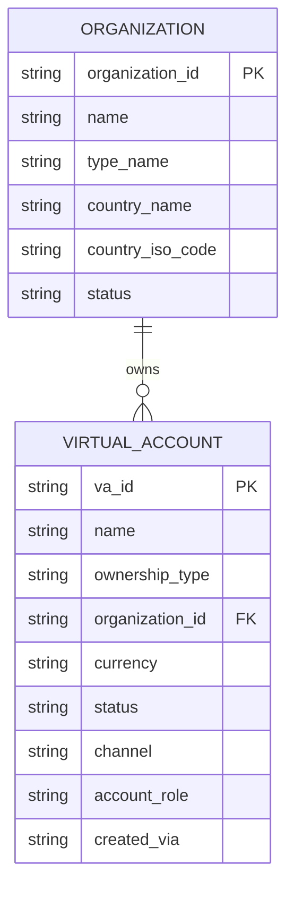

# Task 003 - Virtual Account Registry & Creation via API

> **⚠️ Partially superseded by [Phase 009](../009-ledger-owned-virtual-accounts/DESIGN.md)
> ([ADR-011](../../decisions/011-ledger-owned-virtual-accounts-via-kafka-consumer.md)).** The
> `virtual_account` registry persists, but it is now a **projection of the ledger's
> `ledger.account.created` event**, not a table the API writes directly. `POST /api/v0/virtual-accounts`
> no longer inserts locally — it requests creation from the ledger over HTTP and returns `202`; the
> row appears when the event is consumed. Org VAs can be created with **any currency**. See
> [Phase 009 / Task 004](../009-ledger-owned-virtual-accounts/004-invert-va-creation-api.md). The
> entity/registry shape below remains accurate; the *creation* semantics are superseded.

## Functional Requirements
- Maintain a registry of all virtual accounts the chaos machine knows about (SYSTEM +
  ORGANIZATION) and allow **creating a virtual account via the API**, optionally linking it to
  an organization and optionally announcing it to the ledger over Kafka (Task 004).

## Acceptance Criteria
- [ ] `POST /api/v0/virtual-accounts` creates a VA (`va_id` ULID if not supplied) with name,
      ownership type, currency, optional organization, channel, status.
- [ ] `GET /api/v0/virtual-accounts` lists VAs with pagination + filters (ownership, org,
      currency, status, free-text on name/id).
- [ ] `GET /api/v0/virtual-accounts/{id}` returns one VA.
- [ ] Creating an ORGANIZATION VA with a new `organization_id` also creates/links an
      `organization` record.
- [ ] `created_via` records `API` (or `BOOTSTRAP`/`KAFKA`).
- [ ] An optional `announce=true` flag triggers the Kafka announcement (delegates to Task 004).

## Technical Design
`VirtualAccount` entity (table `virtual_account`, from Task 001) + `Organization` entity
(table `organization`): `organizationId`, `name`, `typeName`, `countryName`, `countryIsoCode`,
`status`, timestamps.

Create request (record, validated): `CreateVirtualAccountRequest{ name, ownershipType,
currency(@ISO4217), organizationId?, organizationName?, channel?, status?, vaId?, announce? }`.
Response: `VirtualAccountResponse`.

Service rules:
- ULID `va_id` if absent; reject duplicates.
- SYSTEM VAs may carry an `accountRole`; ORGANIZATION VAs require an org (create-or-link).
- `announce=true` → call `VirtualAccountAnnouncer` (Task 004) after commit (transactional outbox
  style: persist first, publish after commit).

## Implementation Notes
- Package `account/controller/VirtualAccountController`, `account/service/VirtualAccountService`,
  `account/repository/{VirtualAccountRepository,OrganizationRepository}`, `account/dto`.
- List filtering via Spring Data `Specification` or query methods; pagination uses
  `PageResponse<T>` from Phase 001.
- Keep mapping hand-written (record builders), no MapStruct (ledger convention).

## Non-Functional Requirements
- List endpoint paginates (default `per_page=20`, max 100) and is indexed on
  `organization_id`, `ownership_type`, `status`.
- Create is idempotent on supplied `va_id`.

## Dependencies
Task 001 (model). `announce` path depends on Task 004 + Phase 001 publisher.

## Risks & Mitigations
- *Publishing before commit could announce a VA that rolls back* → publish only after
  successful commit (`@TransactionalEventListener(AFTER_COMMIT)` or explicit post-commit call).
- *Org duplication* → create-or-link by `organization_id`.

## Testing Strategy
- Service tests: create SYSTEM vs ORGANIZATION VA; org create-or-link; duplicate `va_id` → 409.
- WebMvc tests: validation (bad currency, missing ownership), pagination, filters.
- Post-commit announcement invoked only on success (verify with a spy).

## Deployment Strategy
No flag. Registry persists in SQLite.
