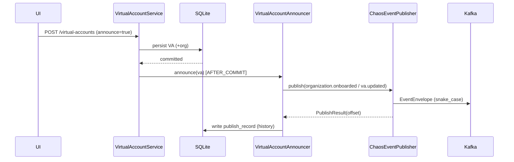

# Task 004 - Virtual Account Creation via Kafka

## Functional Requirements
- Allow virtual accounts / organizations to be **created via Kafka** by publishing the events
  the ledger consumes to materialize them. There is no dedicated `va.created` inbound topic;
  VA/org existence in the ledger is driven by `organization.onboarded` and
  `organization.va.updated`. (See ARCHITECTURE §10.3.)

## Acceptance Criteria
- [ ] `POST /api/v0/virtual-accounts/{id}/publish` emits an `organization.onboarded` (when the
      VA's organization is new) and/or `organization.va.updated` envelope for that VA.
- [ ] Creating a VA via Task 003 with `announce=true` produces the same publication.
- [ ] Published envelopes are schema-valid against the ledger samples (contract test).
- [ ] `created_via` is recorded as `KAFKA` for VAs first materialized this way; a publish
      record (Phase 003 history) is written.
- [ ] Publishing is post-commit and idempotent per `idempotency_key`.

## Technical Design
`VirtualAccountAnnouncer` maps registry entities → envelopes via the Phase 001
`ChaosEventPublisher`:

- **New organization** → `organization.onboarded` with `data` = org profile (id, name,
  type{id,name}, country{...}, primary_contact_email, phone[], status). `source =
  organization-service`.
- **VA status/profile change or association** → `organization.va.updated` with `data` =
  `{ id: vaId, status, currency{id}, type{id} }`. `source = organization-service`.

Topic/source mapping uses `TopicCatalog`. `event_type` = topic name. `metadata.tenant_id`
defaults from config (`chaos.default-tenant-id`, e.g. `org_123`) but is overridable per request.

## Implementation Notes
- Package `account/service/VirtualAccountAnnouncer`; payload records reuse Phase 003
  `flow/model/v1` (`OnboardedEventData`, `OrganizationVaUpdatedEventData`) — define them here
  if Phase 003 hasn't yet, in the shared `flow/model/v1` package, to avoid duplication.
- Decide onboarded-vs-updated by whether the org is newly created in this operation.
- Reuse the same publish + history path as the flow engine so all sends are auditable.

## Non-Functional Requirements
- Exactly-once *intent*: idempotency key `organization-onboarded:{eventId}` /
  `organization-va-updated:{eventId}`; safe to retry.
- Publishing failures don't roll back the registry write (VA still exists locally); failure is
  recorded and retryable via the publish endpoint.

## Dependencies
Task 003 (registry), Phase 001 task 004 (publisher + envelope), shared `flow/model/v1` payloads.

## Risks & Mitigations
- *Ledger may also create accounts lazily from transaction flows* → announcement is optional;
  document that flows can reference VAs the ledger will create on first use.
- *Schema drift* → contract tests against `bin/kafka-payload-samples.md` onboarded / va.updated blocks.

## Testing Strategy
- Unit: entity → envelope mapping equals the sample fixtures.
- Integration (Testcontainers Kafka): announce → consume → assert payload + topic.
- Post-commit-only publication verified.

## Deployment Strategy
No flag. Targets the configured broker (`chaos.kafka.cluster-label` surfaced for safety).
