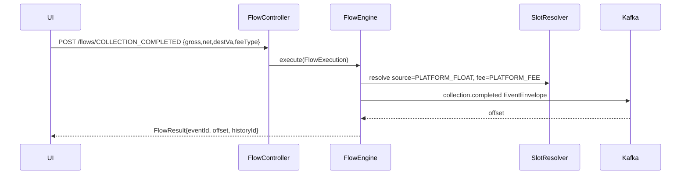

# Task 002 - Single Transaction Publishing API (Full Schemas)

## Functional Requirements
- Expose `POST /api/v0/flows/{flowType}` to publish a single, well-formed event for any of the
  11 flows, with system VAs resolved from the chart of accounts and client/org VAs supplied or
  resolved. Provide `GET /api/v0/flows/catalog` describing each flow's fields. Payloads must be
  byte-compatible with the ledger (oracle: `ss-ledger-service/bin/kafka-payload-samples.md`).

## Acceptance Criteria
- [ ] Each flow publishes an envelope identical to its sample fixture for identical inputs.
- [ ] Required-field validation returns `400` `ApiError` before any publish.
- [ ] `source`, `event_type`/topic, and `metadata` are set per the tables below.
- [ ] Response returns `FlowResult{eventId, topic, partition, offset, status, historyId}`.
- [ ] `GET /flows/catalog` lists, per flow: fields, types, required/optional, slot defaults, CSV columns.

## Technical Design

### Envelope (all flows)
`EventEnvelope{ event_id(ULID), event_type(=topic), timestamp(ISO-8601 Z), source, version="1.0",
data{…}, metadata{ correlation_id, idempotency_key=<event_type>:<event_id>, tenant_id } }`.

### Flow → topic / source / partition key

| `flowType` | topic (`event_type`) | `source` | key |
|---|---|---|---|
| `ORGANIZATION_ONBOARDED` | `organization.onboarded` | organization-service | organization id |
| `ORGANIZATION_VA_UPDATED` | `organization.va.updated` | organization-service | va id |
| `TOPUP_CONFIRMED` | `organization.topup.confirmed` | payments-service | destination_va_id |
| `TRANSFER_REQUESTED` | `organization.transfer.requested` | transfers-service | source_va_id |
| `TREASURY_PREFUND_COMPLETED` | `organization.treasury.prefund.completed` | treasury-service | destination_va_id |
| `TREASURY_SWEEP_COMPLETED` | `organization.treasury.sweep.completed` | treasury-service | source_va_id |
| `TREASURY_TRANSFER_COMPLETED` | `organization.treasury.transfer.completed` | treasury-service | source_va_id |
| `SETTLEMENT_INITIATED` | `organization.va.settlement.initiated` | settlements-service | virtual_account_id |
| `SETTLEMENT_COMPLETED` | `organization.va.settlement.completed` | settlements-service | source_va_id |
| `SETTLEMENT_FAILED` | `organization.va.settlement.failed` | settlements-service | virtual_account_id |
| `COLLECTION_COMPLETED` | `collection.completed` | payments-service | destination_va_id |

### `data` payload schemas (`flow/model/v1`, snake_case)

**organization.onboarded** — `OnboardedEventData`: `id`, `name`, `type{id,name}`,
`country{id,name,iso_code,status,modified_date}`, `primary_contact_email`, `phone[]`, `status`.

**organization.va.updated** — `OrganizationVaUpdatedEventData`: `id`, `status`,
`currency{id}`, `type{id}`.

**organization.topup.confirmed** — `TopUpConfirmedEventData`: `topup_request_id`,
`organization_id`, `source_va_id`(client), `destination_va_id`(system), `amount`, `currency`,
`source_payment_reference`, `approved_by`, `approved_at`.

**organization.transfer.requested** — `TransferRequestedEventData`: `transfer_request_id`,
`source_organization_id`, `destination_organization_id`, `source_va_id`(client),
`destination_va_id`(client), `amount`, `currency`, `narrative`, `initiated_by`, `initiated_at`.

**organization.treasury.prefund.completed** — `TreasuryPrefundCompletedEventData`:
`prefund_request_id`, `source_channel`, `destination_channel`, `source_va_id`(system),
`destination_va_id`(system), `amount`, `currency`, `completion_reference`, `completed_by`, `completed_at`.

**organization.treasury.sweep.completed** — `TreasurySweepCompletedEventData`:
`sweep_request_id`, `source_channel`, `destination_channel`, `source_va_id`(system),
`destination_va_id`(system), `amount`, `currency`, `completion_reference`, `completed_by`, `completed_at`.

**organization.treasury.transfer.completed** — `TreasuryTransferCompletedEventData`:
`transfer_request_id`, `source_channel`, `destination_channel`, `source_va_id`(system),
`destination_va_id`(system), `amount`, `currency`, `completion_reference`, `completed_by`, `completed_at`.

**organization.va.settlement.initiated** — `SettlementInitiatedEventData`:
`settlement_request_id`, `virtual_account_id`(client), `organization_id`, `amount`, `currency`,
`destination_bank_account`, `destination_bank`, `approved_by`, `approved_at`.

**organization.va.settlement.completed** — `SettlementCompletedEventData`:
`settlement_request_id`, `source_organization_id`, `source_va_id`(client),
`destination_va_id`(SETTLEMENT_ACCOUNT), `amount`, `currency`, `completion_reference`,
`completed_by`, `completed_at`.

**organization.va.settlement.failed** — `SettlementFailedEventData`: `settlement_request_id`,
`organization_id`, `virtual_account_id`(client), `failure_reason_code`, `failure_note`,
`marked_by`, `marked_at`.

**collection.completed** — `CollectionCompletedEventData`: `collection_request_id`,
`source_va_id`(PLATFORM_FLOAT*), `destination_va_id`(merchant org), `gross_amount`,
`net_amount`, `currency`, `merchant_reference`, `provider_collection_id`,
`fees[]{ fee_type, amount, destination_va_id }`. Invariant: `net_amount = gross_amount − Σ fee.amount`.

### Slot resolution defaults (from Phase 002)
- `COLLECTION_COMPLETED.source_va_id` ← `PLATFORM_FLOAT` (or `PLATFORM_FLOAT_MTN/TELECEL` by
  `channel`); `fees[].destination_va_id` ← `PLATFORM_FEE` / `PROVIDER_FEE` by `fee_type`.
- `SETTLEMENT_COMPLETED.destination_va_id` ← `SETTLEMENT_ACCOUNT`.
- Treasury source/destination ← configured system roles. Client/org VAs are request inputs.

## Implementation Notes
- Package `flow/controller/FlowController`, `flow/dto` (one request record per flow +
  `@JsonNaming` snake_case), `flow/builder/*FlowBuilder`, `flow/model/v1/*EventData`.
- Reuse field defaults from the bin scripts (e.g. `tenant_id=org_123`, `currency=GHS`,
  `approved_by=ops@acme.example`) as request defaults; everything overridable.
- `amount`/`gross`/`net`/`fee.amount` are `BigDecimal`; validate `net = gross − Σfees` for collection.
- Build the `JsonFixtures` oracle from `bin/kafka-payload-samples.md` for parity assertions.

## Non-Functional Requirements
- Validation + resolution + publish round trip < 50ms p50 locally.
- Strict numeric formatting (no scientific notation; scale matches samples, e.g. `100.00`).

## Dependencies
Task 001 (engine), Phase 002 (resolution), Phase 001 (publisher), Task 005 (history record).

## Risks & Mitigations
- *Schema drift vs ledger* → fixture-based contract tests per flow fail on any drift.
- *Collection imbalance bugs* → explicit invariant check (unless chaos `unbalanced` is requested).

## Testing Strategy
- One contract test per flow: build envelope, assert equals fixture JSON.
- WebMvc tests: per-flow validation (missing required client VA, bad currency, imbalance).
- Catalog endpoint test (fields/types/slots present for all 11).

## Deployment Strategy
Auth-protected. No flag. Target broker label surfaced for safety.
