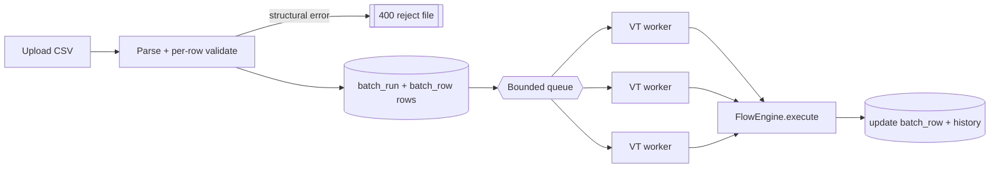

# Task 003 - CSV Batch Publishing

## Functional Requirements
- Accept a CSV upload of flow rows, validate per-row, and execute them as a tracked **batch
  run** with bounded concurrency, optional rate limiting, partial-failure isolation, and
  progress querying. (See [ADR-007](../../decisions/007-csv-batch-execution-model.md).)
- The ledger's `BATCH_DISBURSEMENT` / `BATCH_SETTLEMENT` transaction types are realized here as
  CSV batches of the single `DISBURSEMENT_COMPLETED` / `SETTLEMENT_*` flows — no separate flow types.

## Acceptance Criteria
- [ ] `POST /api/v0/batches` (multipart: `file`, `flowType`, optional `maxRatePerSecond`,
      `chaos`) parses the CSV and creates a `batch_run` + `batch_row` per line.
- [ ] Structurally-bad files (missing required headers) are rejected `400`; otherwise individual
      bad rows are marked `INVALID` and the run continues.
- [ ] Valid rows publish via the Phase-001 publisher on a bounded virtual-thread pool; each row
      ends `PUBLISHED` or `FAILED` with its `event_id` / error.
- [ ] `GET /api/v0/batches/{id}` returns counts + status (`RUNNING`, `COMPLETED`,
      `COMPLETED_WITH_FAILURES`, `FAILED`); `GET /api/v0/batches` lists runs.
- [ ] `GET /api/v0/batches/{id}/rows` paginates row outcomes.
- [ ] A mixed-flow CSV (with a `flow_type` column) is supported when `flowType=MIXED`.

## Technical Design
CSV columns = the union of a flow's request fields (snake_case), discoverable via
`GET /flows/catalog`. Example `COLLECTION_COMPLETED` CSV header:
`gross_amount,net_amount,fee_amount,fee_type,destination_va_id[,source_va_id,fee_va_id,currency,tenant_id]`.

Execution pipeline:

- Parser: a small CSV library (e.g. `com.opencsv` or Commons CSV — justify the single dep) or a
  hand-rolled RFC-4180 reader; stream rows (don't load whole file in memory).
- Each row → a `FlowRequest` (reuse Task 002 mapping) → `FlowEngine.execute`.
- Concurrency: `Executors.newVirtualThreadPerTaskExecutor()` fronted by a **bounded** work
  queue (size = config) so memory/broker pressure is capped; optional `RateLimiter`
  (`maxRatePerSecond`) for controlled load tests.
- State machine per row: `PENDING → PUBLISHED | FAILED | INVALID`; run aggregates terminal status.
- Async: the POST returns `202 Accepted` with the `batch_run` id; the UI polls.
- Idempotency: re-uploading the same file starts a new run (distinct `batch_run` id); per-row
  idempotency keys still default to `<event_type>:<event_id>` (unique unless chaos requests duplicates).

## Implementation Notes
- Packages `batch/controller/BatchController`, `batch/service/{BatchService,BatchRunner}`,
  `batch/csv/CsvFlowParser`, `batch/model/{BatchRun,BatchRow}`, `batch/repository`, `batch/dto`.
- Reuse `FlowEngine` (Task 001) and `HistoryWriter` (Task 005). Do not bypass the engine.
- Persist `batch_run`/`batch_row` first, then execute, so progress survives a restart (rows in
  `PENDING` can be resumed or reported).
- Config: `chaos.batch.max-rows`, `chaos.batch.queue-capacity`, `chaos.batch.workers`,
  `chaos.batch.default-max-rate`.

## Non-Functional Requirements
- Backpressure: in-flight work bounded regardless of file size; large files streamed.
- A 10k-row file completes without OOM; progress observable within ~1s granularity.
- SQLite history/row writes serialized through one writer (single-writer model).

## Dependencies
Task 001 (engine), Task 005 (history), Phase 001 (publisher), Phase 002 (resolution).

## Risks & Mitigations
- *Broker/ledger overrun during load tests* → bounded queue + worker count + rate limiter;
  surfaced target label.
- *Partial progress lost on crash* → rows persisted before execution; status reconstructable.
- *Malformed CSV* → strict header validation + per-row error capture.

## Testing Strategy
- Parser tests (quoting, embedded commas, missing headers, blank lines).
- Batch service tests: partial failure isolation; status aggregation; rate limiting honored.
- Integration (Testcontainers Kafka): run a small CSV; consume; assert N events + per-row outcomes.
- Load test (tagged stress): 10k rows within memory + time budget.

## Deployment Strategy
Auth-protected, async (`202`). Caps via config. No flag.
