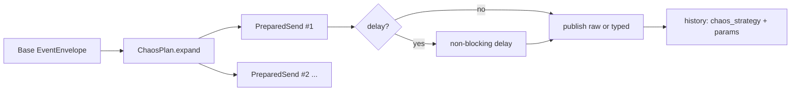

# Task 004 - Chaos Injection Strategies

## Functional Requirements
- Provide opt-in, controlled "chaos" transformations applied to any single flow or batch so an
  operator can probe the ledger's resilience: duplicate delivery, out-of-order delivery,
  malformed payloads, burst/volume, unbalanced amounts, and delayed delivery — each bounded and
  explicit. This realizes the project objective ("test the ledger's resilience in a controlled way").

## Acceptance Criteria
- [ ] A `chaos` block on a flow/batch request selects zero or more strategies with parameters.
- [ ] **Duplicate**: same envelope (same `idempotency_key`) published `n` times → probes ledger idempotency.
- [ ] **Out-of-order**: a multi-event sequence (e.g. settlement completed before initiated) is
      published in a chosen order → probes ordering tolerance.
- [ ] **Malformed**: drop/rename/blank a field, bad currency, negative amount, broken JSON →
      still sent as bytes; probes validation + DLT routing.
- [ ] **Unbalanced**: collection `net ≠ gross − Σfees` → probes balance validation.
- [ ] **Burst**: publish `n` copies at `rate` → probes backpressure/throughput.
- [ ] **Delay**: insert a fixed/jittered delay before send → probes timeout/lateness handling.
- [ ] Every chaos send is labeled in history (`chaos_strategy`, params) for later analysis.
- [ ] All strategies are bounded by global caps (`maxDuplicates`, `maxBurst`, `maxRate`, `maxDelayMs`).

## Technical Design
Chaos is applied **above** the durable publisher (ADR-004) — the harness never loses what it
claims to send; it only changes *what* and *in what order/shape*.

```java
sealed interface ChaosStrategy
  permits Duplicate, OutOfOrder, Malformed, Unbalanced, Burst, Delay {}

interface ChaosPlan {                 // ordered list of strategies + params
  List<PreparedSend> expand(EventEnvelope<?> base, FlowContext ctx);
}
record PreparedSend(EventEnvelope<?> envelope, String rawOverride /*nullable broken JSON*/, Duration delay) {}
```

- The engine builds the **base** envelope, then `ChaosPlan.expand(...)` returns an ordered list
  of `PreparedSend`s (1..n). For malformed/broken-JSON, a `rawOverride` string bypasses the
  serializer so genuinely invalid bytes can be emitted via the `KafkaTemplate<String,String>`
  variant (mirrors the ledger's raw-JSON producer).
- **Out-of-order** is only meaningful for flows with a natural sequence; the catalog marks which
  flows form sequences (settlement initiated→completed/failed; treasury prefund→sweep).
- **Malformed** mutation set: `dropField(path)`, `renameField`, `blankField`,
  `invalidCurrency`, `negativeAmount`, `nonNumericAmount`, `truncateJson`.
- Selection via pattern-matching switch over the sealed `ChaosStrategy` (Java 25).



## Implementation Notes
- Package `flow/chaos` (`ChaosStrategy` sealed hierarchy, `ChaosPlan`, `ChaosPlanFactory`,
  `MalformedMutators`). Request DTO `ChaosOptions{ duplicate{count}, outOfOrder{order[]},
  malformed{mutations[]}, unbalanced{delta}, burst{count,ratePerSecond}, delay{ms,jitterMs} }`.
- Use the `KafkaTemplate<String,String>` (Phase 001) for `rawOverride` sends; typed template otherwise.
- Delays use virtual-thread friendly waiting; bursts honor a shared `RateLimiter`.
- Enforce caps from `chaos.limits.*`; reject over-cap requests `400`.
- Mark `publish_record.intentional_failure=true` for malformed/unbalanced so analytics don't
  treat them as harness bugs.

## Non-Functional Requirements
- Chaos must be **safe and bounded**: hard caps, explicit opt-in, target-cluster label surfaced.
- No chaos strategy weakens producer durability or the harness's own correctness.

## Dependencies
Task 001 (engine seam), Task 002 (base envelopes), Phase 001 (both KafkaTemplates), Task 005 (labeling).

## Risks & Mitigations
- *Accidental production blast* → global caps + opt-in + visible target label + auth.
- *Malformed JSON not actually invalid* → dedicated raw-string path + tests asserting the
  ledger's validation/DLT reaction in integration.
- *Out-of-order needing real sequences* → catalog declares sequence-capable flows; reject otherwise.

## Testing Strategy
- Unit: each strategy's `expand()` (duplicate count, order permutation, each mutator, imbalance delta).
- Integration (Testcontainers Kafka): duplicate → one logical effect at ledger (if ledger
  available) or assert N identical records; malformed → lands on DLT; burst → N consumed.
- Cap-enforcement tests (over-limit → 400).

## Deployment Strategy
Opt-in per request, auth-protected, capped. No global flag; destructive shapes are explicit.
