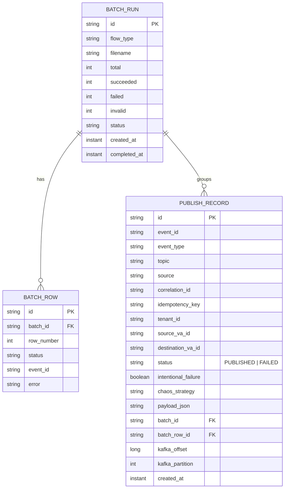

# Task 005 - Publish History & Run Tracking

## Functional Requirements
- Persist a durable, queryable record of **every** published event (single, batch, VA
  announcement) and every batch run, so operators can audit what was sent and correlate with
  ledger behavior.

## Acceptance Criteria
- [ ] Every publish writes a `publish_record` with envelope metadata, payload JSON, target
      topic, status, and chaos labels.
- [ ] `GET /api/v0/history` filters by flow/event type, VA id (source/destination), correlation
      id, idempotency key, status, intentional-failure flag, and time range; paginated.
- [ ] `GET /api/v0/history/{id}` returns the full stored envelope JSON.
- [ ] Batch runs are linked: `publish_record.batch_id` / `batch_row_id` join to `batch_run`.
- [ ] History writes never block or fail the publish path beyond a bounded retry; a write
      failure is logged and surfaced in health, not propagated to the caller.

## Technical Design
Single-writer history to respect SQLite (ADR-002): publishes enqueue a `HistoryEvent` to a
bounded in-memory queue drained by one writer thread/virtual-thread; batched inserts.

- `source_va_id` / `destination_va_id` are denormalized from `data` for fast VA-scoped queries
  (powering Phase 005's per-VA transaction history without calling the ledger).
- Querying uses Spring Data `Specification`s; indexes on `event_type`, `source_va_id`,
  `destination_va_id`, `correlation_id`, `created_at`, `batch_id`.
- `HistoryWriter` (interface from Task 001) impl here; exposes queue depth + last-write-age to Actuator.

## Implementation Notes
- Packages `history/controller/HistoryController`, `history/service/{HistoryWriter,HistoryQueryService}`,
  `history/model/PublishRecord`, `history/repository`, `history/dto`.
- Store the exact serialized envelope JSON (post-chaos `rawOverride` if any) for fidelity.
- Retention: config `chaos.history.retention-days` with a scheduled purge (keep the SQLite file bounded).
- Denormalize VA ids per flow via a small extractor keyed by `FlowType`.

## Non-Functional Requirements
- Writes are async + batched; publish-path overhead < 1ms enqueue.
- Queries paginate; default `per_page=20`, max 100; p95 < 100ms on a typical local DB.
- Bounded growth via retention purge.

## Dependencies
Task 001 (writer seam), Tasks 002/003/004 (producers of history), Phase 002 (VA context).

## Risks & Mitigations
- *History queue overflow under extreme burst* → bounded queue with drop-to-disk fallback or
  apply backpressure to batch workers (config: `block` vs `drop-oldest`), surfaced in health.
- *SQLite write contention* → single writer + batched inserts.

## Testing Strategy
- Writer test: concurrent enqueues from virtual threads → all persisted, ordered, no `SQLITE_BUSY`.
- Query tests: each filter + pagination; VA-scoped query returns both source/destination matches.
- Retention purge test.

## Deployment Strategy
No flag. Retention via config. Queue health in `/actuator/health`.
