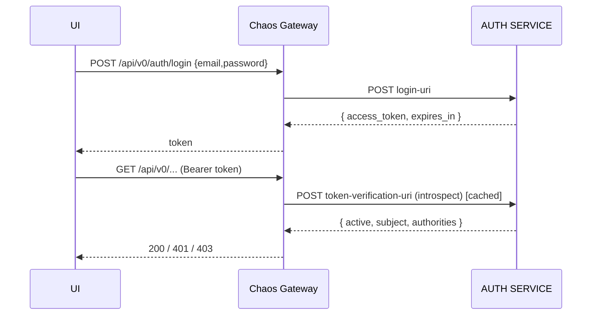

# Task 001 - Auth Proxy & Token Verification

## Functional Requirements
- Proxy login to the AUTH SERVICE and protect all `/api/v0/**` endpoints by introspecting
  bearer tokens against that service — reproducing `ss-ledger-service`'s auth model (no local
  JWT signing). (See [ADR-006](../../decisions/006-auth-via-external-auth-service.md).)

## Acceptance Criteria
- [ ] `POST /api/v0/auth/login` forwards credentials to the AUTH SERVICE and returns
      `{ access_token, token_type, expires_in, refresh_token? }`.
- [ ] `POST /api/v0/auth/refresh` and `GET /api/v0/auth/me` work against the AUTH SERVICE / context.
- [ ] Requests with a valid `Authorization: Bearer …` reach protected endpoints; invalid/missing
      → `401` `ApiError`; insufficient authority → `403`.
- [ ] Public allow-list: `/api/v0/auth/login`, `/actuator/health`, OpenAPI/Swagger.
- [ ] CSRF disabled (stateless); CORS configured for the UI origin.
- [ ] `auth-service.client-auth.enabled=false` (dev) yields a permissive dev principal.

## Technical Design
Mirror the ledger's `auth` + `config/SecurityConfiguration`:
- `auth/AuthController` — `login`, `refresh`, `me`; delegates to `AuthService`.
- `auth/AuthService` — `RestClient` to `auth-service.base-url` + `login-uri`; maps auth-service
  responses/errors to chaos DTOs/`ApiError`.
- `auth/AccessTokenFilter` (`OncePerRequestFilter`) — extracts bearer token, calls
  `TokenVerifier`, populates `SecurityContext` with principal + authorities.
- `auth/TokenVerifier` / `AccessTokenVerifier` — `RestClient` POST to
  `auth-service.token-verification-uri`; gated by `client-auth.enabled`; short-TTL cache keyed
  by token hash (config `auth.verification-cache-ttl`).
- `config/SecurityConfiguration` — `SecurityFilterChain`: permit allow-list, authenticate the
  rest, register the filter, disable CSRF, set CORS.

## Implementation Notes
- Package `com.softspark.chaos.auth` + `config/SecurityConfiguration`.
- Config keys mirror the ledger: `auth-service.base-url`, `.login-uri`,
  `.token-verification-uri`, `.client-auth.enabled`.
- Use Spring's `RestClient` with a dedicated builder (timeouts, error handler).
- Never log tokens/credentials; cache stores only a token **hash** → verification result.
- Authorities map to `@PreAuthorize` expressions consistent with the ledger style.
- Secured controller operations declare `@SecurityRequirement(name = "bearerAuth")` (the scheme
  defined in Phase 001 `OpenApiConfiguration`) so Swagger UI's "Authorize" button drives them;
  `/api/v0/auth/login` and the public allow-list are left unsecured in the OpenAPI doc.

## Non-Functional Requirements
- Verification cache cuts introspection calls (short TTL, e.g. 30–60s) without granting access
  past revocation windows beyond the TTL.
- Login/verify timeouts bounded (e.g. 3–5s) with a clear `503` on auth-service outage.

## Dependencies
Phase 001 (web/error conventions, config). Protects Phase 002–005 endpoints.

## Risks & Mitigations
- *Auth-service outage blocks all calls* → bounded timeout, `503` messaging, cache softens blips.
- *Token leakage in logs* → redaction + hash-only cache keys.
- *Over-permissive dev mode in prod* → `client-auth.enabled` must be `true` in staging/prod;
  startup warns loudly if disabled outside dev.

## Testing Strategy
- WebMvc + filter tests: allow-list, valid/invalid/expired token, 401/403 shapes.
- `AuthService` tests with `MockRestServiceServer`/WireMock (login success/failure, mapping).
- Cache behavior test (hit/miss/TTL expiry).

## Deployment Strategy
URLs + `client-auth.enabled` via env per environment. CORS origin = UI host. No migration.
