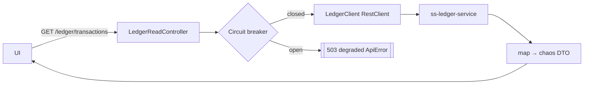

# Task 002 - Ledger Read Proxy

## Functional Requirements
- Surface ledger-owned reads (accounts, balances, transactions/journal) through the gateway as
  chaos DTOs, with resilience (timeouts, retries, circuit breaker), so the UI's virtual-account
  and transaction pages have a single backend to call. (See [ADR-003](../../decisions/003-backend-as-single-api-gateway.md).)

## Acceptance Criteria
- [ ] `GET /api/v0/ledger/accounts` (filter by ownership/org/status, paginated) proxies the
      ledger's account list.
- [ ] `GET /api/v0/ledger/accounts/{id}` and `/balances` proxy single account + balances.
- [ ] `GET /api/v0/ledger/transactions` proxies transactions, filterable by VA id, type,
      correlation id, date range (powers Phase 005 transactions page).
- [ ] The caller's bearer token is forwarded (or a service token attached) per ledger auth needs.
- [ ] Ledger slowness/outage → circuit breaker opens → `503` degraded response (no hang);
      recovers automatically.
- [ ] Responses are chaos DTOs (stable UI contract), not raw ledger payloads.

## Technical Design
- `ledgerproxy/LedgerClient` — Spring `RestClient` to `ledger.base-url` (`/api/v0/...` on the
  ledger). Dedicated builder: connect/read timeouts, a retry policy (idempotent GETs only,
  bounded, jittered backoff), and a circuit breaker.
- `ledgerproxy/LedgerReadController` — exposes the gateway endpoints; maps ledger DTOs → chaos
  response records; applies the chaos pagination contract.
- Resilience: prefer a small, proven library (Resilience4j) for circuit breaker + retry +
  time limiter; justify the dependency in-line (mirrors the ledger's resilience posture). If
  avoiding the dep, implement a minimal breaker around `RestClient`.
- Token propagation: forward the inbound `Authorization` header; if the ledger requires a
  service identity, attach a configured service token instead (config switch).

> Note: per-VA **published-event** history is served locally from `publish_record`
> (Phase 003 / Task 005). This proxy serves the ledger's **authoritative** account/transaction
> views. Phase 005 may show both: "what we sent" (local) and "what the ledger recorded" (proxy).

## Implementation Notes
- Package `com.softspark.chaos.ledgerproxy` (`LedgerClient`, `LedgerReadController`,
  `dto`, `mapper`, `LedgerResilience` config).
- Endpoint/path mapping is configurable (`ledger.paths.*`) to absorb ledger API differences.
- Map ledger errors → `ApiError`; never leak ledger URLs in messages.
- Cache short-lived read responses optionally (config) to reduce load during UI polling.

## Non-Functional Requirements
- Bounded timeouts (e.g. 3–5s); breaker thresholds + half-open probes via config.
- The gateway stays responsive while the ledger is degraded (fail fast, not hang) — essential
  since the chaos machine may itself be stressing that ledger.

## Dependencies
Phase 001 (web/error, config), Phase 004 Task 001 (auth to protect these endpoints).

## Risks & Mitigations
- *Cascading slowness from a stressed ledger* → circuit breaker + time limiter + degraded `503`.
- *Ledger API shape drift* → configurable paths + mapping layer + contract tests against
  recorded ledger responses.
- *Auth mismatch (user vs service token)* → config switch + tests for both modes.

## Testing Strategy
- `LedgerClient` tests with WireMock: success, 4xx/5xx, timeout, slow → breaker opens, recovery.
- Controller mapping tests (ledger DTO → chaos DTO) + pagination/filter passthrough.
- Resilience tests: breaker open→half-open→closed transitions; degraded `503` shape.

## Deployment Strategy
`ledger.base-url`, paths, timeouts, breaker config via env. Token-propagation mode per
environment. No migration.
