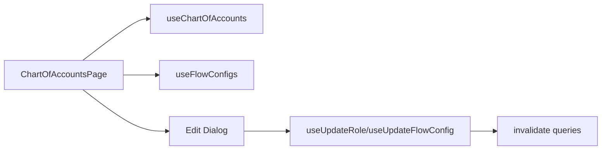

# Task 003 - Chart of Accounts Config Page

## Functional Requirements
- A page to view and edit the chart of accounts (account roles → code, category, currency,
  default VA) and to configure which account fills each slot of each transaction flow —
  consuming the Phase 002 APIs.

## Acceptance Criteria
- [ ] Lists all account roles with code, category, currency, default VA id, channel.
- [ ] Edit a role's default VA / currency / status via a shadcn `Dialog` form → `PUT
      /api/v0/chart-of-accounts/{role}`; react-query invalidates + refetches.
- [ ] A "Flow configuration" view lists each flow's slots with the resolved role/VA and lets the
      operator change them → `PUT /api/v0/flow-configs/{flowType}`.
- [ ] Validation + API errors render via `InlineNotice` from `ApiError`.
- [ ] Loading/empty/error use `TableLoadingRows` / `StatePanel` (swift-admin parity).

## Technical Design
- `features/chart-of-accounts/chart-of-accounts-page.tsx` — two tabs (shadcn `Tabs`): **Roles**
  and **Flow Slots**.
- Roles tab: `Table` of roles + edit `Dialog` (shadcn `Select` for default VA, fed by the
  virtual-accounts query).
- Flow Slots tab: per-flow cards/rows; each slot a `Select` of roles (or explicit VA);
  save per flow.
- Data hooks: `useChartOfAccounts()`, `useUpdateRole()`, `useFlowConfigs()`,
  `useUpdateFlowConfig()` (react-query; resource-based keys `["chart-of-accounts"]`,
  `["flow-configs"]`).

## Implementation Notes
- `features/chart-of-accounts/{components,hooks,types}`; API fns added to `lib/api.ts`.
- Reuse swift-admin `Table`, `Dialog`, `Select`, `Badge` primitives.
- Forms: `useState` + manual validation (swift-admin convention).

## Non-Functional Requirements
- Edits reflect immediately (optimistic or invalidate-refetch). Clear which VA each role maps to.

## Dependencies
Task 001/002; Phase 002 APIs (chart-of-accounts, flow-configs); virtual-accounts list (Task 004 hook).

## Risks & Mitigations
- *Selecting a non-existent VA* → Select sourced from the VA registry; server re-validates.

## Testing Strategy
- MSW tests: render roles + flow slots, edit role, edit flow slot, error rendering.

## Deployment Strategy
No flag.
