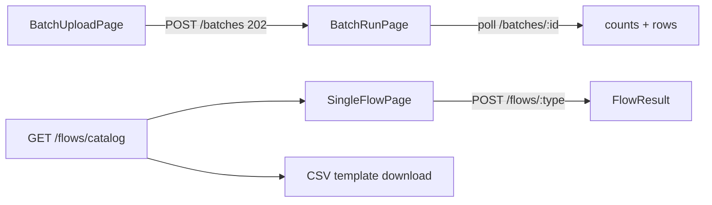

# Task 006 - Chaos Runner (Single & CSV)

## Functional Requirements
- An operator console to drive the ledger: build and send a **single** flow (any of the 12,
  with optional chaos options), and **upload a CSV** to run a batch — with live run progress and
  per-row outcomes. Realizes the UI half of the project objective ("test resilience in a
  controlled way").

## Acceptance Criteria
- [ ] **Single Flow** form: pick `flowType` (from `GET /api/v0/flows/catalog`), render its
      fields dynamically, with system VAs pre-filled from chart-of-accounts defaults (editable)
      → `POST /api/v0/flows/{flowType}`; show the `FlowResult` (event id, offset, history link).
- [ ] **Chaos options** panel: toggles for duplicate (count), out-of-order, malformed
      (mutation checklist), unbalanced (delta), burst (count + rate), delay (ms) — bounded by
      server caps; a confirm dialog for destructive options.
- [ ] **CSV Batch**: upload file + choose `flowType` (or MIXED) + optional rate → `POST
      /api/v0/batches` (`202`); navigate to a **Run** page polling `GET /api/v0/batches/{id}`.
- [ ] Run page shows counts (total/published/failed/invalid), status, and a paginated
      `batch_row` table with per-row errors; auto-refresh until terminal.
- [ ] A downloadable **CSV template** per flow (columns from the catalog).
- [ ] The targeted Kafka cluster label is shown prominently as a safety cue.

## Technical Design
- `features/chaos/single-flow-page.tsx` — `Select` flow + dynamic form from catalog metadata;
  `ChaosOptions` sub-form; `useMutation(runFlow)`.
- `features/chaos/batch-upload-page.tsx` — file input + flow select + rate; `useMutation(startBatch)`.
- `features/chaos/batch-run-page.tsx` — `useQuery(["batch", id], { refetchInterval: notTerminal ? 1500 : false })`;
  counts cards + `Table` of rows + `ListPagination`.
- `features/chaos/batches-page.tsx` — list past runs.
- Catalog-driven forms: a small renderer maps catalog field descriptors
  (`{name,type,required,default,slot}`) to inputs; numeric → amount inputs; enum → `Select`.

## Implementation Notes
- `lib/api.ts`: `getFlowCatalog`, `runFlow`, `startBatch` (multipart), `getBatch`,
  `listBatchRows`, `listBatches`.
- Multipart upload via `FormData` (bypass JSON content-type in the api client for this call).
- Chaos caps fetched from `GET /flows/catalog` or `/meta`; client-side validate before submit;
  destructive options behind a shadcn `Dialog` confirm.
- Reuse `Table`/`ListPagination`/`StatePanel`/`Badge`/`Tabs`/`Dialog` primitives.

## Non-Functional Requirements
- Polling stops at terminal status; no tight loops. Large CSVs upload with progress + size cap.
- Clear, bounded, opt-in chaos UX; target-cluster label always visible.

## Dependencies
Task 001/002; Phase 003 (flows catalog, single publish, batches, chaos); the gateway base URL.

## Risks & Mitigations
- *Accidental destructive run in prod* → visible target label + confirm dialog + server caps + auth.
- *Catalog/UI drift* → forms are fully catalog-driven (server is the source of truth).
- *Polling cost* → interval gated on non-terminal status; react-query dedupes.

## Testing Strategy
- MSW tests: catalog-driven form render per flow; single run + result; chaos option caps +
  confirm; CSV upload → run page polling → terminal; template download.

## Deployment Strategy
No flag. Caps + target label from the gateway. Auth-protected like the rest of the app.
