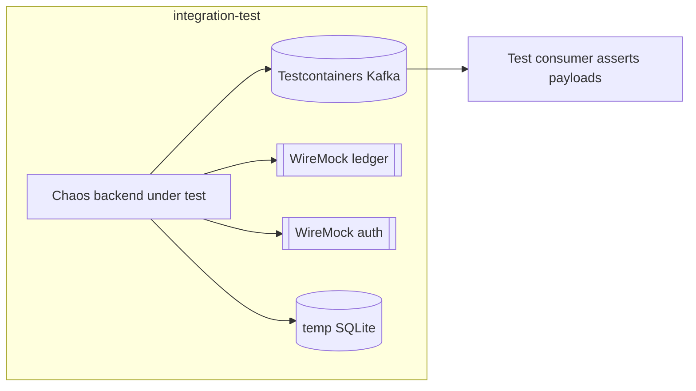

# Task 002 - Backend Integration Tests

## Functional Requirements
- Integration tests that exercise the backend against real infrastructure seams: an embedded
  Kafka broker (Testcontainers), a stubbed ledger + auth service (WireMock/`MockRestServiceServer`),
  and a real SQLite file — verifying end-to-end behavior, contracts, and resilience.

## Acceptance Criteria
- [ ] `./gradlew integrationTest` (separate `integration-test` source set, `@Tag("integration")`)
      is green and wired into `check` (mirrors the ledger's Gradle setup).
- [ ] **Publishing:** each flow publishes to the right topic; a console/consumer reads JSON
      identical to its fixture (all 12 flows, incl. `disbursement.completed`).
- [ ] **CoA HTTP bootstrap (Phase 007):** against WireMock ledger — happy path stores
      ledger-returned ids; `409` → adopts existing; 5xx/timeout retries; ledger-down → `PENDING`
      then reconcile → `PROVISIONED`; chaos DB holds real ids.
- [ ] **Persistence:** Flyway migrates a temp SQLite file; concurrent virtual-thread history
      writes persist with no `SQLITE_BUSY`.
- [ ] **Batch:** a small CSV runs end-to-end; per-row outcomes + run status correct; rate limit honored.
- [ ] **Chaos:** duplicate → N identical records; malformed → lands on DLT; out-of-order →
      sequence published in requested order; unbalanced flagged `intentional_failure`.
- [ ] **Auth/proxy:** protected endpoint rejects without token (stubbed verifier); ledger-proxy
      breaker opens on stubbed slowness → degraded `503`.

## Technical Design
- Testcontainers: `org.testcontainers:kafka` (broker), temp SQLite file per test class.
- WireMock: stub `ss-ledger-service` (`POST/GET /api/v0/accounts`, read endpoints) and the AUTH
  SERVICE (login + token-verification) to drive happy/error/timeout paths.
- Spring Boot test slices + `@SpringBootTest` with a `integration-test` profile; consume
  published events via a test consumer and assert payload equality vs `JsonFixtures`.

## Implementation Notes
- `src/integration-test/java/...`; reuse the ledger's `build.gradle` `integrationTest` task +
  `junit-platform.properties` tags. Tag heavy throughput/burst cases `integration-stress`.
- Share `JsonFixtures` with unit tests. Provide a `LedgerStub`/`AuthStub` WireMock fixture builder.
- Assert producer durability config (`acks=all`, idempotence) via an embedded admin/consumer.

## Non-Functional Requirements
- Integration suite completes in a few minutes; stress/burst behind `integration-stress` tag/flag.
- Hermetic: no reliance on a running ledger/broker outside the test.

## Dependencies
Task 001 fixtures; all backend phases for code under test; Testcontainers + WireMock deps
(integrationTest configuration, mirroring the ledger).

## Risks & Mitigations
- *Container startup cost/flakiness* → reuse containers per class; pin image versions
  (`apache/kafka` matching the ledger's bin default).
- *Contract drift* → fixture-based assertions for all 12 flows fail on drift.

## Deployment Strategy
`./gradlew integrationTest` in CI (part of `check`); `integrationStressTest` gated by CI/flag,
mirroring the ledger.
