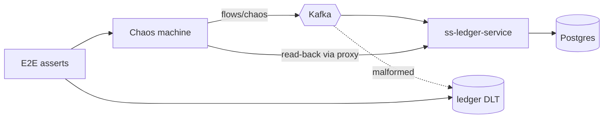

# Task 004 - End-to-End Chaos Verification

## Functional Requirements
- An opt-in end-to-end suite that runs the assembled chaos machine against a **real**
  `ss-ledger-service` + Kafka, drives representative flows and chaos strategies, and verifies the
  ledger's observable reactions — proving the harness achieves its objective: testing the
  ledger's resilience in a controlled way.

## Acceptance Criteria
- [ ] A compose/Testcontainers topology brings up Kafka + Postgres + `ss-ledger-service` + the
      chaos backend, and bootstraps the chart of accounts via HTTP (Phase 025).
- [ ] A well-formed run per representative flow (collection, **disbursement**, settlement
      sequence, treasury) is consumed and recorded by the ledger (assert via the ledger's read
      API through the proxy).
- [ ] **Idempotency:** a duplicate-chaos run yields a single net ledger effect.
- [ ] **Validation/DLT:** a malformed/unbalanced run is rejected/routed to the ledger DLT, not
      applied to balances.
- [ ] **Backpressure:** a bounded burst/CSV load completes without harness errors and within budget.
- [ ] The suite is gated (profile/tag/CI job), not part of the default PR gate.

## Technical Design
- Topology via `docker compose` (reuse the ledger's `bin/bootstrap.sh` images: `apache/kafka`,
  `postgres`) or Testcontainers `Compose`. Point the chaos machine at this Kafka + ledger.
- Scenarios scripted through the chaos machine's own API (`/api/v0/flows`, `/api/v0/batches`),
  then assertions read back through `/api/v0/ledger/*` (proxy) and the ledger DLT topics.

## Implementation Notes
- Keep scenarios declarative (a small scenario list: flow + chaos + expected ledger outcome).
- Reuse `JsonFixtures` and the bin scripts as a cross-check oracle.
- Tag `integration-stress` for the burst/backpressure scenario (mirrors the ledger's gating).
- Surface the targeted Kafka cluster label in assertions/logs (safety: never a shared/prod broker).

## Non-Functional Requirements
- Hermetic + ephemeral (compose up/down per run). Bounded runtime; burst scenario capped.
- Safe by construction: dedicated throwaway broker/DB; explicit target label.

## Dependencies
All phases assembled; `ss-ledger-service` image/build available; Phase 006 Tasks 001–003 green.

## Risks & Mitigations
- *Heavy/slow in CI* → opt-in job (nightly/manual), not the PR gate.
- *Ledger version skew* → pin the ledger image/tag; contract tests (Task 002) guard schemas.
- *Flaky async timing* → poll with bounded timeouts on the read-back, not fixed sleeps.

## Deployment Strategy
Dedicated CI job (nightly/manual) or local `make e2e`. Never targets shared infrastructure;
spins its own Kafka/Postgres/ledger.
