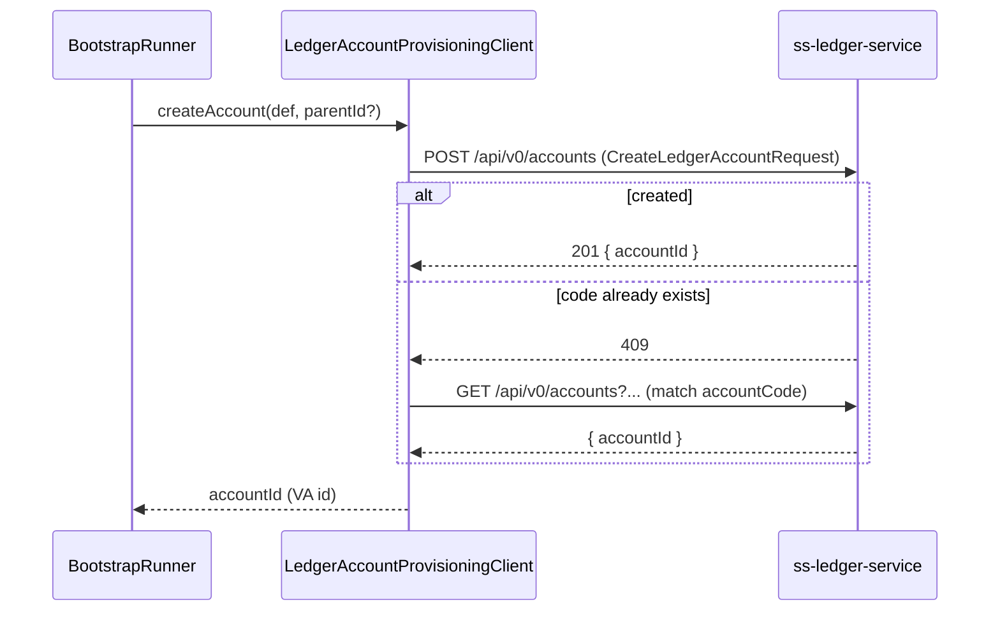

# Task 002 - Ledger Account Provisioning Client

## Functional Requirements
- An HTTP client that creates a SYSTEM account in `ss-ledger-service` and returns its
  ledger-assigned `accountId` (the VA id) — and that can look up an existing account by code so
  provisioning is idempotent.

## Acceptance Criteria
- [ ] `createAccount(SystemAccountDefinition, parentAccountId?)` issues `POST /api/v0/accounts`
      with the ledger's `CreateLedgerAccountRequest` shape and returns the response `accountId`.
- [ ] A ledger `409`/conflict (account code already exists) is **not** an error: the client
      resolves the existing account by code and returns its `accountId`.
- [ ] `findAccountByCode(code)` queries `GET /api/v0/accounts` (filtering by ownership/category)
      and matches on `accountCode`, returning the `accountId` if present.
- [ ] Transient ledger failures (5xx, timeouts) are retried with bounded backoff; persistent
      failure surfaces a typed `LedgerProvisioningException`.
- [ ] The request is authenticated per the ledger's needs (forwarded token or configured
      service credentials), consistent with Phase 004 Task 002.

## Technical Design
Request/response mirror the ledger DTOs exactly:

```
POST /api/v0/accounts
CreateLedgerAccountRequest {
  accountCode, accountName, accountCategory,        // strings (enums by name)
  currency, parentAccountId?, overdraftLimit?,
  minimumBalance?, accountOwnershipType, organizationId?   // organizationId null for SYSTEM
}
→ 201 LedgerAccountResponse { accountId (UUID), accountCode, accountName, accountCategory,
                              normalBalance, currency, status, accountOwnershipType, ... }
```



- Built on Spring `RestClient` with a dedicated builder: connect/read timeouts, bounded retry
  (idempotent create is safe because a duplicate code 409s → adopt-existing), and the same
  circuit-breaker posture as the Phase 004 ledger proxy.
- `accountOwnershipType = SYSTEM`, `organizationId = null` for all bootstrap accounts.
- Maps ledger validation errors (`400`) to `LedgerProvisioningException` with the field detail
  so misconfigured codes are diagnosable.

## Implementation Notes
- Package `account/bootstrap/LedgerAccountProvisioningClient` (or `ledgerproxy` if colocating
  ledger HTTP concerns). Reuse the Phase 004 `LedgerClient` builder/resilience config.
- Lookup-by-code: if the ledger lacks a direct code filter, page `GET /api/v0/accounts` filtered
  by `accountOwnershipType=SYSTEM` (+ category) and match client-side; cache within a run.
- Never log tokens; do log `role → accountId` at INFO for traceability.

## Non-Functional Requirements
- Bounded timeouts (3–5s) + retry; a slow ledger must not hang startup beyond the configured budget.
- Idempotent: re-invoking for an existing code returns the same id without creating duplicates.

## Dependencies
Task 001 (definitions), Phase 001 (config), Phase 004 Task 002 (RestClient/resilience + auth mode).

## Risks & Mitigations
- *No server-side code filter* → client-side match with paging; documented assumption, covered by tests.
- *Auth mode mismatch (user vs service token)* → config switch shared with Phase 004; both tested.
- *Retry creating duplicates* → safe: duplicate code 409s → adopt-existing path.

## Testing Strategy (intent; implemented in Phase 006)
- WireMock ledger: 201 happy path; 409 → lookup-and-adopt; 5xx/timeout retry; 400 → typed error.

## Deployment Strategy
`ledger.base-url`, account path, timeouts, auth mode via env (shared with Phase 004).
