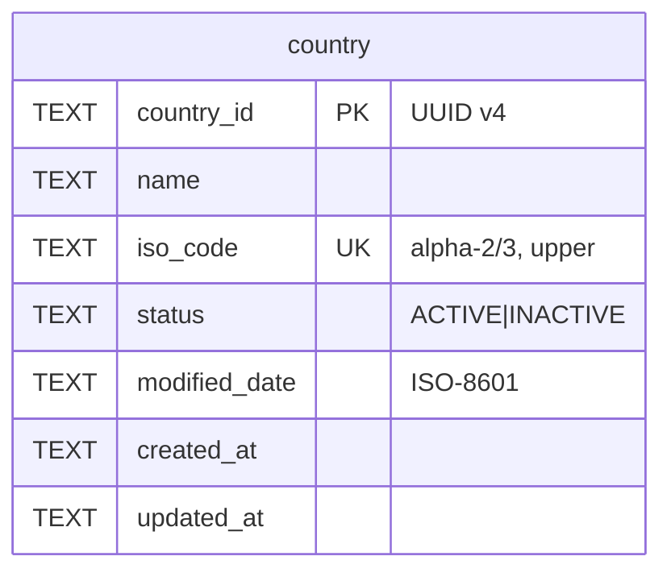

# Task 001 - Country Master Data & API

## Functional Requirements
- Provide a `country` resource with fields: `id` (UUID v4, server-assigned), `name`, `iso_code`,
  `status`, `modified_date`, plus audit `created_at` / `updated_at`.
- Support: **create**, **list** (paginated), **get by id**, **update** (name, iso_code, status).
- `iso_code` is unique and accepts ISO 3166-1 **alpha-2 or alpha-3** (length 2–3, upper-cased).
- `status` is a constrained enum (`ACTIVE` | `INACTIVE`).
- `modified_date` reflects the last business modification time; default it to the create/update
  instant unless the caller supplies one.

## Acceptance Criteria
- [ ] `POST /api/v0/countries` with `{name, iso_code, status?}` returns `201` with the full country
      incl. a server-generated UUID v4 `id` and `modified_date`.
- [ ] Creating a second country with an existing `iso_code` returns `409 Conflict`.
- [ ] `iso_code` shorter than 2 or longer than 3 chars returns `400` with a field error.
- [ ] `status` outside the enum returns `400`.
- [ ] `GET /api/v0/countries` returns a `PageResponse<CountryResponse>`; `GET …/{id}` returns the
      country or `404`.
- [ ] `PUT …/{id}` updates name/iso_code/status, bumps `modified_date` + `updated_at`, and keeps
      uniqueness on `iso_code`.
- [ ] Flyway `V5` creates the `country` table; app boots clean.

## Technical Design
Target **Java 25 / Spring Boot 4** (per [ADR-001](../../decisions/001-target-java-25-and-spring-boot-4.md)),
mirroring the VirtualAccount CRUD conventions. New package `com.softspark.chaos.organization`.



- **Entity** `Country extends AuditableEntity` — `@Id` `country_id`; `@Enumerated(STRING)` status;
  `modified_date` an `Instant` via the existing `InstantStringConverter`.
- **Enum** `CountryStatus { ACTIVE, INACTIVE }`.
- **Id**: `java.util.UUID.randomUUID().toString()` in the service on create
  ([ADR-010](../../decisions/010-uuid-v4-ids-for-organization-domain.md)) — do **not** use
  `base/Ids`.
- DTOs are `@RecordBuilder record`s; validate with `@NotBlank`, `@Size(min=2,max=3)`,
  `@IsInEnum(enumClass = CountryStatus.class)` (reuse the existing custom validator).
- Pagination via `PageRequest` → `Page` → `PageResponse` wrapper (as in `VirtualAccountService`).
- Errors via the existing `@ControllerAdvice` (`GlobalExceptionHandler`) using
  `ConflictException` / `NotFoundException` / `BadRequestException`.

## Implementation Notes
Files to create (under `chaos-machine/src/main/java/com/softspark/chaos/organization/`):
- `model/Country.java` — JPA entity, `@Table(name = "country")`.
- `enumeration/CountryStatus.java`.
- `repository/CountryRepository.java` — `JpaRepository<Country, String>` +
  `boolean existsByIsoCode(String)` / `Optional<Country> findByIsoCode(String)`.
- `dto/CreateCountryRequest.java`, `dto/UpdateCountryRequest.java`, `dto/CountryResponse.java`.
- `service/CountryService.java` — `@Transactional` create/update, `@Transactional(readOnly=true)`
  reads; uppercases `iso_code`; sets UUID id + `modified_date`; conflict on duplicate iso.
- `controller/CountryController.java` — `@RestController @RequestMapping("/api/v0/countries")`,
  `@Tag(name = "Countries", ...)`, springdoc `@Operation` annotations, `@Valid` bodies.

Migration: `chaos-machine/src/main/resources/db/migration/V5__organization_onboarding.sql` (shared
across tasks 001–004; this task adds the `country` table + `UNIQUE(iso_code)`).

```sql
CREATE TABLE IF NOT EXISTS country (
    country_id TEXT PRIMARY KEY,
    name TEXT NOT NULL,
    iso_code TEXT NOT NULL UNIQUE,
    status TEXT NOT NULL,
    modified_date TEXT NOT NULL,
    created_at TEXT NOT NULL,
    updated_at TEXT NOT NULL
);
```

No new dependencies.

## Non-Functional Requirements
- Reads are paginated; default page size consistent with existing list endpoints.
- `iso_code` uniqueness enforced at the DB (unique index) **and** checked in-service for a clean
  `409` rather than a raw constraint violation.
- All endpoints require a verified AUTH SERVICE token (inherited global security).

## Dependencies
None (independent of Task 002). Shares the `V5` migration file with Tasks 002–004 — coordinate so
all three tables land in one migration version.

## Risks & Mitigations
- **Migration-file contention** across parallel tasks 001/002/004 → agree that `V5` is one file;
  append table DDL per task in task order (country → organization_type → organization alters →
  outbox_event). Never split into `V5`/`V5.1`.
- **iso_code casing inconsistency** → normalize to upper-case in the service before persist/compare.

## Testing Strategy
JUnit 5 + AssertJ + Mockito for the service (duplicate iso → conflict, iso length validation,
UUID + modified_date assignment, status enum parsing). `@WebMvcTest` for the controller
(validation + status codes). Repository slice optional. (Implemented in
[Phase 006](../006-testing-and-verification/DESIGN.md).)

## Deployment Strategy
Ships with Flyway `V5` (additive). No flag needed — a new resource with no consumers until the
frontend (Task 005) and onboarding (Task 003) use it.
