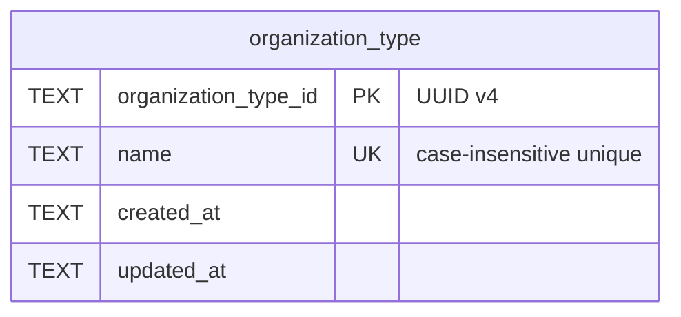

# Task 002 - Organization Type Master Data & API

## Functional Requirements
- Provide an `organization_type` resource with fields: `id` (UUID v4, server-assigned), `name`,
  plus audit `created_at` / `updated_at`.
- Support: **create**, **list** (paginated), **get by id**, **update** (name).
- `name` is unique (case-insensitive) and required.

## Acceptance Criteria
- [ ] `POST /api/v0/organization-types` with `{name}` returns `201` with a server-generated UUID v4
      `id`.
- [ ] Creating a type whose `name` already exists (case-insensitive) returns `409 Conflict`.
- [ ] Blank/missing `name` returns `400`.
- [ ] `GET /api/v0/organization-types` returns `PageResponse<OrganizationTypeResponse>`;
      `GET …/{id}` returns the type or `404`.
- [ ] `PUT …/{id}` renames the type (keeping uniqueness) and bumps `updated_at`.
- [ ] Flyway `V5` creates the `organization_type` table; app boots clean.

## Technical Design
Target **Java 25 / Spring Boot 4**. Same CRUD shape as Task 001, simpler (two business fields).
Package `com.softspark.chaos.organization`.



- **Entity** `OrganizationType extends AuditableEntity` — `@Id` `organization_type_id`.
- **Id**: `java.util.UUID.randomUUID().toString()` on create
  ([ADR-010](../../decisions/010-uuid-v4-ids-for-organization-domain.md)).
- DTOs are `@RecordBuilder record`s; `@NotBlank` `name`.
- Uniqueness: DB unique index on `name` plus an in-service case-insensitive existence check for a
  clean `409`. (SQLite `TEXT` comparison is case-sensitive by default — compare on a normalized
  form, e.g. store as-entered but check via `findByNameIgnoreCase`.)

## Implementation Notes
Files to create (under `chaos-machine/src/main/java/com/softspark/chaos/organization/`):
- `model/OrganizationType.java` — `@Table(name = "organization_type")`.
- `repository/OrganizationTypeRepository.java` — `JpaRepository<OrganizationType, String>` +
  `Optional<OrganizationType> findByNameIgnoreCase(String)`.
- `dto/CreateOrganizationTypeRequest.java`, `dto/UpdateOrganizationTypeRequest.java`,
  `dto/OrganizationTypeResponse.java`.
- `service/OrganizationTypeService.java` — create/update/list/get with conflict handling.
- `controller/OrganizationTypeController.java` —
  `@RequestMapping("/api/v0/organization-types")`, `@Tag(name = "Organization Types", ...)`.

Migration: append the `organization_type` DDL to the shared
`V5__organization_onboarding.sql` (after the `country` table from Task 001).

```sql
CREATE TABLE IF NOT EXISTS organization_type (
    organization_type_id TEXT PRIMARY KEY,
    name TEXT NOT NULL UNIQUE,
    created_at TEXT NOT NULL,
    updated_at TEXT NOT NULL
);
```

No new dependencies.

## Non-Functional Requirements
- Paginated reads; AUTH-protected endpoints (inherited).
- Case-insensitive uniqueness handled deterministically (see Technical Design).

## Dependencies
None (independent of Task 001). Shares the `V5` migration file — coordinate ordering per Task 001's
Risks note.

## Risks & Mitigations
- **SQLite case-sensitive UNIQUE** may not catch `Business` vs `business` at the DB → enforce via
  the service `findByNameIgnoreCase` check; optionally add `COLLATE NOCASE` to the column for
  defense in depth.

## Testing Strategy
JUnit 5 + AssertJ + Mockito service tests (duplicate name case-insensitive → conflict, UUID
assignment, blank-name validation); `@WebMvcTest` controller tests. (Implemented in
[Phase 006](../006-testing-and-verification/DESIGN.md).)

## Deployment Strategy
Ships with Flyway `V5` (additive). No flag needed.
