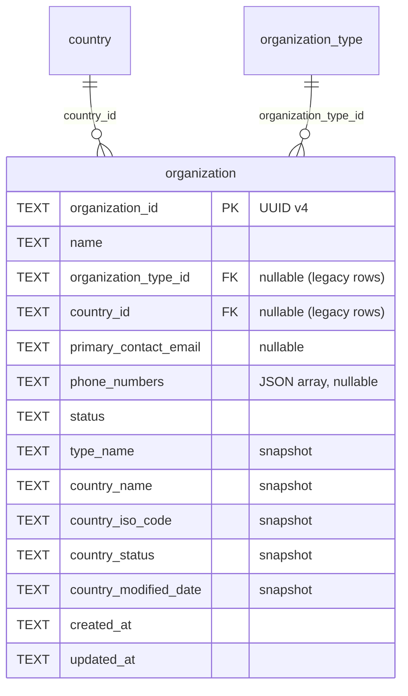
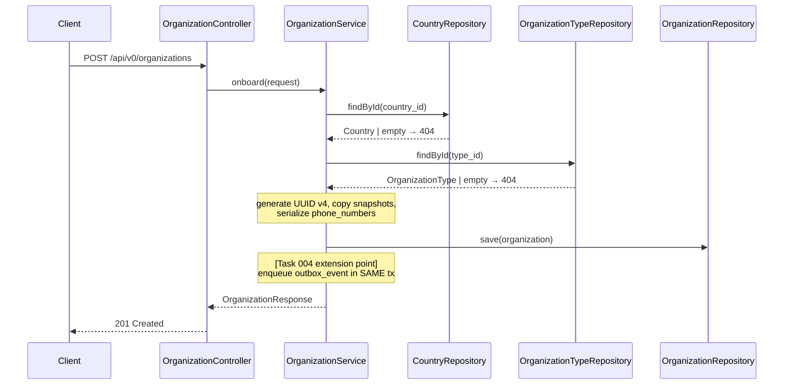

# Task 003 - Organization Onboarding Persistence & API

## Functional Requirements
- Refactor the existing `organization` table/entity to the idea-`001` shape, adding:
  `organization_type_id` (FK → `organization_type`), `country_id` (FK → `country`),
  `primary_contact_email`, `phone_numbers` (JSON array of strings), and **point-in-time snapshot**
  columns `type_name`, `country_name`, `country_iso_code`, `country_status`,
  `country_modified_date` (keep/extend the existing `type_name`/`country_*` snapshot columns).
- Provide an onboarding API: **create (onboard)**, **list** (paginated), **get by id**.
- On onboard: validate the referenced country + type exist, generate a UUID v4 `id`, copy the
  referenced reference-data values into the snapshot columns, persist, and return the org.
- Preserve the legacy VA-driven create-on-demand path (`VirtualAccountService` /
  `VirtualAccountAnnouncer`) — those rows have null FKs/contact fields and must remain valid.
- This task **persists** the org and exposes the API; the automatic event publication is added in
  [Task 004](./004-transactional-outbox-and-relay.md) at a clearly marked extension point in the
  onboard transaction.

## Acceptance Criteria
- [ ] `POST /api/v0/organizations` with `{name, organization_type_id, country_id,
      primary_contact_email?, phone_numbers?, status?}` returns `201` with a UUID v4 `id` and the
      resolved snapshot fields (`type_name`, `country_name`, `country_iso_code`, `country_status`,
      `country_modified_date`).
- [ ] Onboarding with an unknown `country_id` or `organization_type_id` returns `404` (or `400`)
      and persists nothing.
- [ ] `phone_numbers` round-trips: an array in → the same array out; `[]` and absent both accepted.
- [ ] Invalid `primary_contact_email` (when provided) returns `400`; `status` outside
      `OrganizationStatus` returns `400`.
- [ ] `GET /api/v0/organizations` returns `PageResponse<OrganizationResponse>`; `GET …/{id}`
      returns the org or `404`.
- [ ] Flyway `V5` alters `organization` (adds nullable columns) without breaking existing rows or
      the VA-driven path.
- [ ] Existing VA-creation tests still pass (org create-on-demand unaffected).

## Technical Design
Target **Java 25 / Spring Boot 4**. The org references reference data by FK but snapshots its
values at onboard time ([ADR-008](../../decisions/008-organization-onboarding-domain-model.md)).





- **Entity** `Organization` (existing, at
  `account/model/Organization.java`) gains the new fields. **Decision:** move the canonical entity
  into the new `organization` package or keep it in `account` and reuse? Keep the JPA entity where
  it is to avoid breaking the VA path imports, but add the new columns; the new
  `organization` package holds the onboarding controller/service/DTOs/repository-extensions.
  (Record this choice in the PR; the simplest is to relocate `Organization` + `OrganizationStatus`
  + `OrganizationRepository` into `organization/` and update the two `account` references —
  prefer relocation for package cohesion if low-risk.)
- **phone_numbers**: `List<String>` persisted via a JPA `AttributeConverter`
  `JsonStringListConverter` (`@Converter`) serializing with the app `ObjectMapper` to a JSON string
  in a `TEXT` column. Place in `base/` (reusable) next to `InstantStringConverter`.
- **Id**: UUID v4 ([ADR-010](../../decisions/010-uuid-v4-ids-for-organization-domain.md)).
- **Snapshots**: copy `country.name/iso_code/status/modified_date` and `type.name` into the org at
  onboard; never re-derive on read.
- DTOs (`@RecordBuilder`): `CreateOrganizationRequest`
  (`@NotBlank name`, `@NotBlank organization_type_id`, `@NotBlank country_id`,
  `@Email primary_contact_email` optional, `List<String> phone_numbers` optional,
  `@IsInEnum(OrganizationStatus.class) status` optional, default `ACTIVE`), `OrganizationResponse`.

## Implementation Notes
Files (under `chaos-machine/src/main/java/com/softspark/chaos/organization/`):
- `service/OrganizationService.java` — `onboard()`, `list()`, `get()`; FK validation; snapshot
  copy; UUID id; leaves the Task-004 enqueue hook (a no-op/interface call until 004 lands).
- `controller/OrganizationController.java` — `@RequestMapping("/api/v0/organizations")`,
  `@Tag(name = "Organizations", ...)`, `@Valid` create body, `201 Created`.
- `dto/CreateOrganizationRequest.java`, `dto/OrganizationResponse.java`.
- `repository/OrganizationRepository.java` — relocate/extend the existing repo (paginated `findAll`).
- `base/JsonStringListConverter.java` — `AttributeConverter<List<String>, String>`.

Modify:
- `account/model/Organization.java` — add fields + getters/setters (or relocate to `organization/`).
- `account/service/VirtualAccountService.java` + `VirtualAccountAnnouncer.java` — adjust imports if
  the entity/repo is relocated; behavior unchanged.
- `db/migration/V5__organization_onboarding.sql` — append `ALTER TABLE organization ADD COLUMN …`
  for each new nullable column (SQLite supports one column per `ALTER TABLE ADD COLUMN`).

```sql
ALTER TABLE organization ADD COLUMN organization_type_id TEXT REFERENCES organization_type(organization_type_id);
ALTER TABLE organization ADD COLUMN country_id TEXT REFERENCES country(country_id);
ALTER TABLE organization ADD COLUMN primary_contact_email TEXT;
ALTER TABLE organization ADD COLUMN phone_numbers TEXT;
ALTER TABLE organization ADD COLUMN country_status TEXT;
ALTER TABLE organization ADD COLUMN country_modified_date TEXT;
-- type_name, country_name, country_iso_code already exist (V2).
CREATE INDEX IF NOT EXISTS idx_organization_country_id ON organization(country_id);
CREATE INDEX IF NOT EXISTS idx_organization_type_id ON organization(organization_type_id);
```

No new dependencies (Jackson `ObjectMapper` already present).

## Non-Functional Requirements
- FK validation happens before any write; onboarding is `@Transactional` so a later failure (incl.
  the Task-004 outbox insert) rolls back the org.
- New columns are nullable → backward compatible with the VA-driven path; no data backfill.
- AUTH-protected endpoints (inherited).

## Dependencies
- **Task 001** (country) and **Task 002** (organization_type) — onboarding FKs and validates both.
- Shares the `V5` migration file (org alters appended after the two `CREATE TABLE`s).

## Risks & Mitigations
- **Relocating the `Organization` entity** could ripple into the VA path → if risk is non-trivial,
  leave the entity in `account/` and only add columns; the onboarding service can still depend on
  it. Decide based on the actual import graph.
- **SQLite `ALTER TABLE` limitations** (no add-column-with-FK enforcement at runtime; FK checks
  may be off) → declare the FK in DDL for documentation; enforce existence in the service, which is
  the real guard.
- **Snapshot vs live divergence** is intentional but can confuse consumers → document in the
  response DTO Javadoc that snapshot fields are onboard-time values.

## Testing Strategy
JUnit 5 + AssertJ + Mockito: onboard happy path (snapshots copied, UUID set), unknown country/type
→ 404 and no save, `JsonStringListConverter` round-trip (incl. empty + multi), email/status
validation. `@WebMvcTest` controller tests. Regression: existing VA-creation service tests stay
green. (Implemented in [Phase 006](../006-testing-and-verification/DESIGN.md).)

## Deployment Strategy
Ships with Flyway `V5` (additive, nullable columns). The onboarding endpoint is live but emits no
event until [Task 004](./004-transactional-outbox-and-relay.md) wires the outbox.
