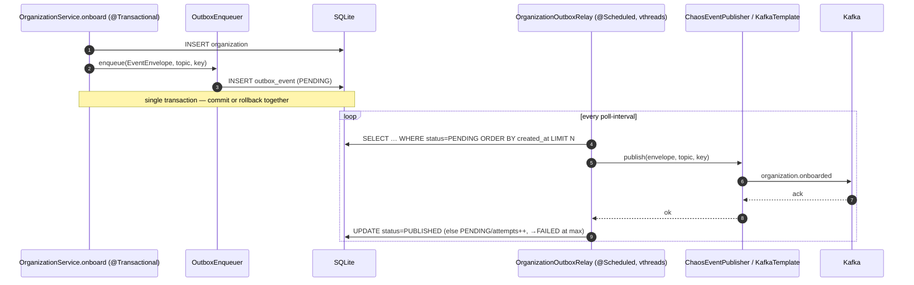

# Task 004 - Transactional Outbox & `organization.onboarded` Relay

## Functional Requirements
- On organization onboard (Task 003), atomically insert an `outbox_event` row — in the **same DB
  transaction** as the org row — carrying a fully-built `EventEnvelope<OrganizationOnboardedEventData>`
  serialized to JSON, the topic, the partition key, and status `PENDING`.
- A scheduled **relay** claims `PENDING` rows in creation order, publishes each to Kafka via the
  existing idempotent producer, and marks the row `PUBLISHED` on broker ack. Failures leave the row
  `PENDING` (retried) and increment an attempt counter; after a max attempt count the row goes
  `FAILED` (still retained for inspection).
- The published envelope must **match the authoritative ss-ledger-service contract**
  (`../ss-ledger-service/bin/publish-organization-onboarded.sh`) field-for-field.
- Extend `OrganizationOnboardedEventData.Country` to include `status` and `modified_date` (it
  currently has only `id`, `name`, `iso_code`).
- Retain a **stable** `event_id` and `idempotency_key` across retries (no regeneration on re-send).

## Acceptance Criteria
- [ ] Onboarding writes the `organization` row and one `outbox_event` row atomically; if either
      insert fails, neither persists (no phantom event).
- [ ] The relay publishes the `PENDING` event to the `organization.onboarded` topic and flips the
      row to `PUBLISHED`; a `kafka-console-consumer` payload equals the contract sample's structure.
- [ ] The serialized `data.country` includes `status` and `modified_date`; `data.type` is
      `{id,name}`; `phone` is a JSON array; `metadata.idempotency_key` ==
      `"organization-onboarded:<event_id>"`; `source` == `organization-service`; `version` ==
      `1.0`; `event_type` == `organization.onboarded`.
- [ ] Broker unavailable when the relay runs → row stays `PENDING`, no exception escapes, retried
      next tick; once the broker returns, the event publishes.
- [ ] Re-running the relay over an already-`PUBLISHED` row does not double-publish; a crash before
      the `PUBLISHED` write re-sends with the **same** `event_id`/`idempotency_key`.
- [ ] The onboarding response includes the enqueued `eventId`.
- [ ] The manual chaos flow for `organization.onboarded` is unchanged and still works.

## Technical Design
Target **Java 25 / Spring Boot 4**. Implements the outbox pattern from
[ADR-009](../../decisions/009-transactional-outbox-for-organization-onboarded.md), reusing the
idempotent Kafka producer ([ADR-004](../../decisions/004-event-envelope-and-kafka-publishing.md))
and `TopicCatalog`.



- **`outbox_event` entity** (`organization/outbox/OutboxEvent.java`, extends `AuditableEntity`):
  `outbox_id` (UUID v4 PK), `aggregate_type` (`ORGANIZATION`), `aggregate_id` (organization id),
  `event_id`, `event_type` (topic), `partition_key`, `payload_json` (`TEXT`, the serialized
  envelope), `status` (`OutboxStatus { PENDING, PUBLISHED, FAILED }`), `attempts` (INTEGER),
  `last_error` (`TEXT`, nullable), `published_at` (nullable). Index on `(status, created_at)`.
- **Envelope assembly** lives in a shared component (e.g. `OrganizationOnboardedEnvelopeFactory`)
  reused by both onboarding and — ideally — the existing `OrganizationOnboardedFlowBuilder`, so the
  two producers cannot drift. It builds the same `EventEnvelope<OrganizationOnboardedEventData>`:
  - `id/name/status` from the org; `type {id,name}` from the type snapshot; `country
    {id,name,iso_code,status,modified_date}` from the country snapshots; `primary_contact_email`
    and `phone[]` from the org; `source = "organization-service"`, `version = "1.0"`.
  - `metadata = {correlation_id (from request/MDC), idempotency_key =
    "organization-onboarded:" + eventId, tenant_id}`.
  - topic via `TopicCatalog.topicFor(FlowType.ORGANIZATION_ONBOARDED)`; partition key = org id.
- **Enqueuer** serializes the envelope with the app `ObjectMapper` and inserts the row in the
  onboarding transaction (called from the Task-003 extension point).
- **Relay** `@Scheduled(fixedDelayString = "${chaos.organization.outbox.poll-interval:1s}")`,
  gated by `@ConditionalOnProperty("chaos.organization.outbox.enabled", default true)`, runs claims
  on the virtual-thread executor ([ADR-007](../../decisions/007-csv-batch-execution-model.md)). It
  deserializes `payload_json` back to `EventEnvelope` (or publishes the raw JSON string) and sends
  via `ChaosEventPublisher`. Mark `PUBLISHED` only after ack.

## Implementation Notes
Files (under `chaos-machine/src/main/java/com/softspark/chaos/organization/outbox/`):
- `OutboxEvent.java`, `OutboxStatus.java`, `OutboxEventRepository.java`
  (`findByStatusOrderByCreatedAtAsc(OutboxStatus, Pageable)` + a claim update).
- `OutboxEnqueuer.java` — builds nothing itself; takes the envelope + topic + key, serializes,
  inserts `PENDING`.
- `OrganizationOnboardedEnvelopeFactory.java` — single source of the envelope shape.
- `OrganizationOutboxRelay.java` — `@Scheduled` poller + publish + status transition.

Modify:
- `flow/model/v1/OrganizationOnboardedEventData.java` — add `status` and `modified_date` to the
  nested `Country` record (snake_case via the existing `@JsonNaming`; `iso_code` already mapped).
- `flow/builder/OrganizationOnboardedFlowBuilder.java` — populate the new `Country` fields (so the
  chaos path also matches the contract) and, if practical, delegate to the shared envelope factory.
- `OrganizationService.onboard` (Task 003) — call `OutboxEnqueuer` at the extension point; return
  the `eventId` in the response.
- `db/migration/V5__organization_onboarding.sql` — append the `outbox_event` DDL.
- Ensure `@EnableScheduling` is present (add a `@Configuration` if not already enabled).

```sql
CREATE TABLE IF NOT EXISTS outbox_event (
    outbox_id TEXT PRIMARY KEY,
    aggregate_type TEXT NOT NULL,
    aggregate_id TEXT NOT NULL,
    event_id TEXT NOT NULL,
    event_type TEXT NOT NULL,
    partition_key TEXT,
    payload_json TEXT NOT NULL,
    status TEXT NOT NULL,
    attempts INTEGER NOT NULL DEFAULT 0,
    last_error TEXT,
    published_at TEXT,
    created_at TEXT NOT NULL,
    updated_at TEXT NOT NULL
);
CREATE INDEX IF NOT EXISTS idx_outbox_status_created ON outbox_event(status, created_at);
```

Reference envelope (from `bin/publish-organization-onboarded.sh`):

```json
{
  "event_id": "<uuid>", "event_type": "organization.onboarded",
  "timestamp": "<iso>", "source": "organization-service", "version": "1.0",
  "data": {
    "id": "<org uuid>", "name": "Acme Limited",
    "type": { "id": "<uuid>", "name": "BUSINESS" },
    "country": { "id": "<uuid>", "name": "Ghana", "iso_code": "GH",
                 "status": "ACTIVE", "modified_date": "<iso>" },
    "primary_contact_email": "ops@acme.example",
    "phone": ["+233201234567"], "status": "ACTIVE"
  },
  "metadata": { "correlation_id": "<uuid>",
                "idempotency_key": "organization-onboarded:<event_id>",
                "tenant_id": "org_123" }
}
```

No new dependencies (Spring scheduling, Kafka producer, Jackson already present).

## Non-Functional Requirements
- **Reliability:** at-least-once delivery; rows are never deleted on failure, only re-tried. Single
  source of truth is the DB.
- **Idempotency:** stable `event_id` + `idempotency_key` across retries; ledger dedupes. Producer
  is `acks=all`, `enable.idempotence=true`.
- **Isolation:** relay runs off the request thread (virtual threads); a slow/broken broker never
  blocks onboarding requests.
- **Ordering:** best-effort by `created_at`; per-org ordering preserved via the org-id partition
  key. Claim batch bounded by `LIMIT N`.
- **Backpressure / poison rows:** `attempts` cap → `FAILED`, surfaced (log + count) rather than
  retried forever.

## Dependencies
- **Task 003** (onboarding write path + `OrganizationService.onboard` extension point).
- Existing `kafka` package (`ChaosEventPublisher`, `EventEnvelope`, `EventMetadata`,
  `TopicCatalog`) and `flow/model/v1/OrganizationOnboardedEventData`.
- Shares the `V5` migration (outbox table appended last).

## Risks & Mitigations
- **SQLite single-writer + concurrent relay/onboard** → keep the relay single-instance (this is a
  single-node harness); claim with a short transaction; `busy_timeout` already governs contention.
- **Producer/consumer envelope drift** between the chaos path and the outbox path → both go through
  `OrganizationOnboardedEnvelopeFactory`; add a contract test asserting against the sample JSON.
- **Double-publish on crash** → acceptable (idempotent consumer); document and rely on stable keys.
- **Relay silently stops** (unhandled exception in `@Scheduled`) → wrap each tick in try/catch, log,
  and expose a `PENDING`/`FAILED` count metric for alerting.

## Testing Strategy
- **Unit:** envelope factory produces the exact contract field set (golden-JSON comparison to the
  sample, incl. `country.status`/`modified_date`, `idempotency_key` form); status-transition logic;
  attempt-cap → `FAILED`.
- **Integration:** onboard → org + outbox row committed atomically; rollback emits nothing; relay
  publishes and flips to `PUBLISHED` (embedded/Testcontainers Kafka); broker-down keeps `PENDING`
  and recovers on retry; no double-publish for `PUBLISHED` rows.
- (Implemented in [Phase 006](../006-testing-and-verification/DESIGN.md).)

## Deployment Strategy
- Flyway `V5` additive. Relay enabled by default; disable via
  `chaos.organization.outbox.enabled=false` where onboarding events must not be emitted. Poll
  cadence via `chaos.organization.outbox.poll-interval`. Idempotent + retained rows make redeploys
  and broker blips safe.
