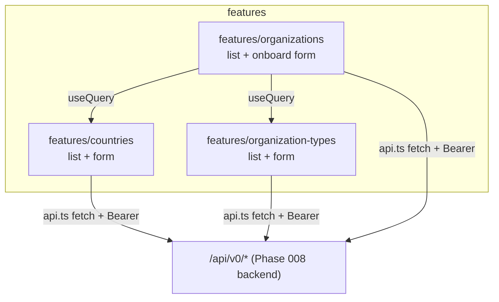

# Task 005 - Frontend Admin Pages (Countries, Org Types, Organizations)

## Functional Requirements
- Add three admin sections to the React UI, mirroring the Phase 005 conventions
  ([ADR-005](../../decisions/005-react-vite-shadcn-frontend.md)):
  - **Countries** — list + create + edit (name, iso_code, status).
  - **Organization Types** — list + create + edit (name).
  - **Organizations** — list + **onboard** (create) form (name, organization type [select],
    country [select], primary contact email, phone numbers [multi-entry], status).
- The onboarding form's type/country selects are populated from the Countries / Org-Types APIs.
- On successful onboard, surface the returned `eventId` (the enqueued `organization.onboarded`) so
  the operator can confirm the event was emitted, and invalidate the organizations list query.
- All pages sit behind the existing protected-route/auth shell and use the shared API client.

## Acceptance Criteria
- [ ] New nav entries route to Countries, Organization Types, and Organizations pages within the
      authenticated app shell.
- [ ] Countries page lists countries (paginated), creates a country, and edits one; duplicate
      `iso_code` surfaces the backend `409` as a readable error.
- [ ] Organization Types page lists/creates/edits types; duplicate name surfaces `409`.
- [ ] Organizations page lists organizations and onboards a new one via a form whose type/country
      fields are dropdowns sourced from the respective APIs; phone numbers accept multiple values.
- [ ] Onboard success shows the returned `eventId` and the new org appears in the list.
- [ ] Client-side validation (required fields, email format, iso length) matches the backend rules;
      server validation errors render via the shared `ApiError` handling.

## Technical Design
React 19 + Vite 6 + react-router 7 + react-query 5 + Tailwind + shadcn/ui, following the existing
`src/features/*` structure and `src/lib/api.ts` (fetch + Bearer + `ApiError`).

- Data fetching/mutations via react-query hooks (`useQuery` for lists/selects, `useMutation` +
  `queryClient.invalidateQueries` for create/edit). Reuse the existing query-key and error patterns
  from `features/chart-of-accounts` / `features/virtual-accounts`.
- Forms built from existing shadcn primitives (`input`, `select`, `button`, `dialog`/`card`,
  `table`); phone numbers as a small repeatable input list. Reuse `enum-badge` for statuses.
- Routes registered in `src/app/router.tsx`; nav entries in the app shell/sidebar.

## Implementation Notes
Files to create (under `chaos-admin/src/`):
- `features/countries/countries-page.tsx` (+ a create/edit form component).
- `features/organization-types/organization-types-page.tsx` (+ form).
- `features/organizations/organizations-page.tsx` and `onboard-organization-form.tsx`.
- Optional `lib/` query-key helpers consistent with existing features.

Modify:
- `src/app/router.tsx` — add the three routes (protected).
- App shell/sidebar nav — add Countries / Organization Types / Organizations links.

Follow the existing `features/chart-of-accounts/chart-of-accounts-page.tsx` and
`features/virtual-accounts/*` as the reference implementations for list/detail/create patterns,
pagination handling, and `ApiError` rendering. No new npm dependencies expected.

## Non-Functional Requirements
- Accessibility/consistency with existing shadcn components; loading/empty/error states handled as
  on current pages.
- No secrets in the client; talks only to the chaos backend gateway with the session Bearer token.

## Dependencies
- **Task 001** (countries API) and **Task 002** (org-types API) for those pages and the onboarding
  selects.
- **Task 003** (organizations API) for the onboarding page; **Task 004** for the returned `eventId`
  surfaced on success.
- Existing Phase 005 frontend scaffold (auth/session, api client, app shell).

## Risks & Mitigations
- **Backend not yet ready** during parallel work → mock the endpoints in react-query or develop
  against the OpenAPI/Swagger contract; integrate once 001–004 land.
- **Select option volume** (many countries) → simple paginated/typeahead select (the existing
  `command`/`popover` combobox primitives are available) rather than loading everything.

## Testing Strategy
Component/interaction tests per the Phase 006 frontend approach: form validation, successful
create/list, and rendering of a backend `409`/`400` as a readable error. (Implemented in
[Phase 006 / Task 003](../006-testing-and-verification/003-frontend-tests.md).)

## Deployment Strategy
Ships with the frontend bundle; no flag. Pages are inert until the Phase 008 backend endpoints are
deployed.
