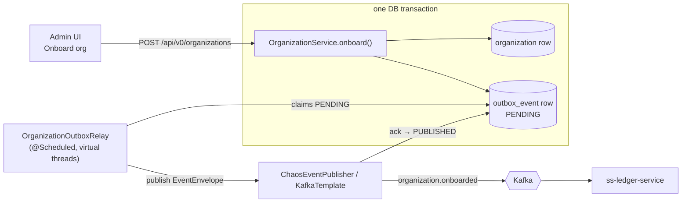

# Phase 008 - Organization Onboarding

## Summary
Turns organization onboarding into a first-class operation. Adds **Country** and
**Organization Type** master-data CRUD, refactors the `organization` entity to reference them by FK
(plus `primary_contact_email` and `phone_numbers`), and makes **creating an organization
automatically publish `organization.onboarded`** through a **transactional outbox** whose payload
matches the authoritative `ss-ledger-service` contract. Frontend admin pages expose all three.

## Motivation
Today the chaos machine has no managed reference data: `organization` is a denormalized table whose
`type_name`/`country_name`/`country_iso_code` are free strings, rows are created opportunistically
during VA creation, and `organization.onboarded` can only be emitted by hand through the chaos flow
runner with operator-typed flow fields and hardcoded defaults (`MERCHANT`, `Ghana`). Idea
`001_country_org_type_org_config.md` asks for proper countries, organization types, and an
organization onboarding flow that emits the event automatically and reliably — the realistic
"happy path" an operator can drive from the UI, alongside the existing chaos (fault-injection)
path.

## User-Facing Changes
New REST resources under `/api/v0` (Bearer-authenticated, same as all endpoints):

- `…/countries` — create / list / get / update (id, name, iso_code, status, modified_date).
- `…/organization-types` — create / list / get / update (id, name).
- `…/organizations` — **create (onboard)** / list / get. Create validates the referenced
  country + type, persists the org, and atomically enqueues an `organization.onboarded` event;
  a polling relay publishes it. Response returns the created org plus the enqueued `eventId`.

New admin UI pages: **Countries**, **Organization Types**, **Organizations** (onboarding form +
list), mirroring the Phase 005 frontend conventions.

The manual chaos flow for `organization.onboarded` is unchanged and still available for fault
injection.

## Architecture Impact
- New backend package `com.softspark.chaos.organization` (controller / dto / service / repository /
  model / enumeration) plus an `organization.outbox` subpackage (`OutboxEvent` entity +
  `OrganizationOutboxRelay`). See module map in [ARCHITECTURE.md §4](../../ARCHITECTURE.md).
- New tables via Flyway `V5`: `country`, `organization_type`, `outbox_event`; `organization`
  altered to add `organization_type_id`, `country_id`, `primary_contact_email`, `phone_numbers`,
  and `country_status` / `country_modified_date` snapshots.
- Identifiers for the three domain tables are **UUID v4** ([ADR-010](../../decisions/010-uuid-v4-ids-for-organization-domain.md)),
  diverging (scoped) from the house ULID `base/Ids` generator.
- Onboarding publishes via the **transactional outbox** ([ADR-009](../../decisions/009-transactional-outbox-for-organization-onboarded.md)),
  reusing the idempotent Kafka producer ([ADR-004](../../decisions/004-event-envelope-and-kafka-publishing.md))
  and snake_case `EventEnvelope` conventions, **not** the fire-and-forward chaos publisher.
- The domain model (FKs + snapshot columns + JSON phone storage) is captured in
  [ADR-008](../../decisions/008-organization-onboarding-domain-model.md).
- The `organization.onboarded` `country` payload is extended with `status` + `modified_date` to
  match the ledger contract (`../ss-ledger-service/bin/publish-organization-onboarded.sh`).

## Edge Cases
- **Onboard referencing a missing country/type** → `404`/`400`, no row, no outbox entry.
- **Roll back after enqueue** — org insert fails after outbox insert (or vice versa): the single
  transaction guarantees neither persists; no phantom event.
- **Broker down when relay runs** — `outbox_event` stays `PENDING`; retried next tick; never lost.
- **Crash between broker ack and `PUBLISHED` write** — re-send on restart (at-least-once); the
  stable `idempotency_key` (`organization-onboarded:<event_id>`) lets the ledger dedupe.
- **Reference-data edits after onboarding** — the org's snapshot columns (and the already-emitted
  event) are unchanged by later country/type renames or status flips (by design, [ADR-008](../../decisions/008-organization-onboarding-domain-model.md)).
- **Duplicate country `iso_code` / duplicate type `name`** — enforced unique at the DB + surfaced
  as `409 Conflict`.
- **`iso_code` is alpha-2 (`GH`) or alpha-3** — accept length 2–3; do not hard-pin to 3.
- **Legacy VA-driven org rows** — created with null FKs/contact fields; must remain valid
  (columns nullable); they do not produce onboarding events.
- **Empty / many `phone_numbers`** — stored as a JSON array (`[]` allowed); round-trips via the
  converter.

## Testing Strategy
> Implementation of these tests is consolidated in
> [Phase 006](../006-testing-and-verification/DESIGN.md); this states intent.
- **Unit:** country/type/org service validation (missing refs, duplicate iso/name, iso length),
  snapshot copying, `JsonStringListConverter` round-trip, UUID id generation, envelope assembly.
- **Contract:** assert the built `EventEnvelope<OrganizationOnboardedEventData>` serializes to the
  exact field set in `ss-ledger-service/bin/publish-organization-onboarded.sh` (incl. nested
  `country.status` + `country.modified_date`, `phone[]`, `idempotency_key` shape).
- **Integration:** onboarding writes org + outbox atomically; relay publishes and flips to
  `PUBLISHED`; broker-down leaves `PENDING` and recovers; rollback emits nothing
  (`@DataJpaTest` / Testcontainers Kafka or embedded broker).
- **Frontend:** form validation + create/list flows for the three pages.

## Deployment Strategy
- Flyway `V5` is additive (new tables + nullable columns) — safe forward migration, no backfill
  required for existing rows.
- Relay cadence configurable (`chaos.organization.outbox.poll-interval`, default e.g. `1s`) and the
  relay gated by a toggle (`chaos.organization.outbox.enabled`, default `true`) so it can be
  disabled in environments that should not emit onboarding events.
- No change to the chaos flow runner; the manual `organization.onboarded` path ships unchanged.

## Tasks
- [001 - Country master data & API](./001-country-master-data.md) — `country` table, entity, CRUD.
- [002 - Organization type master data & API](./002-organization-type-master-data.md) — `organization_type` table, entity, CRUD.
- [003 - Organization onboarding persistence & API](./003-organization-onboarding-api.md) — refactor `organization` (FKs, email, phone JSON, snapshots), onboard/list/get endpoints, reference validation.
- [004 - Transactional outbox & `organization.onboarded` relay](./004-transactional-outbox-and-relay.md) — `outbox_event` table, atomic enqueue, scheduled relay, contract-matching envelope.
- [005 - Frontend admin pages](./005-frontend-admin-pages.md) — Countries, Organization Types, Organizations onboarding UI.

## Parallel Tasks
- **001** and **002** are independent and can proceed in parallel (separate tables/endpoints).
- **003** depends on **001 + 002** (it FKs both and validates them on onboard).
- **004** depends on **003** (enqueues on the onboarding write path) and on extending the
  `OrganizationOnboardedEventData.Country` record; it integrates at `OrganizationService.onboard`.
- **005** depends on the corresponding backend endpoints: the Countries/Org-Types pages need
  001/002; the Organizations page needs 003 (and benefits from 004 for the returned `eventId`).

Recommended order: (001 ‖ 002) → 003 → 004 → 005.
