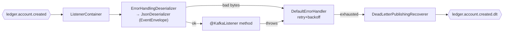

# Task 001 - Kafka Consumer Foundation (DLT + idempotent deserialization)

## Functional Requirements
- Introduce the chaos machine's **first Kafka consumer** infrastructure (the app is currently
  producer-only). Provide a reusable `ConcurrentKafkaListenerContainerFactory` that:
  - deserializes ledger `EventEnvelope<T>` payloads (snake_case, **no Jackson type headers** — the
    ledger publishes with `spring.json.add.type.headers=false`),
  - retries transient failures with bounded back-off,
  - routes poison/exhausted records to a **dead-letter topic**, reusing the ledger's existing
    `ledger.account.created.dlt`.
- Be toggleable and configurable (group id, concurrency, topics, enable flag) without code changes.

## Acceptance Criteria
- [ ] A `ConsumerFactory<String, Object>` + `ConcurrentKafkaListenerContainerFactory` bean exist,
      using `ErrorHandlingDeserializer` around a `JsonDeserializer` configured for the ledger
      envelope (snake_case, trusted packages, type pinned — not header-driven).
- [ ] A `DefaultErrorHandler` retries N times with exponential back-off, then a
      `DeadLetterPublishingRecoverer` publishes the failed record to `<topic>.dlt`
      (`ledger.account.created` → `ledger.account.created.dlt`).
- [ ] Consumer group id (`chaos.kafka.consumer.group-id`, default `chaos-machine`), concurrency,
      `auto-offset-reset` (default `earliest`), and an enable flag (`chaos.kafka.consumer.enabled`,
      default `true`) are configurable; when disabled, no listener container starts.
- [ ] A deserialization failure does **not** kill the container: the record is retried then DLT'd
      and the consumer continues.
- [ ] Consumer metrics (lag, DLT count) are exposed via the existing Micrometer/Actuator setup.

## Technical Design
Target **Java 25 / Spring Boot 4** (Spring for Apache Kafka). New package
`com.softspark.chaos.kafka` additions sit beside the existing producer
(`ProducerConfiguration`, `ChaosEventPublisher`, `EventEnvelope`, `EventMetadata`, `TopicCatalog`).



- **`ConsumerConfiguration`** — `@Configuration` defining `ConsumerFactory` and
  `ConcurrentKafkaListenerContainerFactory`. Value deserializer =
  `ErrorHandlingDeserializer(JsonDeserializer)`; the inner `JsonDeserializer` uses the app
  `ObjectMapper` (snake_case + `JavaTimeModule`), `USE_TYPE_INFO_HEADERS=false`, and a pinned
  default type set per-listener (the listener for `ledger.account.created` pins
  `EventEnvelope<LedgerAccountCreatedEventData>` via `@KafkaListener` generics / `JavaType`).
- **`DefaultErrorHandler`** with `ExponentialBackOffWithMaxRetries` and a
  `DeadLetterPublishingRecoverer` whose destination resolver appends `.dlt` to the source topic
  (so it lands on the ledger's pre-declared DLT). Non-retryable exceptions
  (`DeserializationException`, validation) are classified to go straight to the DLT.
- **`ConsumerProperties`** — `@ConfigurationProperties("chaos.kafka.consumer")`
  (`enabled`, `group-id`, `concurrency`, `auto-offset-reset`, retry `max-attempts`,
  `backoff-initial-ms`, `backoff-multiplier`).
- Topic names extend the existing `TopicCatalog` / `chaos.topics`:
  `ledger-account-created` (default `ledger.account.created`) and its `.dlt`.

## Implementation Notes
Files (under `chaos-machine/src/main/java/com/softspark/chaos/kafka/`):
- `ConsumerConfiguration.java` — factories + error handler + DLT recoverer.
- `ConsumerProperties.java` — `@ConfigurationProperties`.
- Extend `TopicCatalog.java` / `chaos.topics` with `ledgerAccountCreated` (+ `.dlt`).

Config (`application.yml`):
```yaml
spring:
  kafka:
    consumer:
      group-id: ${KAFKA_CONSUMER_GROUP:chaos-machine}
      auto-offset-reset: earliest
      key-deserializer: org.apache.kafka.common.serialization.StringDeserializer
      value-deserializer: org.springframework.kafka.support.serializer.ErrorHandlingDeserializer
chaos:
  kafka:
    consumer:
      enabled: true
      concurrency: 1
      max-attempts: 3
      backoff-initial-ms: 1000
      backoff-multiplier: 2.0
  topics:
    ledger-account-created: ledger.account.created
```
No new dependencies — `spring-kafka` is already on the classpath (producer side). This task adds
**only** consumer wiring; the actual `@KafkaListener` handler is Task 002.

## Non-Functional Requirements
- The container must never silently stop on a bad record; poison messages always reach the DLT.
- Bounded retry/back-off so a persistently-failing record cannot stall the partition indefinitely.
- Consumer lag and DLT publish counts observable for operations.

## Dependencies
None within this phase (it is the foundation). Reuses the existing producer `ObjectMapper`,
`KafkaTemplate`, and Micrometer setup.

## Risks & Mitigations
- **Type-header mismatch** (ledger sends no type headers) → pin the target type per listener and set
  `JsonDeserializer.USE_TYPE_INFO_HEADERS=false`; verify with an integration test against a
  ledger-shaped payload.
- **DLT topic missing** in some environments → the ledger declares `ledger.account.created.dlt`;
  document that the broker/topic must exist, or enable auto-topic-creation in non-prod.
- **First consumer in the app** → keep the factory generic/reusable so later ledger outbound events
  (state-changed, balance) reuse it.

## Testing Strategy
JUnit 5 + Spring Kafka test support / Testcontainers Kafka: a well-formed envelope is delivered to a
test listener; a malformed payload is retried then appears on `ledger.account.created.dlt`; disabled
flag → no container. AssertJ assertions.

## Deployment Strategy
Ships with the `chaos.kafka.consumer.enabled` toggle (default `true`). Group id and topics via env.
No migration. Safe to deploy ahead of Task 002 (no listener consumes yet until 002 lands).
