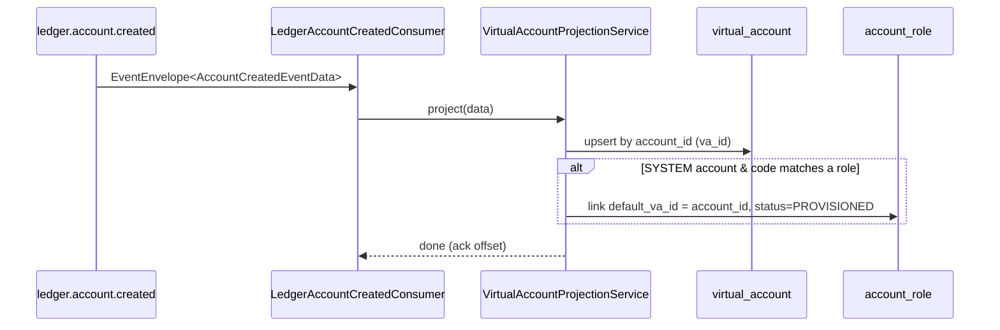

# Task 002 - `ledger.account.created` Projection into the VA Registry

## Functional Requirements
- Consume `ledger.account.created` and **upsert** a `virtual_account` projection row keyed by the
  ledger `account_id` (the chaos `va_id` *is* the ledger account id from now on).
- Project every field the ledger emits; link the matching `account_role` (by `account_code`) when
  the account is a SYSTEM account so the chart-of-accounts registry shows real ledger ids.
- Be **idempotent** under at-least-once redelivery (no duplicate rows; later events update in place).

## Acceptance Criteria
- [ ] A `@KafkaListener` on `ledger.account.created` (using the Task 001 factory) deserializes
      `EventEnvelope<LedgerAccountCreatedEventData>`.
- [ ] For a new `account_id`, a `virtual_account` row is inserted with `va_id = account_id`,
      `currency`, `name = account_name`, `ownership_type` from `account_ownership_type`,
      `organization_id`, `status`, and `created_via = KAFKA`.
- [ ] For an already-known `account_id`, the row is **updated** (status/name/etc.), not duplicated.
- [ ] When `account_ownership_type = SYSTEM` and `account_code` matches an `account_role`, the
      role's `default_va_id` is set to `account_id` and `provisioning_status = PROVISIONED`,
      `provisioned_at` stamped.
- [ ] An account whose `account_code` matches no role is still projected (no role link); no error.
- [ ] Redelivering the same event yields exactly one row and a stable result (verified in test).
- [ ] Mapping is contract-accurate against the ledger's `AccountCreatedEventData` field set.

## Technical Design
Target **Java 25 / Spring Boot 4**. New package `com.softspark.chaos.account.consumer`.

The ledger payload (`account/events/v1/AccountCreatedEventData`, mirrored chaos-side):

| ledger field (snake_case) | type | → projection |
|---|---|---|
| `account_id` | UUID | `virtual_account.va_id` (PK) |
| `account_code` | String | role lookup; stored for SYSTEM accounts |
| `account_name` | String | `name` |
| `account_category` | String | role/category context |
| `normal_balance` | String | (informational) |
| `currency` | String (ISO-4217) | `currency` |
| `status` | String | `status` (→ `AccountStatus`) |
| `organization_id` | UUID (nullable) | `organization_id` |
| `overdraft_limit` / `minimum_balance` | BigDecimal (nullable) | (optional columns / ignored) |
| `created_at` / `updated_at` | LocalDateTime | (informational) |
| `account_ownership_type` | String | `ownership_type` (→ `AccountOwnershipType`) |

- **`LedgerAccountCreatedEventData`** — chaos-side `@JsonNaming(SnakeCase)` record mirroring the
  ledger fields above (the chaos contract-test oracle).
- **`LedgerAccountCreatedConsumer`** — `@KafkaListener(topics = "${chaos.topics.ledger-account-created}")`;
  delegates to a `@Transactional` `VirtualAccountProjectionService.project(...)`.
- **Upsert** — `virtualAccountRepository.findById(accountId)` then update-or-insert (SQLite has no
  portable `MERGE`; do a find-then-save, relying on the listener's single-threaded-per-partition
  ordering). Unique PK on `va_id` guards against races.
- **Role linkage** — `accountRoleRepository.findByAccountCode(code)`; if present, set
  `default_va_id` + `PROVISIONED`. (Add `findByAccountCode` if not already present.)
- `created_via = CreatedVia.KAFKA` for all projected rows. (`LEDGER_PROVISIONED` is retained on the
  enum for historical rows; new projections use `KAFKA` to mean "materialized from the ledger
  event".)

## Implementation Notes
Files (under `chaos-machine/src/main/java/com/softspark/chaos/account/`):
- `consumer/LedgerAccountCreatedConsumer.java` — the `@KafkaListener`.
- `consumer/LedgerAccountCreatedEventData.java` — mirror payload record.
- `service/VirtualAccountProjectionService.java` — idempotent upsert + role link, `@Transactional`.
- `repository/AccountRoleRepository.java` — add `Optional<AccountRoleEntity> findByAccountCode(String)`.
- `repository/VirtualAccountRepository.java` — already keyed by `va_id`; no change beyond find-by-id.

No schema change strictly required (existing `virtual_account` columns suffice). If overdraft/min
balance must be retained, add nullable columns in the shared `V6` migration.

## Non-Functional Requirements
- Idempotent and order-tolerant: redelivery and re-ordering of create/update for the same
  `account_id` converge to the latest state.
- Projection latency dominated by poll interval; target sub-second under normal load.
- No unbounded growth: one row per ledger account.

## Dependencies
- **Task 001** (consumer factory, error handler, DLT).
- The ledger actually publishing `ledger.account.created` (it does, via its account outbox).
- Existing `VirtualAccount` / `AccountRoleEntity` entities and repositories (Phase 002/007).

## Risks & Mitigations
- **Concurrent updates to the same `account_id`** across partitions → key the topic by account/org
  id (ledger already keys events); set consumer concurrency conservatively; rely on PK uniqueness.
- **Schema drift** vs the ledger payload → contract test against
  `account/events/v1/AccountCreatedEventData`; fail the build on mismatch.
- **Role link ambiguity** (code not unique) → `account_code` is unique in both services; assert it.

## Testing Strategy
- **Unit:** `project()` maps every field; SYSTEM+matching-code links the role; unknown code skips
  linkage; second call with same id updates not inserts.
- **Integration (Testcontainers Kafka):** publish an envelope → row appears; republish → one row;
  SYSTEM account flips its role to `PROVISIONED`.
- **Contract:** deserialize a captured ledger sample payload into `LedgerAccountCreatedEventData`.
- Consolidated in [Phase 006](../006-testing-and-verification/DESIGN.md).

## Deployment Strategy
No flag of its own (gated by the Task 001 consumer toggle). Ships with shared Flyway `V6` only if
optional columns are added. Idempotent; safe to replay the topic to rebuild the projection.
