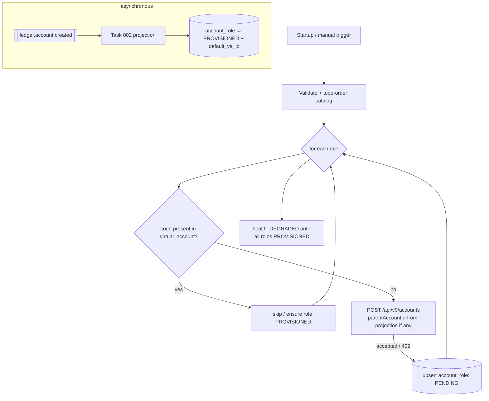

# Task 003 - Bootstrap Rework: HTTP-only, Non-blocking, Consumer-materialized

## Functional Requirements
- Rework the chart-of-accounts bootstrap so it **only issues HTTP requests** to the ledger and no
  longer persists virtual accounts from the HTTP response. Per the idea: *"It should only run the
  http requests and no longer block to create them manually … the COA bootstrap will check if the
  codes are in the va table, if not, create them via http."*
- The `virtual_account` rows for SYSTEM accounts are materialized by the
  [Task 002](./002-ledger-account-created-projection.md) consumer when the ledger publishes
  `ledger.account.created`; the bootstrap merely **requests** creation and tracks role status.

## Acceptance Criteria
- [ ] On startup (when `chaos.bootstrap.provision-on-startup=true`) the runner, for each catalog
      role, **checks whether its `account_code` already exists in `virtual_account`**; if present it
      skips, if absent it issues `POST /api/v0/accounts` to the ledger and returns — **without**
      inserting a `virtual_account` row.
- [ ] The `account_role` row is upserted with `provisioning_status = PENDING` after the HTTP request
      is accepted; it flips to `PROVISIONED` (with `default_va_id`) **only** when Task 002 projects
      the corresponding `ledger.account.created` event.
- [ ] Bootstrap **does not block** waiting for the VA to be created; startup completes promptly even
      if the event has not yet arrived.
- [ ] Parent accounts are requested before children (existing topological order), passing the
      parent's ledger `accountId` as `parentAccountId` — resolved from the projection (or the 409
      lookup) rather than from a synchronous create response.
- [ ] Re-running (restart or `POST /api/v0/chart-of-accounts/bootstrap`) is idempotent: codes
      already present in `virtual_account` are skipped; only missing codes are re-requested.
- [ ] Ledger 409 (code exists) is treated as already-requested; the VA still arrives via the event
      (or is reconciled by `findAccountByCode`).
- [ ] `GET /api/v0/chart-of-accounts` shows per-role status; health is `DEGRADED` while any role is
      `PENDING`/`FAILED`, `UP` when all `PROVISIONED`.

## Technical Design
Target **Java 25 / Spring Boot 4**. Revises `account/bootstrap/ChartOfAccountsBootstrapRunner` and
`BootstrapReconciler`; **supersedes** the synchronous-persist behavior of
[Phase 007 / Task 003](../007-chart-of-accounts-http-bootstrap/003-bootstrap-orchestration-and-persistence.md).

Key differences vs Phase 007:
- **No VA insert in the bootstrap path.** The only writer of `virtual_account` for SYSTEM accounts
  is the Task 002 projection.
- **Existence check is against `virtual_account` by `account_code`**, not against `account_role`
  alone — the idea's "check if the codes are in the va table".
- **Role status flips to `PROVISIONED` by the consumer**, not the runner. The runner sets/keeps
  `PENDING` and records `last_error` on HTTP failure (`FAILED`).
- **Parent id resolution** is asynchronous: if a child is reached before its parent's VA has been
  projected, defer the child (it will be picked up on the next reconcile tick or manual re-run).

`BootstrapReconciler` (`@Scheduled`) re-requests roles still `PENDING`/`FAILED` whose code is not yet
in `virtual_account`, with capped attempts + backoff — the same non-blocking, HTTP-only logic.

## Implementation Notes
Files (under `chaos-machine/src/main/java/com/softspark/chaos/account/`):
- `bootstrap/ChartOfAccountsBootstrapRunner.java` — remove VA persistence; add VA-code existence
  check (`virtualAccountRepository.existsByAccountCodeColumn?`/lookup by code); request-only flow.
- `bootstrap/BootstrapReconciler.java` — re-request missing codes; do not persist VAs.
- `repository/VirtualAccountRepository.java` — add a lookup by `account_code` if VA stores code, or
  resolve presence via the `account_role.default_va_id` link plus projection. **Note:** today
  `virtual_account` may not have an `account_code` column — add a nullable `account_code` column in
  the shared `V6` migration so the bootstrap can check "is this code already a VA", and have the
  Task 002 projection populate it for SYSTEM accounts.
- `controller` — keep `POST /api/v0/chart-of-accounts/bootstrap` (manual trigger; UI in Task 005).

Migration (`db/migration/V6__...sql`, shared with Phase 010): `ALTER TABLE virtual_account ADD
COLUMN account_code TEXT;` + index for the code lookup.

## Non-Functional Requirements
- Startup is never blocked on VA creation; the time budget covers only the HTTP requests, which are
  fire-and-forget with bounded retry.
- Idempotent end-to-end; identity is the `account_code`.
- Partial progress is safe: some roles `PENDING`, others `PROVISIONED`; reconcile resumes.

## Dependencies
- **Task 002** (projection materializes the VA and flips role status).
- Existing `LedgerAccountProvisioningClient` (Phase 007 / Task 002) for the HTTP `POST`/`409` lookup.
- Shared Flyway `V6` migration (adds `virtual_account.account_code`).

## Risks & Mitigations
- **VA never arrives** (ledger outbox down) → role stays `PENDING`; health `DEGRADED`; reconcile +
  metrics surface it; manual trigger re-requests.
- **Child-before-parent ordering** across async materialization → defer children lacking a resolved
  parent id; reconcile completes them once the parent VA is projected.
- **Double-request** on rapid restarts → idempotent on `account_code` (skip if VA present; ledger
  409 otherwise).

## Testing Strategy
- **Unit:** existence-by-code skip logic; request-only (asserts no VA insert in the runner);
  PENDING upsert; parent-deferral.
- **Integration (WireMock ledger + Testcontainers Kafka):** bootstrap issues HTTP without
  persisting; a published `ledger.account.created` then materializes the VA and flips the role to
  `PROVISIONED`; 409 path; ledger-down → PENDING → reconcile.
- Consolidated in [Phase 006](../006-testing-and-verification/DESIGN.md).

## Deployment Strategy
Toggle `chaos.bootstrap.provision-on-startup` (default `true`) unchanged. Additive `V6` migration
(`virtual_account.account_code`). Idempotent every boot; now non-blocking.
