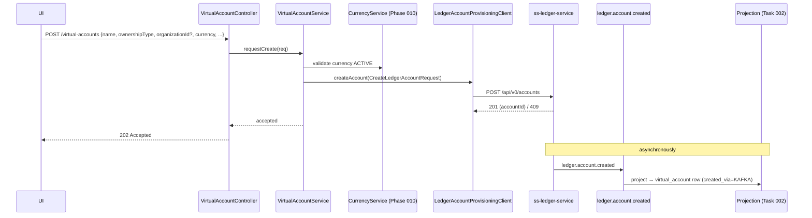

# Task 004 - Invert VA Creation API (request-via-ledger, `202 Accepted`)

## Functional Requirements
- Repurpose `POST /api/v0/virtual-accounts` so the chaos machine **no longer inserts a VA locally**.
  Instead it **requests the ledger to create the account** over HTTP (`POST /api/v0/accounts`); the
  VA materializes in the registry only when the resulting `ledger.account.created` is consumed
  ([Task 002](./002-ledger-account-created-projection.md)). Per the idea: *"the chaos machine should
  create virtual accounts only through kafka."*
- Support creating **organization** virtual accounts **with any currency** (the requester chooses
  the currency; validated against the Phase 010 `currency` table when available).
- Retire the old "announce to ledger" path (`VirtualAccountAnnouncer` publishing
  `organization.onboarded` / `organization.va.updated` to *create* VAs) — the ledger owns VAs and no
  longer needs to be told. The manual **chaos fault-injection** flows for those topics remain in the
  flow runner, unchanged.

## Acceptance Criteria
- [ ] `POST /api/v0/virtual-accounts` validates the request, calls the ledger
      `POST /api/v0/accounts` (via `LedgerAccountProvisioningClient`), and returns **`202 Accepted`**
      with a body indicating the request was forwarded (echoing the requested `account_code` /
      `organization_id` / `currency`), **without** writing a `virtual_account` row.
- [ ] The VA appears in `GET /api/v0/virtual-accounts` only after Task 002 projects the event;
      `created_via = KAFKA` on the materialized row.
- [ ] Creating an ORGANIZATION VA accepts any valid (ACTIVE) currency; an unknown/inactive currency
      → `400/409` before the ledger call.
- [ ] The direct-insert code path and the `announce=true`/`VirtualAccountAnnouncer` create path are
      removed (or reduced to fault-injection only); related Phase 002/004 behavior/tests updated.
- [ ] Ledger errors are surfaced cleanly (4xx → `400`/`409`, 5xx/circuit-open → `502`/`503`); a
      ledger 409 (account exists) is reported as already-requested.

## Technical Design
Target **Java 25 / Spring Boot 4**. Revises `account/controller/VirtualAccountController` and
`account/service/VirtualAccountService`; **supersedes** the create-and-announce design of
[Phase 002 / Tasks 003–004](../002-accounts-chart-of-accounts/).

- **Request DTO** (`CreateVirtualAccountRequest`, revised): `name`, `ownershipType`,
  `organizationId?`, `currency` (ISO-4217 / Phase 010 currency code or id), `accountCode?`
  (required for SYSTEM; derivable/optional for ORG), `accountCategory`, `parentAccountId?`,
  `overdraftLimit?`, `minimumBalance?`. Drop `vaId` (the ledger assigns the id) and `announce`.
- **Service** maps the request to the ledger's `CreateLedgerAccountRequest` (the exact contract:
  `accountCode, accountName, accountCategory, currency, parentAccountId?, overdraftLimit?,
  minimumBalance?, accountOwnershipType, organizationId?`) and POSTs it. No local persistence.
- **Currency validation** delegates to the Phase 010 `CurrencyService` when present; otherwise
  falls back to the `@ISO4217` format validator (graceful if Phase 010 has not landed).
- **List/Get** endpoints are unchanged (they read the projection).

## Implementation Notes
Files (under `chaos-machine/src/main/java/com/softspark/chaos/account/`):
- `controller/VirtualAccountController.java` — `POST` returns `202`; keep `GET` list/get; remove the
  `/{id}/publish` announce endpoint (or repurpose to "re-request provisioning").
- `service/VirtualAccountService.java` — `requestCreate(...)` calls the provisioning client; remove
  `createVirtualAccount` direct-insert and the post-commit announce.
- `service/VirtualAccountAnnouncer.java` — **remove** (or strip to nothing used by creation); ensure
  no remaining callers. The flow-runner fault-injection for `organization.*` lives in `flow/` and is
  untouched.
- `dto/CreateVirtualAccountRequest.java` — revise as above; `dto/VirtualAccountResponse` unchanged.

Cross-references to update: Phase 002 Tasks 003/004 (annotated as superseded), Phase 004 if it
referenced the announce path.

## Non-Functional Requirements
- The endpoint is async-by-design; document the eventual-consistency contract (`202`, poll the list)
  in the OpenAPI description.
- Ledger calls reuse the existing timeouts/retry/circuit-breaker; a ledger outage degrades the
  request (5xx/503), it does not corrupt local state (nothing is written).
- Idempotency: a repeat request for an existing `account_code` is a ledger 409 → reported, not
  duplicated.

## Dependencies
- **Task 002** (projection) — without it the requested VA never appears.
- `LedgerAccountProvisioningClient` (Phase 007 / Task 002).
- Phase 010 / Task 001 (`currency` table) for any-currency validation (optional/soft dependency).

## Risks & Mitigations
- **Operator confusion at eventual consistency** ("I created it but it's not in the list") → `202`
  semantics + a "requested/pending" affordance in the UI (Task 005); document clearly.
- **Removing the announce path** may ripple into Phase 002/004 tests → update those suites; keep the
  fault-injection flows intact (different code path in `flow/`).
- **SYSTEM vs ORG required fields** differ → validate per ownership type (SYSTEM needs `accountCode`
  + category; ORG needs `organizationId`).

## Testing Strategy
- **Unit:** request→`CreateLedgerAccountRequest` mapping; currency validation; no local write;
  ledger 409 handling; SYSTEM/ORG field rules.
- **WebMvc:** `202` on success; `400` on bad currency/missing fields; ledger 5xx → `502/503`.
- **Integration (WireMock + Testcontainers Kafka):** POST → ledger called → event published →
  projection materializes the VA in the list.
- Consolidated in [Phase 006](../006-testing-and-verification/DESIGN.md).

## Deployment Strategy
No new flag. Behavioral change to an existing endpoint (now `202`, async) — call out in release
notes. No migration of its own (shares `V6`).
