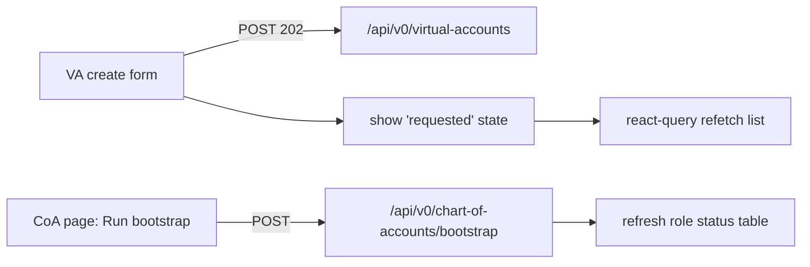

# Task 005 - Frontend: Async VAs & Manual Chart-of-Accounts Trigger

## Functional Requirements
- Update the admin UI to reflect that **VA creation is now asynchronous** (the ledger owns VAs):
  the create form requests provisioning and the VA appears once the projection updates.
- Add a **manual chart-of-accounts bootstrap trigger** button (per the idea: *"there should be a
  manual COA trigger on the UI"*).
- Surface per-role provisioning status (`PENDING`/`PROVISIONED`/`FAILED`) and a way to re-trigger.

## Acceptance Criteria
- [ ] The Virtual Accounts **create form** submits to `POST /api/v0/virtual-accounts`, handles the
      `202 Accepted` response, and shows a "requested — will appear shortly" state instead of
      optimistically adding a row.
- [ ] The VA list (react-query) **refetches/polls** so a newly materialized VA appears without a
      manual reload; the create form lets the user pick **any currency** (from the Phase 010
      currency list) for ORGANIZATION VAs.
- [ ] A **Chart of Accounts** page shows each role with its `provisioning_status` and a **"Run
      bootstrap"** button calling `POST /api/v0/chart-of-accounts/bootstrap`, with success/error
      toasts and a refreshed status table.
- [ ] Errors (ledger 4xx/5xx/circuit-open) are shown as actionable messages.

## Technical Design
Follows the Phase 005 frontend conventions (React 19 + Vite 6 + react-router 7 + react-query 5 +
Tailwind + shadcn/ui), per [ADR-005](../../decisions/005-react-vite-shadcn-frontend.md).

- **`features/virtual-accounts`** — revise the create mutation to expect `202`; on success show a
  pending affordance and invalidate the list query (with a short poll/`refetchInterval` until the
  requested account_code/org appears).
- **`features/chart-of-accounts`** — add a "Run bootstrap" action (mutation → `POST
  /chart-of-accounts/bootstrap`), render the per-role status table from `GET /chart-of-accounts`,
  and badge `PENDING`/`PROVISIONED`/`FAILED`.
- Currency select sources from `GET /api/v0/currencies` (Phase 010); degrade to a free text ISO
  input if that endpoint is absent.

## Implementation Notes
Files (under `chaos-admin/src/features/`):
- `virtual-accounts/` — update create mutation + list query (`refetchInterval`/invalidation),
  pending UI; currency select wired to currencies query.
- `chart-of-accounts/` — bootstrap trigger button + role-status table + badges.
- `lib/api.ts` — add the bootstrap trigger + currencies calls if not present.
Reuse existing shadcn primitives (button, table, badge, toast, select). No new dependencies.

## Non-Functional Requirements
- Eventual-consistency UX: clearly communicate "requested vs present"; avoid implying instant
  creation.
- Polling is bounded (stop after the row appears or a timeout) to avoid hammering the API.
- AUTH-protected routes (inherited from Phase 005).

## Dependencies
- **Task 004** (the `202` create endpoint) and **Task 002** (projection that fills the list).
- **Task 003** for the role-status semantics behind the bootstrap button.
- Phase 010 / Task 001 for the currency select (soft dependency).

## Risks & Mitigations
- **User expects the VA immediately** → explicit pending state + auto-refresh; copy that explains
  the async flow.
- **Bootstrap button spamming** → disable while in-flight; idempotent server side.

## Testing Strategy
Frontend component/integration tests (per Phase 006 / Task 003): create form handles `202` +
pending state; list refetch surfaces the new VA (mocked); bootstrap button triggers the call and
renders updated statuses; currency select populated from the currencies query.

## Deployment Strategy
Ships with the Phase 009 backend. No flag; static frontend deploy per existing pipeline.
