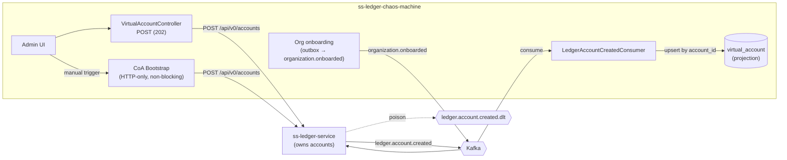

# Phase 009 - Ledger-Owned Virtual Accounts (Kafka-driven materialization)

## Summary
Inverts virtual-account ownership: **the ledger owns VAs**, and the chaos machine's
`virtual_account` table becomes a **read projection** populated by **consuming
`ledger.account.created`**. This introduces the chaos machine's **first Kafka consumer** (it has
been producer-only). VA creation via the API and the chart-of-accounts bootstrap stop persisting
VAs directly — they issue HTTP requests to the ledger's `POST /api/v0/accounts` and let the
resulting `ledger.account.created` event materialize the row. A manual COA-bootstrap trigger is
exposed in the UI. See [ADR-011](../../decisions/011-ledger-owned-virtual-accounts-via-kafka-consumer.md).

## Motivation
The chaos DB could previously hold virtual accounts the ledger never created, with ids the ledger
never assigned. The idea (`002_countries_va_via_kafka.md`) makes the rule explicit — *"THE LEDGER
OWNS Virtual Accounts"* — and prescribes the mechanism: orgs/accounts are created in the ledger
(via `organization.onboarded` or HTTP), the ledger publishes `ledger.account.created`, and the
chaos machine consumes it to create the VA. This removes id drift and makes the registry a faithful
mirror of the ledger.

## User-Facing Changes
- `POST /api/v0/virtual-accounts` becomes **asynchronous**: it requests provisioning from the
  ledger and returns `202 Accepted`; the VA appears in `GET /api/v0/virtual-accounts` once the
  `ledger.account.created` event is consumed. Organization VAs may be requested with **any
  currency**.
- The COA bootstrap no longer blocks to persist accounts; `GET /api/v0/chart-of-accounts` shows a
  role as `PENDING` until its VA is materialized from the event, then `PROVISIONED`.
- `POST /api/v0/chart-of-accounts/bootstrap` (already present) is surfaced as a **manual trigger
  button** in the admin UI.
- New operational visibility: consumer lag / DLT counts for `ledger.account.created`.

## Architecture Impact
First Kafka **consumer** in the service: a new `kafka` consumer configuration
(`ConsumerFactory` + `ConcurrentKafkaListenerContainerFactory`, `ErrorHandlingDeserializer` +
`JsonDeserializer`, `DefaultErrorHandler` with bounded retry + `DeadLetterPublishingRecoverer` →
`ledger.account.created.dlt`). A new `account/consumer` package holds
`LedgerAccountCreatedConsumer` and the chaos-side mirror record `LedgerAccountCreatedEventData`. The
`virtual_account` projection is upserted by ledger `account_id` (`va_id = account_id`). VA creation
and the bootstrap are rewired to call the ledger over HTTP only. Supersedes the VA-ownership model
of [Phase 002](../002-accounts-chart-of-accounts/DESIGN.md) Tasks 003–004 and the synchronous
persistence of [Phase 007 / Task 003](../007-chart-of-accounts-http-bootstrap/003-bootstrap-orchestration-and-persistence.md).

## Edge Cases
- **At-least-once redelivery** of `ledger.account.created` → upsert by `account_id` is a no-op
  update, never a duplicate row.
- **Out-of-order / unknown account** (e.g. an account whose `account_code` matches no known role) →
  still projected as a VA; role linkage is best-effort and skipped when no role matches.
- **Deserialization failure / poison record** → retried per the error handler, then routed to
  `ledger.account.created.dlt`; consumer keeps making progress.
- **Ledger unreachable** when the API/bootstrap issues `POST /api/v0/accounts` → request retried
  (existing `LedgerAccountProvisioningClient` resilience); role stays `PENDING`; no VA until the
  ledger eventually creates + publishes.
- **Ledger 409 (code exists)** on bootstrap → treat as already-requested; the VA still arrives via
  the event (or is reconciled by `account_code` lookup).
- **Event arrives before the bootstrap row is committed** (race) → consumer upserts the VA; the
  bootstrap later finds the code present and links the role. Order-independent.
- **VA requested with an unknown/inactive currency** → validated at request time against the
  Phase 010 `currency` table (when present) before calling the ledger.

## Testing Strategy
- **Unit:** envelope→VA mapping (all `AccountCreatedEventData` fields), idempotent upsert,
  role-by-code linkage, currency validation on the create-request path.
- **Integration (Testcontainers Kafka):** publish a `ledger.account.created` envelope → assert the
  VA projection row; redelivery → single row; poison payload → lands on the DLT; bootstrap issues
  HTTP (WireMock ledger) without persisting, then a published event materializes the VA and flips
  the role to `PROVISIONED`.
- **Contract:** the chaos-side `LedgerAccountCreatedEventData` deserializes the exact field set the
  ledger emits (`account/events/v1/AccountCreatedEventData` + `AccountCreatedEventFactory`).
- Tests are consolidated into [Phase 006](../006-testing-and-verification/DESIGN.md).

## Deployment Strategy
- Flyway `V6` (shared with Phase 010) — additive; no VA backfill (the registry re-materializes from
  the ledger's events / a one-off replay if needed).
- Consumer gated by a toggle (`chaos.kafka.consumer.enabled`, default `true`) and configurable
  group id / topics; can be disabled where the chaos machine should not project ledger accounts.
- Bootstrap remains idempotent and safe to re-run every deploy; now non-blocking.

## Tasks
- [001 - Kafka consumer foundation (DLT + idempotent deserialization)](./001-kafka-consumer-foundation.md) — first `ConsumerFactory`/listener container, error handler, `ledger.account.created.dlt` routing.
- [002 - `ledger.account.created` projection into the VA registry](./002-ledger-account-created-projection.md) — consumer + mirror record + idempotent upsert + role linkage.
- [003 - Bootstrap rework: HTTP-only, non-blocking, consumer-materialized](./003-bootstrap-rework-http-only.md) — bootstrap checks code in VA table, POSTs to ledger, role flips to PROVISIONED on projection.
- [004 - Invert VA creation API (request-via-ledger, 202)](./004-invert-va-creation-api.md) — repurpose `POST /virtual-accounts`; retire the announce path; any-currency org VAs.
- [005 - Frontend: async VAs + manual CoA trigger](./005-frontend-async-vas-and-coa-trigger.md) — pending/requested states, manual bootstrap button.

## Parallel Tasks
- **001** is the foundation and blocks **002**.
- **002** (projection) is the integration point for **003** (bootstrap) and **004** (VA API) — both
  rely on the consumer to materialize the row, so they can be built in parallel *after* 002 but are
  not complete until 002 lands.
- **003** and **004** are independent of each other.
- **005** depends on 003 + 004 (and 002 for the projection it renders).

Recommended order: **001 → 002 → (003 ‖ 004) → 005**. Independent of Phase 010 except that
**004**'s any-currency validation and **005**'s create form benefit from the Phase 010 `currency`
table (degrade to a free ISO-4217 string if Phase 010 has not landed).
