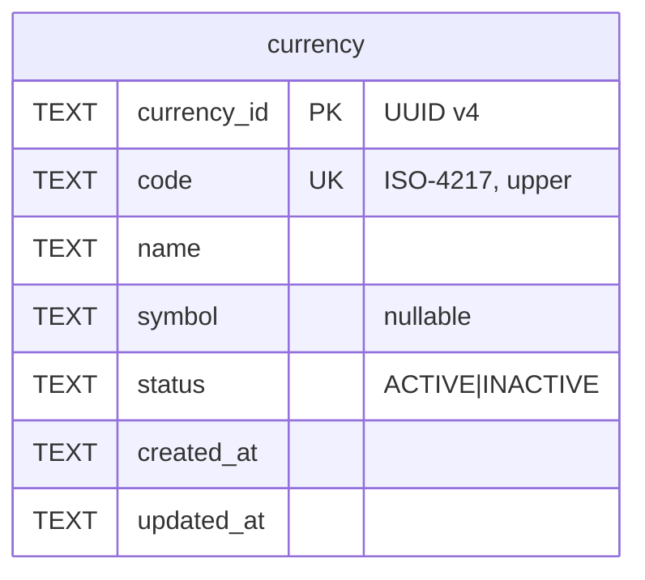

# Task 001 - Currency Master Data, Seeding & API

## Functional Requirements
- Provide a managed `currency` resource: `id` (UUID v4, server-assigned), `code` (ISO-4217, unique,
  upper-cased), `name`, `symbol` (nullable), `status` (`ACTIVE | INACTIVE`), audit timestamps.
- **Seeded from the restcountries.com fetch** in [Task 002](./002-country-primary-currency-and-seeding.md)
  ([ADR-013](../../decisions/013-seed-countries-and-currencies-from-restcountries-api.md)) — the
  per-country `currencies` map is deduplicated by ISO-4217 `code` and upserted (seed-if-absent);
  this task owns the **entity + CRUD API**, not the seed mechanism. Manual create / list / get /
  update sit on top.
- `code` is the natural key the ledger consumes; `id` is the internal FK target.

## Acceptance Criteria
- [ ] `POST /api/v0/currencies` with `{code, name, symbol?, status?}` returns `201` with a UUID v4
      `id`; `code` is upper-cased and validated as ISO-4217.
- [ ] Duplicate `code` → `409 Conflict`.
- [ ] `GET /api/v0/currencies` returns `PageResponse<CurrencyResponse>`; `GET …/{id}` → currency or
      `404`; `PUT …/{id}` updates `name`/`symbol`/`status` (and `code`, keeping uniqueness).
- [ ] Currencies are seeded (seed-if-absent by `code`) by the Task 002 restcountries seeder; re-seed
      does **not** duplicate rows and does not clobber manual edits.
- [ ] `status` outside the enum → `400`.

## Technical Design
Target **Java 25 / Spring Boot 4**, mirroring the Phase 008 Country CRUD conventions. UUID v4 id per
[ADR-010](../../decisions/010-uuid-v4-ids-for-organization-domain.md); model per
[ADR-012](../../decisions/012-currency-and-supported-country-reference-model.md).



- **Entity** `Currency extends AuditableEntity` — `@Id currency_id`; `@Enumerated(STRING) status`.
- **Enum** `CurrencyStatus { ACTIVE, INACTIVE }`.
- **Id**: `UUID.randomUUID().toString()` in the service (not `base/Ids`), per ADR-010.
- DTOs (`@RecordBuilder`): `CreateCurrencyRequest` (`@NotBlank @ISO4217 code`, `@NotBlank name`,
  `symbol?`, `@IsInEnum(CurrencyStatus.class) status?` default `ACTIVE`), `UpdateCurrencyRequest`,
  `CurrencyResponse`. Reuse the existing `@ISO4217` and `@IsInEnum` validators.
- **Seeding** is performed by the `ReferenceDataSeeder` in
  [Task 002](./002-country-primary-currency-and-seeding.md) from the restcountries.com `currencies`
  maps (dedup by `code`, idempotent, seed-if-absent). This task exposes an upsert-by-code service
  method (`upsertIfAbsent(code, name, symbol)`) the seeder calls; it does **not** ship a bundled
  list.

## Implementation Notes
Files (under `chaos-machine/src/main/java/com/softspark/chaos/organization/`):
- `model/Currency.java` — `@Table(name = "currency")`.
- `enumeration/CurrencyStatus.java`.
- `repository/CurrencyRepository.java` — `JpaRepository<Currency, String>` + `existsByCode`,
  `findByCode`.
- `dto/CreateCurrencyRequest.java`, `dto/UpdateCurrencyRequest.java`, `dto/CurrencyResponse.java`.
- `service/CurrencyService.java` — `@Transactional` CRUD; upper-cases `code`; UUID id; conflict on
  dup code; plus `upsertIfAbsent(code, name, symbol)` used by the Task 002 seeder.
- `controller/CurrencyController.java` — `@RequestMapping("/api/v0/currencies")`, `@Tag`, `@Valid`.
- (Seeding lives in Task 002's `ReferenceDataSeeder` — no bundled-list seeder here.)

Migration (`db/migration/V6__currencies_and_supported_countries.sql`, shared with Phase 009 + tasks
002/003):
```sql
CREATE TABLE IF NOT EXISTS currency (
    currency_id TEXT PRIMARY KEY,
    code TEXT NOT NULL UNIQUE,
    name TEXT NOT NULL,
    symbol TEXT,
    status TEXT NOT NULL,
    created_at TEXT NOT NULL,
    updated_at TEXT NOT NULL
);
```
No new dependencies.

## Non-Functional Requirements
- Reads paginated (consistent default page size).
- `code` uniqueness enforced at DB + checked in-service for a clean `409`.
- This task itself makes no external calls (pure CRUD + an `upsertIfAbsent` method); the external
  restcountries.com fetch and its resilience live in Task 002.
- AUTH-protected (inherited).

## Dependencies
None (foundational for tasks 002 + 004). Shares the `V6` migration file.

## Risks & Mitigations
- **Migration-file contention** across V6 tasks → one `V6` file; append DDL in task order (currency
  → country alter → supported_country).
- **ISO-4217 list drift** → manual CRUD is the escape hatch; seed is best-effort current.

## Testing Strategy
JUnit 5 + AssertJ + Mockito (service: dup code → 409, ISO validation, UUID assignment, status enum,
`upsertIfAbsent` no-op when code exists) + `@WebMvcTest` controller. Seeder tests live in
[Task 002](./002-country-primary-currency-and-seeding.md). Consolidated in
[Phase 006](../006-testing-and-verification/DESIGN.md).

## Deployment Strategy
Flyway `V6` (additive) + idempotent seeder. No flag.
