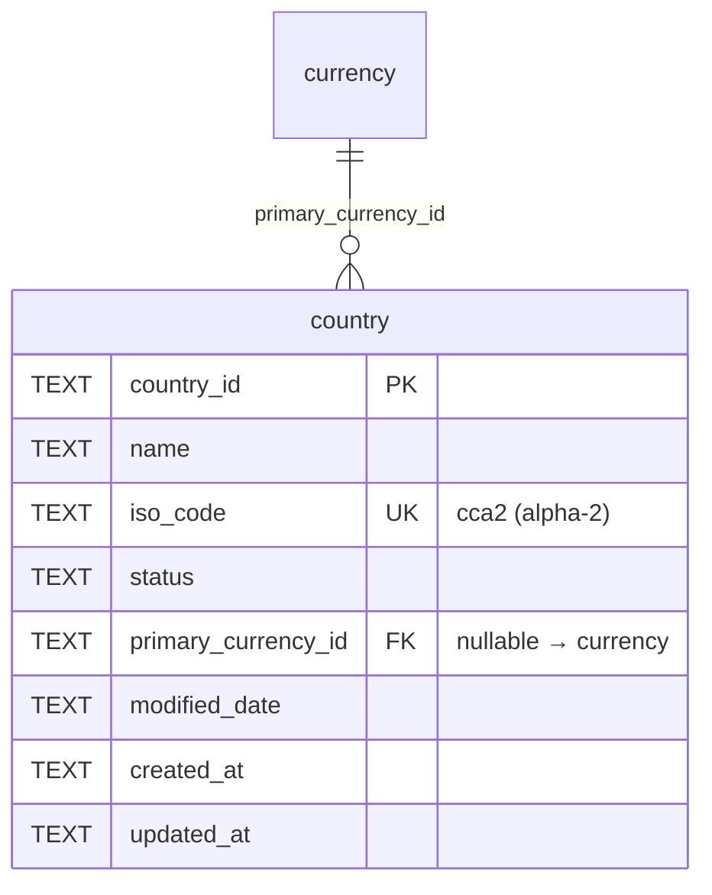

# Task 002 - Country Primary Currency & Seeding from restcountries.com

## Functional Requirements
- Add `primary_currency_id` (FK → `currency`) to the existing `country` table/entity (Phase 008).
- **Pre-seed the `country` table at startup from the restcountries.com API**
  ([ADR-013](../../decisions/013-seed-countries-and-currencies-from-restcountries-api.md)) — *not*
  from a bundled file. The same fetch also seeds the `currency` table (Task 001) and links each
  country's primary currency. Manual country/currency entries continue to work.
- Country create/update accept and return `primary_currency_id` (responses also resolve
  `primary_currency` `{id, code, name}`).

## Acceptance Criteria
- [ ] `country` has a nullable `primary_currency_id` FK → `currency`; existing rows remain valid.
- [ ] On startup (when `chaos.reference-data.seed-on-startup != NEVER`) a `ReferenceDataSeeder`
      fetches `GET https://restcountries.com/v3.1/all?fields=name,cca2,cca3,currencies`, upserts
      currencies (dedup by ISO-4217 `code`), then upserts countries by `iso_code` (`cca2`) with
      `primary_currency_id` = the first currency in each country's `currencies` map.
- [ ] Seeding runs **off the boot thread** and **never fails or blocks startup**: if the API is
      unreachable, the app still boots; the failure is logged/metered and retried (scheduled or via
      the manual endpoint).
- [ ] Seeding is **idempotent / seed-if-absent** by natural key (`code`, `iso_code`) — re-running
      does not duplicate rows and does not clobber manual edits.
- [ ] Default policy `IF_EMPTY` only seeds when `country` is empty; `POST /api/v0/countries/refresh`
      forces a re-seed; `ALWAYS`/`NEVER` are configurable.
- [ ] `POST`/`PUT /api/v0/countries` accept `primary_currency_id`; unknown currency → `400`,
      inactive currency → `400/409`; `GET` responses include the resolved primary currency.
- [ ] Existing Phase 008 country tests still pass.

## Technical Design
Target **Java 25 / Spring Boot 4**. Extends the Phase 008 `Country` entity and
[Task 001](./001-currency-master-data.md); seed source per
[ADR-013](../../decisions/013-seed-countries-and-currencies-from-restcountries-api.md). The seeder
runs on a virtual-thread executor ([ADR-007](../../decisions/007-csv-batch-execution-model.md)).

```mermaid
sequenceDiagram
  participant Boot as ApplicationRunner (async / vthread)
  participant Seed as ReferenceDataSeeder
  participant RC as RestCountriesClient
  participant API as restcountries.com
  participant CurR as CurrencyRepository
  participant CtyR as CountryRepository
  Boot->>Seed: seedIfNeeded(policy)
  alt policy=IF_EMPTY and country table not empty
    Seed-->>Boot: skip
  else seed
    Seed->>RC: GET /v3.1/all?fields=name,cca2,cca3,currencies
    RC->>API: HTTP (timeouts + bounded retry)
    API-->>RC: [ {name,cca2,cca3,currencies{CODE:{name,symbol}}}, ... ]
    RC-->>Seed: List<RestCountry>
    Seed->>CurR: upsert currencies by code (dedup)
    Seed->>CtyR: upsert countries by iso_code; primary_currency = first currency
  end
  Note over Seed: API down → log+meter, app still boots, retry later
```



- **`RestCountriesClient`** — a dedicated `RestClient` bean (separate from the ledger proxy), base
  URL `chaos.reference-data.restcountries.base-url` (default `https://restcountries.com`), calling
  `/v3.1/all?fields=name,cca2,cca3,currencies` with bounded connect/read timeouts + small retry.
  Deserializes into `RestCountry` records (`name.common`, `cca2`, `cca3`, `currencies` map).
- **`ReferenceDataSeeder`** (`ApplicationRunner`, `@Order` after Flyway) — runs `seedIfNeeded()` on a
  virtual thread; upserts currencies (Task 001 entity) deduped by `code`, then countries by
  `iso_code`, linking the first currency as primary. Catches all errors (never propagates to boot).
- **Entity** `Country` gains `primaryCurrencyId` (id column; resolve currency in the service for
  responses, consistent with the snapshot style).
- **Validation**: on manual create/update, if `primary_currency_id` is present, verify it exists and
  is `ACTIVE`.
- **Refresh endpoint**: `POST /api/v0/countries/refresh` triggers `ReferenceDataSeeder.refresh()`
  (force `ALWAYS` for this call); returns a summary (countries/currencies upserted). Optional
  scheduled retry reuses the same path while the table is empty after a failed boot fetch.

## Implementation Notes
Files:
- `organization/model/Country.java` — add `primaryCurrencyId` field + column.
- `organization/dto/{CreateCountryRequest,UpdateCountryRequest,CountryResponse}.java` — add
  `primary_currency_id` (request) + resolved `primary_currency` (response).
- `organization/service/CountryService.java` — validate + set `primary_currency_id`; resolve for
  responses.
- `organization/seed/RestCountriesClient.java` + `RestCountry.java` (payload records) — external API
  client.
- `organization/seed/ReferenceDataSeeder.java` — async, idempotent, seed-if-needed; upserts
  currencies + countries.
- `organization/seed/ReferenceDataProperties.java` — `@ConfigurationProperties("chaos.reference-data")`
  (`seed-on-startup`, `restcountries.base-url`, timeouts, retry).
- `organization/controller/CountryController.java` — add `POST /api/v0/countries/refresh`.
- `db/migration/V6__currencies_and_supported_countries.sql` — append:
  `ALTER TABLE country ADD COLUMN primary_currency_id TEXT REFERENCES currency(currency_id);`
  `CREATE INDEX IF NOT EXISTS idx_country_primary_currency ON country(primary_currency_id);`

Config (`application.yml`):
```yaml
chaos:
  reference-data:
    seed-on-startup: IF_EMPTY        # IF_EMPTY | ALWAYS | NEVER
    restcountries:
      base-url: https://restcountries.com
      fields: name,cca2,cca3,currencies
      connect-ms: 5000
      read-ms: 20000
      retry-max-attempts: 3
```
No new dependencies (RestClient + Jackson already present).

## Non-Functional Requirements
- **Boot is never blocked or broken** by the external API: seeding is async + failure-tolerant.
- Idempotent upsert-if-absent; preserves manual entries; bounded API calls (seed-if-empty by
  default, not every boot).
- External egress to a public endpoint required; base URL configurable to a mirror/self-host.
- AUTH-protected endpoints (inherited).

## Dependencies
- **Task 001** (currency entity/table) — the seeder writes currencies and the country FK targets it.
- Phase 008 / Task 001 (existing `country` table/entity/CRUD).
- External: **restcountries.com** ([ADR-013](../../decisions/013-seed-countries-and-currencies-from-restcountries-api.md)).
- Shares the `V6` migration.

## Risks & Mitigations
- **API unreachable / rate-limited / `fields` required** → timeouts + retry; seed-if-empty minimizes
  calls; degrade and boot anyway; manual refresh endpoint; configurable base URL.
- **Multi-currency countries** → pick the first as primary; manual CRUD corrects edge cases.
- **API schema change** → isolate mapping in `RestCountry`/`RestCountriesClient`; a contract/parse
  test on a captured sample; failure degrades, never crashes.
- **Seeder ↔ manual-edit race** → upsert strictly by natural key; never overwrite existing rows'
  operator-edited fields (insert-if-absent semantics).

## Testing Strategy
- **Unit:** `RestCountry` → currency/country mapping (incl. multi-currency primary pick); primary-
  currency validation; seed-if-empty vs ALWAYS vs NEVER; idempotent re-run.
- **Integration:** WireMock restcountries endpoint — happy path seeds N countries + currencies;
  API-down → app boots, table empty, retry/endpoint completes; re-seed does not duplicate.
- Regression on existing country tests. Consolidated in
  [Phase 006](../006-testing-and-verification/DESIGN.md).

## Deployment Strategy
Flyway `V6` (additive nullable FK). Async idempotent seeder gated by `chaos.reference-data.seed-on-startup`
(default `IF_EMPTY`). Outbound network to restcountries.com (or a configured mirror) must be allowed;
`POST /api/v0/countries/refresh` re-syncs on demand.
