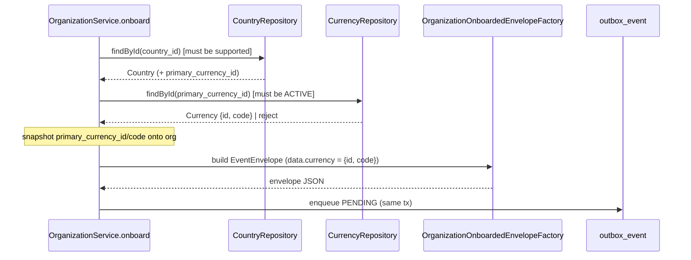

# Task 004 - `organization.onboarded` Carries Primary Currency

## Functional Requirements
- On onboarding, resolve the country's **primary currency** and include it in the
  `organization.onboarded` event as a **top-level `currency { id, code }`** object — *"creating the
  organization will use the primary currency of the country in the organization.onboarded event."*
- Snapshot the org's `primary_currency_id` / `primary_currency_code` at onboard time (snapshot
  discipline, [ADR-008](../../decisions/008-organization-onboarding-domain-model.md)); later
  currency/country edits do not change the org or the already-emitted event.

## Acceptance Criteria
- [ ] Onboarding resolves the onboarded country's `primary_currency`; if absent or inactive →
      onboarding is rejected (`400/409`) and nothing is persisted/enqueued.
- [ ] The org row stores `primary_currency_id` + `primary_currency_code` snapshots.
- [ ] The enqueued `organization.onboarded` envelope's `data` includes a top-level
      `currency: { id: <currency_id>, code: <ISO-4217> }` (snake_case).
- [ ] A contract test asserts the serialized payload includes `currency.id` + `currency.code`
      alongside the existing `country {...}` block and remains deserializable by the ledger
      (unknown-field tolerant — the ledger's `OnboardedEventData` ignores it for now).
- [ ] Existing onboarding outbox behavior (atomic enqueue, relay, idempotency key) is unchanged
      otherwise.

## Technical Design
Target **Java 25 / Spring Boot 4**. Extends the Phase 008 onboarding/outbox path
([ADR-009](../../decisions/009-transactional-outbox-for-organization-onboarded.md)) and the
`OrganizationOnboardedEventData` record per
[ADR-012](../../decisions/012-currency-and-supported-country-reference-model.md).

- **Payload record** `OrganizationOnboardedEventData` gains a nested
  `Currency(UUID id, String code)` and a top-level `currency` component (snake_case via
  `@JsonNaming`). Position: **top-level** sibling of `country` (decision recorded in ADR-012), value
  `{ id, code }`.
- **`OrganizationOnboardedEnvelopeFactory`** populates `currency` from the org's snapshot.
- **`OrganizationService.onboard`** resolves + validates the primary currency (ACTIVE) and the
  supported-country guard (Task 003) before persisting; copies the currency snapshot onto the org.
- **Organization entity** gains `primary_currency_id` + `primary_currency_code` snapshot columns.

## Implementation Notes
Files:
- `organization/model/Organization.java` — add `primaryCurrencyId`, `primaryCurrencyCode` snapshots.
- The `OrganizationOnboardedEventData` record (wherever Phase 008 placed it — `flow/model/v1` or
  `organization/outbox`) — add the `Currency(id, code)` + top-level `currency` field.
- `organization/outbox/OrganizationOnboardedEnvelopeFactory.java` — set `currency`.
- `organization/service/OrganizationService.java` — resolve/validate primary currency; snapshot it.
- `organization/dto/OrganizationResponse.java` — surface the resolved primary currency.
- `db/migration/V6__...sql` — append:
  `ALTER TABLE organization ADD COLUMN primary_currency_id TEXT;`
  `ALTER TABLE organization ADD COLUMN primary_currency_code TEXT;`

Update the contract fixture / sample to include `currency`.

## Non-Functional Requirements
- Atomicity preserved: currency resolution + snapshot + outbox enqueue happen in the onboard
  transaction; a failure rolls everything back (no phantom event).
- Forward-compatible: additive field; ledger ignores it until it consumes currency (Spring Jackson
  `fail-on-unknown-properties=false`). Documented as an assumption.
- Stable `event_id` / `idempotency_key` across retries (unchanged from ADR-009).

## Dependencies
- **Task 001** (currency) + **Task 002** (country `primary_currency`) — the source of the value.
- **Task 003** (supported-country guard) — shares the onboard validation path.
- Phase 008 / Tasks 003–004 (onboarding persistence + outbox).
- Shares the `V6` migration.

## Risks & Mitigations
- **Ledger rejects the unknown `currency` field** (if it ever enables `fail-on-unknown`) → covered
  by a contract test against the ledger's `OnboardedEventData`; coordinate the ledger change when it
  starts honouring currency (it currently hardcodes `GHS`).
- **Country without a primary currency** → reject onboarding with a clear `400/409`; the seeded
  supported countries all carry a primary currency.

## Testing Strategy
- **Unit:** primary-currency resolution + ACTIVE check; snapshot copy; envelope includes
  `currency {id, code}`; reject when missing/inactive.
- **Contract:** serialized `organization.onboarded` includes `currency` and matches the extended
  fixture; round-trips through the ledger's deserializer (unknown-field tolerant).
- **Integration:** onboard a supported country with a primary currency → outbox row's payload has
  `currency`; relay publishes it.
- Consolidated in [Phase 006](../006-testing-and-verification/DESIGN.md).

## Deployment Strategy
Flyway `V6` (additive). No flag; additive, forward-compatible contract change — note in release
notes that `organization.onboarded` now carries `currency {id, code}`.
