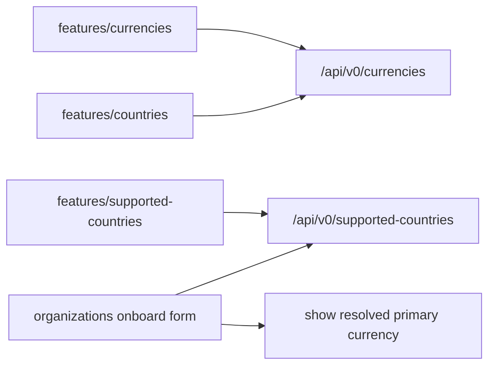

# Task 005 - Frontend: Currencies, Supported Countries & Onboarding Form

## Functional Requirements
- Add admin UI pages for **Currencies** (list + create/edit) and **Supported Countries** (list +
  add/remove), following the Phase 005 frontend conventions.
- Update the **Organizations onboarding form** to (a) restrict the country picker to **supported
  countries** and (b) show the **resolved primary currency** for the chosen country (read-only,
  flowing into `organization.onboarded`).
- Surface primary currency on the Countries page.

## Acceptance Criteria
- [ ] **Currencies** page: paginated list, create form (`code`, `name`, `symbol?`, `status`), edit;
      validation errors surfaced; duplicate code → inline `409` message.
- [ ] **Supported Countries** page: list of supported countries (name, iso, primary currency), add
      (pick from all countries), remove; duplicate → inline conflict message.
- [ ] **Onboarding form**: country select sources from `GET /api/v0/supported-countries`; on country
      change it displays that country's primary currency; submitting onboards via the existing
      endpoint (currency rides along server-side).
- [ ] **Countries** page shows each country's primary currency and allows setting it (select from
      currencies).

## Technical Design
React 19 + Vite 6 + react-router 7 + react-query 5 + Tailwind + shadcn/ui, per
[ADR-005](../../decisions/005-react-vite-shadcn-frontend.md). Mirrors the existing
`features/organizations`, `features/countries`, `features/organization-types` structure already
present in `chaos-admin/src/features/`.

## Implementation Notes
Files (under `chaos-admin/src/`):
- `features/currencies/` — list/create/edit pages, react-query hooks, form (shadcn input/select).
- `features/supported-countries/` — list + add/remove, country picker.
- `features/countries/` — add primary-currency select to the existing page.
- `features/organizations/` — onboarding form: swap the country source to supported-countries;
  derive + display primary currency.
- `app/router.tsx` + `components/layout/app-shell.tsx` — register the two new routes + sidebar nav.
- `lib/api.ts` — currency + supported-country calls.
Reuse existing shadcn primitives; no new dependencies.

## Non-Functional Requirements
- Forms validate client-side and surface server `409/400` cleanly.
- Lists paginated; queries cached/invalidated via react-query.
- AUTH-protected routes (inherited from Phase 005 protected-route wrapper).

## Dependencies
- **Task 001** (currencies API), **Task 002** (country primary currency), **Task 003** (supported
  countries API). Onboarding form benefits from **Task 004** (currency in the event) but works
  against the existing onboarding endpoint.

## Risks & Mitigations
- **Onboarding form regressions** (it already exists) → extend, don't rewrite; keep existing fields;
  add the supported-country source + currency display incrementally.
- **Empty supported-country list** → show an empty-state prompting the operator to add supported
  countries first.

## Testing Strategy
Frontend component/integration tests (Phase 006 / Task 003): currencies create/list; supported-
country add/remove; onboarding form lists only supported countries and shows the primary currency
(mocked queries). 

## Deployment Strategy
Ships with the Phase 010 backend; static frontend deploy per existing pipeline. No flag.
