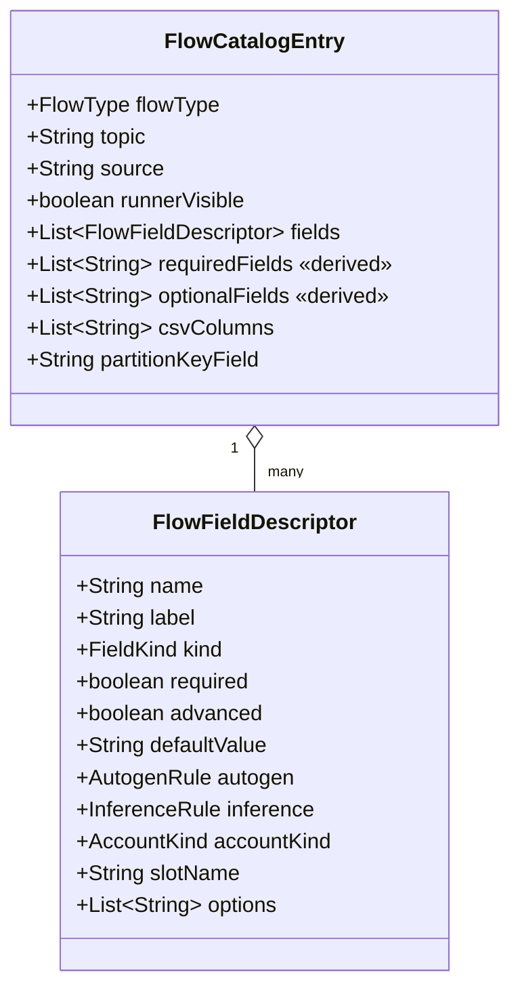

# Task 001 - Flow catalog field descriptors & runner scoping (backend)

## Functional Requirements
- Enrich `GET /api/v0/flows/catalog` so each entry carries **structured per-field
  descriptors** (not bare name strings) describing how the Single Flow Run form should render
  and seed every field: type, required/advanced state, default value, autogen rule, inference
  rule, and (for VA fields) the account kind + slot.
- Mark which flows the Single Flow Run exposes via a `runnerVisible` flag; exactly the five
  idea-listed transaction types are visible.
- Keep the change **additive and backward-compatible**: the existing
  `requiredFields`/`optionalFields`/`csvColumns`/`partitionKeyField` fields remain and are
  derived from the descriptors, so the CSV batch page and existing tests are unaffected.
- The publish endpoint (`POST /api/v0/flows/{flowType}`) is **unchanged**; its request contract
  changes only by an **optional** `idempotencyKey` *iff* decision (c-ii) is taken (see
  *Publish-path alignment*). The bootstrap **slot seed** gains the missing Organization /
  Treasury-Transfer slot rows (config, not migration).

## Acceptance Criteria
- [ ] `FlowCatalogEntry` exposes `List<FlowFieldDescriptor> fields` and `boolean runnerVisible`.
- [ ] `FlowFieldDescriptor` carries: `name`, `label`, `kind`, `required`, `advanced`,
      `defaultValue`, `autogen`, `inference`, `accountKind`, `slotName`, `options`.
- [ ] Exactly these five flows are `runnerVisible=true`: `TOPUP_CONFIRMED`,
      `TRANSFER_REQUESTED`, `TREASURY_SWEEP_COMPLETED`, `TREASURY_PREFUND_COMPLETED`,
      `TREASURY_TRANSFER_COMPLETED`. All other flows are `runnerVisible=false` (incl.
      `ORGANIZATION_ONBOARDED`, `ORGANIZATION_VA_UPDATED`).
- [ ] Descriptors for the five flows match the field tables below (kind, required/advanced,
      default, autogen, inference, accountKind/slot).
- [ ] `requiredFields`/`optionalFields`/`csvColumns` are derived from `fields` and equal their
      current values for every flow (no regression for non-runner consumers).
- [ ] All descriptor `name`s are existing payload wire names (snake_case); the idea's
      friendlier wording lives in `label` (no wire-field renames).
- [ ] **Every field a flow builder reads via `FlowFields.getRequired(...)` is guaranteed
      present even when collapsed** — i.e. each such descriptor carries either an `inference`
      rule or a non-null `defaultValue` (see *Publish-path alignment* below). A default Top-up
      run with the advanced section untouched must publish a `200`, not a `400`.
- [ ] **Slot rows exist for every `VA_REF` slot the runner exposes**, including the
      user-supplied **Organization-account** slots, so a picked VA routes through
      `slotOverrides` into the payload (see *Publish-path alignment*).

## Technical Design
Target **Java 25 / Spring Boot 4** (project standard, [ADR-001](../../decisions/001-target-java-25-and-spring-boot-4.md)),
`record-builder`, no Lombok. See
[ADR-014](../../decisions/014-flow-catalog-field-descriptors-and-client-side-inference.md).

### New/changed types (`com.softspark.chaos.flow.dto`)

```java
@RecordBuilder
public record FlowFieldDescriptor(
    String name,              // wire name, snake_case (e.g. "completed_by")
    String label,             // display label (e.g. "Initiated By")
    FieldKind kind,           // TEXT | UUID | AMOUNT | DATETIME | SELECT | VA_REF
    boolean required,         // shown + validated
    boolean advanced,         // non-required, collapsed-by-default
    String defaultValue,      // nullable seed (amount "1000.0000", channel "bank"…)
    AutogenRule autogen,      // NONE | UUID_V4
    InferenceRule inference,  // NONE | ORG_FROM_SOURCE_VA | ORG_FROM_DEST_VA
                              //      | CURRENCY_FROM_SOURCE_VA | TENANT_FROM_SOURCE_VA
    AccountKind accountKind,  // VA_REF only: ORGANIZATION | SYSTEM ; else null
    String slotName,          // VA_REF only: slot this fills (system prefilled from CoA); else null
    List<String> options) {}  // SELECT only: allowed values; else null

public enum FieldKind { TEXT, UUID, AMOUNT, DATETIME, SELECT, VA_REF }
public enum AutogenRule { NONE, UUID_V4 }
public enum InferenceRule { NONE, ORG_FROM_SOURCE_VA, ORG_FROM_DEST_VA,
                            CURRENCY_FROM_SOURCE_VA, TENANT_FROM_SOURCE_VA }
public enum AccountKind { ORGANIZATION, SYSTEM }
```

`FlowCatalogEntry` gains `fields` + `runnerVisible`, retaining the legacy lists:

```java
@RecordBuilder
public record FlowCatalogEntry(
    FlowType flowType,
    String topic,
    String source,
    boolean runnerVisible,                  // NEW
    List<FlowFieldDescriptor> fields,       // NEW — source of truth for the form
    List<String> requiredFields,            // derived: fields where required==true
    List<String> optionalFields,            // derived: the rest
    List<String> csvColumns,                // unchanged ordering
    String partitionKeyField) {}
```

`FlowCatalogProvider` builds each entry from a `List<FlowFieldDescriptor>` and derives the
legacy lists, e.g.:

```java
private static FlowCatalogEntry entry(FlowType type, String source, boolean runnerVisible,
    List<FlowFieldDescriptor> fields, List<String> csvColumns, String partitionKeyField) {
  var required = fields.stream().filter(FlowFieldDescriptor::required).map(FlowFieldDescriptor::name).toList();
  var optional = fields.stream().filter(f -> !f.required()).map(FlowFieldDescriptor::name).toList();
  return FlowCatalogEntryBuilder.builder()
      .flowType(type).topic(topicFor(type)).source(source)
      .runnerVisible(runnerVisible).fields(fields)
      .requiredFields(required).optionalFields(optional)
      .csvColumns(csvColumns).partitionKeyField(partitionKeyField).build();
}
```

### Field descriptors — the five runnerVisible flows

> `req` = required (shown). `adv` = non-required, collapsed. VA fields list `accountKind`/`slot`.
> **Global advanced fields** appended to every flow: `correlation_id` (TEXT, adv),
> `idempotency_key` (TEXT, adv), `tenant_id` (TEXT, adv, `TENANT_FROM_SOURCE_VA`).

**TOPUP_CONFIRMED** — `organization.topup.confirmed`, key `destination_va_id`

| name | label | kind | state | default / autogen / inference | accountKind·slot |
|---|---|---|---|---|---|
| `topup_request_id` | Transaction Request ID | UUID | req | autogen `UUID_V4` | — |
| `source_va_id` | Source VA ID | VA_REF | req | — | ORGANIZATION · `source` |
| `destination_va_id` | Destination VA ID | VA_REF | req | — | SYSTEM · `destination` |
| `amount` | Amount | AMOUNT | req | default `1000.0000` | — |
| `organization_id` | Organization ID | TEXT | adv | `ORG_FROM_SOURCE_VA` | — |
| `currency` | Currency | TEXT | adv | `CURRENCY_FROM_SOURCE_VA` | — |
| `source_payment_reference` | Source Payment Reference | TEXT | adv | — | — |
| `approved_by` | Approved By | TEXT | adv | — | — |
| `approved_at` | Approved At | DATETIME | adv | — | — |

**TRANSFER_REQUESTED** (Inter-VA) — `organization.transfer.requested`, key `source_va_id`

| name | label | kind | state | default / autogen / inference | accountKind·slot |
|---|---|---|---|---|---|
| `transfer_request_id` | Transaction Request ID | UUID | req | autogen `UUID_V4` | — |
| `source_va_id` | Source VA ID | VA_REF | req | — | ORGANIZATION · `source` |
| `destination_va_id` | Destination VA ID | VA_REF | req | — | ORGANIZATION · `destination` |
| `amount` | Amount | AMOUNT | req | default `1000.0000` | — |
| `source_organization_id` | Source Organization ID | TEXT | adv | `ORG_FROM_SOURCE_VA` | — |
| `destination_organization_id` | Destination Organization ID | TEXT | adv | `ORG_FROM_DEST_VA` | — |
| `currency` | Currency | TEXT | adv | `CURRENCY_FROM_SOURCE_VA` | — |
| `narrative` | Source Payment Reference ¹ | TEXT | adv | — | — |
| `initiated_by` | Initiated By | TEXT | adv | — | — |
| `initiated_at` | Initiated At | DATETIME | adv | — | — |

¹ Idea labels this "Source Payment Reference"; the payload wire field is `narrative`. Display
the label, send `narrative`. Confirm with product (see Risks).

**TREASURY_PREFUND / SWEEP / TRANSFER** — `organization.treasury.*.completed`. Same shape;
the request-id name and the channel **defaults** differ per sub-type. Key = request-id field
for prefund, `source_va_id` for sweep/transfer (preserve current `partitionKeyField`).

| name | label | kind | state | default / autogen / inference | accountKind·slot |
|---|---|---|---|---|---|
| `{sweep\|prefund\|transfer}_request_id` | Transaction Request ID | UUID | req | autogen `UUID_V4` | — |
| `source_va_id` | Source VA ID | VA_REF | req | — | SYSTEM · `source` |
| `destination_va_id` | Destination VA ID | VA_REF | req | — | SYSTEM · `destination` |
| `amount` | Amount | AMOUNT | req | default `1000.0000` | — |
| `source_organization_id` | Source Organization ID | TEXT | adv | `ORG_FROM_SOURCE_VA` | — |
| `destination_organization_id` | Destination Organization ID | TEXT | adv | `ORG_FROM_DEST_VA` | — |
| `source_channel` | Source Channel | SELECT | adv | default per sub-type ² · options `[bank, momo]` | — |
| `destination_channel` | Destination Channel | SELECT | adv | default per sub-type ² · options `[bank, momo]` | — |
| `currency` | Currency | TEXT | adv | `CURRENCY_FROM_SOURCE_VA` | — |
| `completion_reference` | Completion Reference | TEXT | adv | — | — |
| `completed_by` | Initiated By ³ | TEXT | adv | — | — |
| `completed_at` | Initiated At ³ | DATETIME | adv | — | — |

² Channel defaults: **Prefund** src=`bank`/dest=`momo`; **Sweep** src=`momo`/dest=`bank`;
**Transfer** src=`momo`/dest=`momo`.  ³ Idea labels "Initiated By/At"; wire fields are
`completed_by`/`completed_at` (see Risks).



### Publish-path alignment (critical — verified against the builders)

The descriptors above only render a form; they must also produce a `PublishFlowRequest` that
the **existing, unchanged** publish path turns into the right Kafka message. Tracing the
builders (`TopUpConfirmedFlowBuilder`, `TransferRequestedFlowBuilder`, `Treasury*FlowBuilder`)
+ `SlotResolver` + `ChartOfAccountsBootstrap` surfaced three hard constraints the catalog and
its seed data must satisfy. **These are the part the first cut of this plan missed.**

**(a) VA ids travel via `slotOverrides`, and a slot only resolves if a `flow_slot_config`
row exists.** Every builder reads `ctx.resolvedSlots().getOrDefault("source"/"destination",
"")` for `source_va_id`/`destination_va_id` — **never** from `flowFields`. But
`SlotResolver.resolveAll` iterates **only the slots that have a config row**; an override for
an unconfigured slot is silently dropped. The seed (`chaos-bootstrap.yml → chaos.bootstrap.
flow-slots`) currently configures:

| Flow | seeded slots today | runner needs | gap |
|---|---|---|---|
| `TOPUP_CONFIRMED` | `destination` (PLATFORM_FLOAT) | `source` (org) + `destination` (sys) | **+`source`** |
| `TRANSFER_REQUESTED` | *(none)* | `source` (org) + `destination` (org) | **+`source` +`destination`** |
| `TREASURY_PREFUND_COMPLETED` | `source`, `destination` | same | ok |
| `TREASURY_SWEEP_COMPLETED` | `source`, `destination` | same | ok |
| `TREASURY_TRANSFER_COMPLETED` | *(none)* | `source` (sys) + `destination` (sys) | **+`source` +`destination`** |

→ **Add the missing slot rows.** Organization-account slots
(`TOPUP_CONFIRMED.source`, `TRANSFER_REQUESTED.source`, `TRANSFER_REQUESTED.destination`)
get `accountRole: null` (no system default — they resolve only from the request's
`slotOverrides`, which the form always supplies from the picked VA). The two
`TREASURY_TRANSFER_COMPLETED` slots are **System** accounts and need roles — pick the
momo→momo float roles to match the channel defaults (e.g. `source: PLATFORM_FLOAT_MTN`,
`destination: PLATFORM_FLOAT_TELECEL`); **confirm these role choices** (flagged in Risks).
Without these rows the runner's source/destination pickers publish **empty** VA ids — the
current behavior for Top-up `source` and all of Inter-VA/Treasury-Transfer.

**(b) Builder-`getRequired` fields must be guaranteed non-blank even when collapsed.** The
builders call `f.getRequired(...)` (throws `400`) for: Top-up → `topup_request_id`,
`organization_id`, `currency`¹, `approved_by`; Transfer → `transfer_request_id`,
`source_organization_id`, `destination_organization_id`, `currency`¹, `narrative`,
`initiated_by`; Treasury → `*_request_id`, `source_channel`, `destination_channel`,
`currency`¹, `completed_by`. The idea marks most of these **non-required/collapsed**. They
only stay valid because the descriptor **always populates** them: request-ids via `autogen`,
org-ids/currency via `inference`, channels via per-sub-type `defaultValue`. The
**non-inferable human fields have no source yet** — so give them a `defaultValue` from the
bin-script samples: `approved_by`/`initiated_by`/`completed_by` → e.g.
`ops@acme.example`, `narrative` → e.g. `Chaos run`. (`approved_at`/`initiated_at`/
`completed_at` need none — builders use `getTimestampOrNow`.) ¹`currency` is satisfied by the
top-level `PublishFlowRequest.currency` **or** `flowFields.currency`; inference fills it.

**(b2) Ledger-required reference fields must be auto-filled.** Beyond the chaos builders'
`getRequired`, the **ledger** rejects events whose journal `transactionReference` is blank
(`TransactionPayloadPropertyValidator.requireText`). The ledger maps **Top-up
`source_payment_reference` → transactionReference** (`TopUpConfirmedHandler`) and **Treasury
`completion_reference` → transactionReference** (`Treasury*CompletedHandler`), both required +
effectively unique. The idea lists these as non-required/advanced, so leaving them blank makes
the ledger throw `transactionReference must not be blank`. → Their descriptors use
**`autogen=UUID_V4`** (auto-filled, still collapsed + editable, so an operator can deliberately
blank them to exercise the ledger's validation). **Inter-VA Transfer is exempt** — its handler
generates the reference itself (`generateTransactionReference()` → ULID) when absent, so
`narrative` only needs the builder default.

**(c) `idempotency_key` has no transport, and `correlation_id`/`tenant_id` are top-level.**
`PublishFlowRequest` has **no** `idempotencyKey`; every builder hard-derives
`"<event-type>:" + eventId` for `metadata.idempotency_key`. So the idea's collapsed
**Idempotency Key** field cannot be honored by the current contract. **Decision required**
(flagged): either **(i)** drop it from the form (it's server-derived; show read-only/derived),
or **(ii)** add an optional `idempotencyKey` to `PublishFlowRequest` + have builders use it
when present — recommended, since forcing a specific key across *separate* runs is a genuine
idempotency-chaos capability the `duplicate` strategy (same-run only) doesn't cover. Also
note: `metadata.correlation_id`/`tenant_id` come from `ctx` (the **top-level**
`PublishFlowRequest.correlationId`/`tenantId`), **not** `flowFields` — task 003's submit
assembly must route the `correlation_id`/`tenant_id` descriptors to those top-level fields.

## Implementation Notes
- Modify `chaos-machine/.../flow/dto/FlowCatalogEntry.java`; add
  `flow/dto/FlowFieldDescriptor.java` and enums `flow/dto/FieldKind.java`,
  `AutogenRule.java`, `InferenceRule.java`, `AccountKind.java` (or a small
  `flow/dto/catalog` subpackage).
- Rewrite `flow/builder/FlowCatalogProvider.java` to assemble descriptor lists and derive the
  legacy lists. Append the global advanced fields `correlation_id` and `tenant_id`
  (`TENANT_FROM_SOURCE_VA`) to every entry; include `idempotency_key` **only if** decision
  (c-ii) is taken (else omit it — it's server-derived). The non-runner flows
  (settlement/collection/disbursement/onboarded/va_updated) keep working: give them
  `runnerVisible=false` and either a minimal descriptor list derived from their current
  required/optional names (all `kind=TEXT`, `autogen/inference=NONE`) or backfill richer
  descriptors later — derived legacy lists must not change.
- **Seed the missing slots** in `chaos-machine/src/main/resources/chaos-bootstrap.yml`
  (`chaos.bootstrap.flow-slots`): add `TOPUP_CONFIRMED.source` (no `accountRole`),
  `TRANSFER_REQUESTED.source` + `.destination` (no `accountRole`), and
  `TREASURY_TRANSFER_COMPLETED.source` + `.destination` (System roles — confirm the role
  choice). `ChartOfAccountsBootstrap` already upserts these idempotently on startup; no
  migration. (See *Publish-path alignment (a)*.)
- **Guarantee `getRequired` fields**: set `defaultValue` on the non-inferable human fields
  (`approved_by`/`initiated_by`/`completed_by`, `narrative`) so a collapsed advanced section
  still publishes. (See *Publish-path alignment (b)*.)
- **Treasury org-id fields are inert:** the treasury payloads (`Treasury*CompletedEventData`)
  have **no** `source_organization_id`/`destination_organization_id` fields — the builders
  never read them. **Omit** these two descriptors from the treasury flows (the idea lists them,
  but they would be ignored). Org-id inference applies only to Top-up and Inter-VA.
- `slotName` values must match the slots `SlotResolver` resolves (`source`, `destination`) so
  the form's system-VA prefill lines up with server-side slot defaults.
- No DB migration, no change to `FlowController.publish`. The **only** `PublishFlowRequest`
  change is the optional `idempotencyKey` *iff* decision (c-ii) is taken.
- OpenAPI: the new fields surface automatically via springdoc; add `@Schema` descriptions on
  the descriptor enums for the Swagger UI.

## Non-Functional Requirements
- Catalog is static/in-memory; the endpoint stays O(flows) and sub-millisecond. No new I/O.
- Wire format stays snake_case via the existing `@JsonNaming` convention; enums serialize as
  their names (`UUID_V4`, `ORG_FROM_SOURCE_VA`, …).

## Dependencies
- Phase 003 / task 002 (the catalog + publish contract being extended).
- Phase 002 / `SlotResolver` (slot names referenced by `VA_REF` descriptors).
- Consumed by task 003 (frontend form renderer). Independent of task 002.

## Risks & Mitigations
- **Label/wire-name mismatch** (Inter-VA `narrative`; Treasury `completed_by`/`completed_at`)
  → keep wire names, expose idea labels in `label`; flag for product confirmation. Documented
  in [ADR-014](../../decisions/014-flow-catalog-field-descriptors-and-client-side-inference.md).
- **Breaking legacy consumers** → derived-list equality test guarantees no regression for the
  CSV/batch page.
- **Unconfigured slot drops the picked VA** (the big one) → a test asserts that, after
  bootstrap, `flow_slot_config` has a `source`/`destination` row for every `VA_REF.slotName`
  of every runnerVisible flow; an integration test publishes Top-up + Inter-VA + Treasury-
  Transfer with `slotOverrides` and asserts `source_va_id`/`destination_va_id` are non-empty
  in the envelope.
- **Collapsed advanced section → 400** because a `getRequired` field is blank → a test runs
  each runnerVisible flow with **only** the required-shown fields supplied and asserts a
  `200`/valid envelope (defaults/inference cover the rest).
- **Treasury-Transfer role choice** (momo→momo float roles) unconfirmed → flagged for
  product/ledger confirmation; default to `PLATFORM_FLOAT_MTN`/`PLATFORM_FLOAT_TELECEL` and
  surface in the PR.
- **Slot-name drift** between descriptor `slotName` and `SlotResolver` → covered by the
  bootstrap/slot test above (every `VA_REF.slotName` resolves for its flow).

## Testing Strategy
- JUnit 5 + AssertJ unit tests on `FlowCatalogProvider`:
  - per runnerVisible flow: assert each descriptor's `kind/required/advanced/defaultValue/
    autogen/inference/accountKind/slotName` per the tables above; assert non-inferable
    `getRequired` fields carry a `defaultValue`;
  - assert the derived `requiredFields/optionalFields/csvColumns` equal current values for
    **all** flows (golden assertion against today's output);
  - assert exactly the five flows are `runnerVisible`.
- Bootstrap/slot test: after `ChartOfAccountsBootstrap`, assert a slot row exists for every
  `VA_REF.slotName` of each runnerVisible flow (catches the missing Top-up `source` /
  Transfer / Treasury-Transfer slots).
- Integration (existing Testcontainers-Kafka harness from Phase 003): publish each
  runnerVisible flow with required-only inputs + `slotOverrides`; assert envelope
  `source_va_id`/`destination_va_id` non-empty and the payload validates.
- WebMvc slice test on `GET /flows/catalog`: response includes `fields[]` + `runnerVisible`
  and round-trips the enum names in snake_case JSON.

## Deployment Strategy
Additive, backward-compatible API change — no flag, no migration. Ships with the frontend
tasks; old clients ignore the new fields, new clients require them. Deferred flows become
visible later by flipping `runnerVisible` (+ their descriptors).
