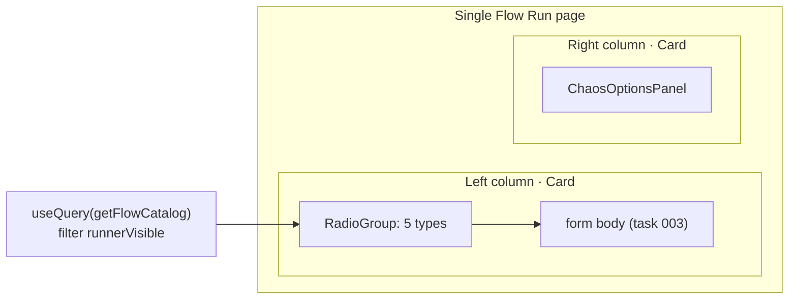

# Task 002 - Single Flow Run shell: nav rename, radio selector, two-column layout (frontend)

## Functional Requirements
- Rename the side-nav entry **"Single Flow" → "Single Flow Run"**.
- Replace the flow-type **dropdown** with a **radio group** of the five `runnerVisible`
  transaction types, default-selected **Top-up**.
- Restructure the page into a **two-column layout**: the transaction form widget on the
  **left**, the chaos-options widget on the **right**, as visually separate panels.
- Move the existing chaos-options UI into the right-column widget unchanged in behavior.
- Responsive: the two columns **stack** on narrow screens (form above chaos options).

This task delivers the **shell** — nav, radio, layout, and the relocated chaos widget. The
catalog-driven form body that fills the left column is task 003; until then the left column
renders the existing field grid (or a placeholder) so the shell is independently shippable.

## Acceptance Criteria
- [ ] Side nav shows **"Single Flow Run"** (label only; route may stay `/chaos/single-flow`).
- [ ] A radio group lists exactly the five flows where `runnerVisible===true`, labelled
      Top-up, Inter-VA Transfer, Treasury Sweep, Treasury Prefund, Treasury Transfer, with
      **Top-up selected by default**.
- [ ] `ORGANIZATION_ONBOARDED` and `ORGANIZATION_VA_UPDATED` no longer appear as options.
- [ ] The page renders two columns: left = transaction form panel, right = chaos-options
      panel; on small screens they stack (form first).
- [ ] The chaos-options panel preserves all current strategies and the destructive-confirm
      behavior.
- [ ] The target-Kafka-cluster safety label remains visible.

## Technical Design
React 19 + Vite + react-router 7 + react-query 5 + Tailwind + shadcn/ui
([ADR-005](../../decisions/005-react-vite-shadcn-frontend.md)).

### Nav
`chaos-admin/src/components/layout/app-shell.tsx` — change the `operateNavigation` entry
label `"Single Flow"` → `"Single Flow Run"` (currently around line 27). Keep `to:
"/chaos/single-flow"` to avoid breaking bookmarks/links; optionally also rename the route to
`/chaos/single-flow-run` with a redirect from the old path (call out in PR; not required).

### Page layout
`chaos-admin/src/features/chaos/single-flow-page.tsx` — restructure the top-level render into
a responsive grid:

```tsx
// runnerVisible flows from GET /flows/catalog, in idea order
const RUNNER_ORDER = [
  "TOPUP_CONFIRMED", "TRANSFER_REQUESTED",
  "TREASURY_SWEEP_COMPLETED", "TREASURY_PREFUND_COMPLETED", "TREASURY_TRANSFER_COMPLETED",
] as const;

const runnerFlows = catalog
  .filter(c => c.runnerVisible)
  .sort((a, b) => RUNNER_ORDER.indexOf(a.flowType) - RUNNER_ORDER.indexOf(b.flowType));

const [flowType, setFlowType] = useState<string>("TOPUP_CONFIRMED");

return (
  <div className="grid grid-cols-1 gap-4 lg:grid-cols-[minmax(0,1fr)_360px]">
    {/* LEFT: transaction form widget */}
    <Card>
      <CardHeader>
        <RadioGroup value={flowType} onValueChange={setFlowType} className="flex flex-wrap gap-2">
          {runnerFlows.map(f => (
            <RadioGroupItem key={f.flowType} value={f.flowType} label={labelFor(f.flowType)} />
          ))}
        </RadioGroup>
      </CardHeader>
      <CardContent>
        {/* task 003: <TransactionTypeForm catalog={selected} .../> */}
      </CardContent>
    </Card>

    {/* RIGHT: chaos options widget (relocated, unchanged behavior) */}
    <Card>
      <CardHeader><CardTitle>Chaos options</CardTitle></CardHeader>
      <CardContent><ChaosOptionsPanel value={chaos} onChange={setChaos} /></CardContent>
    </Card>
  </div>
);
```

- Extract the existing chaos-options block (current lines ~468–588) into a
  `ChaosOptionsPanel` component (`features/chaos/chaos-options-panel.tsx`) with
  `{ value, onChange }` props — a pure move/lift, no behavior change — so it drops into the
  right column and stays testable in isolation.
- If `RadioGroup`/`RadioGroupItem` shadcn primitives don't yet exist under
  `components/ui/`, add them (radix `@radix-ui/react-radio-group`) following the existing
  shadcn wrapper conventions.



## Implementation Notes
- Files: `components/layout/app-shell.tsx` (nav label); `features/chaos/single-flow-page.tsx`
  (layout + radio); new `features/chaos/chaos-options-panel.tsx` (extracted); maybe
  `components/ui/radio-group.tsx`.
- `labelFor` maps flow type → display label (Top-up, Inter-VA Transfer, Treasury Sweep,
  Treasury Prefund, Treasury Transfer). Could later read from a catalog `displayName`; for now
  a small local map keyed by `FlowType` is fine.
- Keep the existing `useQuery(["flow-catalog"], getFlowCatalog)`; just filter on
  `runnerVisible` (added by task 001). Until task 001 lands, the filter can fall back to the
  hard-coded `RUNNER_ORDER` set so this task isn't blocked.
- Preserve current submit wiring (`useMutation(runFlow)`) and the `FlowResult` display.

## Non-Functional Requirements
- No layout shift / horizontal scroll at common breakpoints; right column fixed ~360px on
  `lg+`, full-width stacked below.
- Radio is keyboard-navigable and labelled (a11y) — radix handles roving focus.

## Dependencies
- Task 001 supplies `runnerVisible` (graceful fallback available, so not a hard block).
- Task 003 fills the left column body; this task leaves a seam (`CardContent`) for it.
- Existing `getFlowCatalog`/`runFlow` API client + chaos types.

## Risks & Mitigations
- *Chaos-panel extraction regressions* → it's a pure lift of existing JSX/state; cover with a
  render+interaction test before/after.
- *Route rename breaking links* → keep the old path; only add a redirect if the route is
  renamed.

## Testing Strategy
- MSW + Testing Library: nav renders "Single Flow Run"; radio shows five options with Top-up
  default; switching radio updates selection; chaos panel renders in the right column and its
  destructive-confirm still fires; two-column grid present at `lg`, stacked at `sm`.

## Deployment Strategy
Frontend-only, no flag. Ships independently of task 003 (placeholder body) or together with
it. Auth + target-cluster label unchanged.
