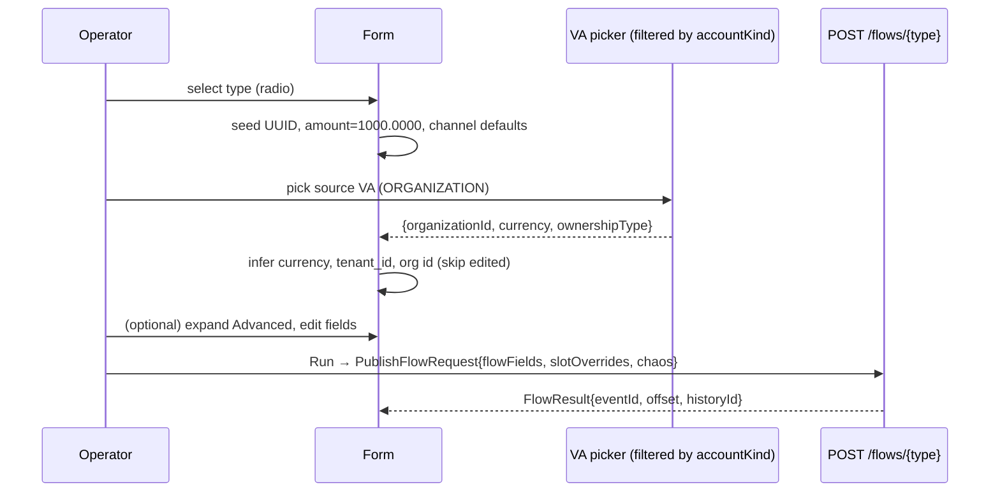

# Task 003 - Catalog-driven transaction-type forms: collapse, VA pickers, autogen & inference (frontend)

## Functional Requirements
Render the left-column transaction form **from the catalog field descriptors** (task 001),
realizing the idea's per-type behavior:
- **Required fields shown**; **non-required (`advanced`) fields collapsed** under an
  expandable "Advanced / inferred" section.
- **Transaction request id** autogenerated as a **UUID v4** with a **regenerate** control.
- **`amount`** seeded to its descriptor default (`1000.0000`), editable.
- **`source_va_id` / `destination_va_id`** rendered as **VA pickers filtered by the
  descriptor's `accountKind`** (Organization vs System); system slots pre-selected from the
  chart-of-accounts default.
- **Inference**: on source/destination VA selection, fill the inferable advanced fields
  (`organization_id` / source+destination org ids, `currency`, `tenant_id`) from the selected
  VA — **client-side**, and keep them **overridable**.
- **Treasury channel selects** seed their per-sub-type defaults from the descriptor.
- Assemble and submit the existing `PublishFlowRequest` (`flowFields` + `slotOverrides` +
  common fields + chaos) to `POST /flows/{flowType}` — wire contract unchanged.

## Acceptance Criteria
- [ ] For each of the five types, required descriptors render as visible inputs; `advanced`
      descriptors render inside a collapsed, expandable section.
- [ ] The request-id field is seeded with a UUID v4 on type-select; a regenerate control
      issues a new one; switching types reseeds.
- [ ] `amount` shows `1000.0000` by default.
- [ ] A `VA_REF` field shows a picker listing only VAs whose `ownershipType` matches the
      descriptor's `accountKind`; a `SYSTEM` slot defaults to the CoA-resolved VA.
- [ ] Selecting a **source** VA fills `currency` (= VA currency) and, when the VA's ownership
      is `ORGANIZATION`, `tenant_id` and the source org-id field (= VA `organizationId`);
      when ownership is `SYSTEM`, `tenant_id` is left blank.
- [ ] Selecting a **destination** VA fills the destination org-id field (= VA
      `organizationId`).
- [ ] Inferred fields are editable; a manual edit is **not** overwritten by a later
      re-inference.
- [ ] Treasury `source_channel`/`destination_channel` default per sub-type (Prefund
      bank→momo, Sweep momo→bank, Transfer momo→momo) and are editable selects.
- [ ] Submitting produces a `PublishFlowRequest` carrying the assembled values; the
      `FlowResult` renders as today.

## Technical Design
Catalog-driven renderer keyed off `FieldKind` + descriptor metadata.

### Field → control mapping
| `kind` | control | seeding / behavior |
|---|---|---|
| `UUID` | text + regenerate button | seed `crypto.randomUUID()`; regenerate reseeds |
| `AMOUNT` | numeric input | seed `defaultValue` (`1000.0000`) |
| `DATETIME` | datetime input | empty unless `defaultValue` |
| `SELECT` | `Select` | options from `descriptor.options`; seed `defaultValue` |
| `VA_REF` | VA picker (searchable `Select`/combobox) | options = VAs filtered by `accountKind`; SYSTEM seed = slot default |
| `TEXT` | text input | seed `defaultValue`; if `inference!=NONE`, value is inference-driven |

### Inference engine (client-side, pure)
```ts
// VirtualAccountResponse already carries { ownershipType, organizationId, currency }
function applyInference(descriptors, values, edited, sourceVa, destVa) {
  for (const d of descriptors) {
    if (d.inference === "NONE" || edited.has(d.name)) continue; // manual edit wins
    switch (d.inference) {
      case "ORG_FROM_SOURCE_VA": set(d.name, sourceVa?.organizationId ?? ""); break;
      case "ORG_FROM_DEST_VA":   set(d.name, destVa?.organizationId ?? "");   break;
      case "CURRENCY_FROM_SOURCE_VA": set(d.name, sourceVa?.currency ?? "");  break;
      case "TENANT_FROM_SOURCE_VA":
        set(d.name, sourceVa?.ownershipType === "ORGANIZATION" ? sourceVa.organizationId ?? "" : "");
        break;
    }
  }
}
```
- Track an `edited: Set<fieldName>` (fields the operator typed in). Inference skips edited
  fields so manual overrides survive a VA re-pick.
- Re-run `applyInference` whenever `sourceVa` or `destVa` changes (and on initial type-select).

### Collapse
- Partition descriptors into `required` (always shown) and `advanced` (inside a
  collapsible/accordion, collapsed by default). A small badge can show how many advanced
  fields are populated so inferred values are discoverable without expanding.

### Submit assembly (must match how the backend reads each field — see task 001 *Publish-path alignment*)
The builders read fields from **three different places**; the form must route each descriptor
to the right one or the value is silently dropped:
- **`slotOverrides[descriptor.slotName]`** — for **`VA_REF`** fields. The builders read
  `source_va_id`/`destination_va_id` **only** from resolved slots, never `flowFields`. Always
  emit the picked VA here (not just on diff-from-default). **Requires** the slot to be seeded
  in `flow_slot_config` (task 001 adds the missing Top-up `source`, Inter-VA `source`+`dest`,
  Treasury-Transfer `source`+`dest`) — otherwise the override is ignored and the VA id
  publishes empty.
- **Top-level `PublishFlowRequest` fields** — for `correlationId` and `tenantId` (the envelope
  `metadata.correlation_id`/`tenant_id` come from these, **not** `flowFields`), plus `amount`,
  `currency`, `channel`. Route the `correlation_id`/`tenant_id`/`currency`/`amount` descriptors
  here. (`currency`/`amount` are also accepted in `flowFields`, but top-level is canonical.)
- **`flowFields[descriptor.name]`** — everything else: the request-id, org-id(s),
  channels, payment refs, `approved_by`/`initiated_by`/`completed_by`, `*_at`, and any inferred
  values the operator left in place. Keys are exact snake_case (no conversion server-side).
- **`idempotency_key`:** the current contract has nowhere to send it (server derives
  `<event-type>:<eventId>`). Per task 001 decision (c): if (c-i), don't render an editable
  field (show derived/read-only or omit); if (c-ii), send it as the new optional
  `PublishFlowRequest.idempotencyKey`. Do **not** put it in `flowFields` (ignored).



## Implementation Notes
- Files: `features/chaos/single-flow-page.tsx` (host); new
  `features/chaos/transaction-type-form.tsx` (descriptor renderer + inference + collapse);
  new `features/chaos/va-picker.tsx` (searchable VA select filtered by `accountKind`); extend
  `lib/api.ts` `FlowCatalogEntry` type with `fields: FlowFieldDescriptor[]` + `runnerVisible`
  and add the `FlowFieldDescriptor` TS type mirroring task 001.
- VA options via the existing `listVirtualAccounts(token, { ownershipType })` (filter by
  `ORGANIZATION`/`SYSTEM`); for `SYSTEM` VA fields, default the selection to the slot's
  CoA-resolved VA (from `FlowConfigResponse.slots[].effectiveVaId` via `listFlowConfigs`, or
  the slot default surfaced today).
- UUID via `crypto.randomUUID()` (browser-native). Regenerate updates the field and any
  mirror (e.g. an idempotency key derived from it).
- Reuse shadcn `Accordion`/`Collapsible`, `Select`, `Input`, `Button`, `Badge`. Keep the
  numeric formatting consistent with the backend (`1000.0000`, no scientific notation).
- Deferred (idea `003_auto_generated_uuid`): "transaction ids should be selectable" from prior
  runs — leave a TODO; not built here.

## Non-Functional Requirements
- Inference is synchronous and local (no network) — instant on VA select.
- VA picker handles large lists (search/virtualize) and an empty list (fall back to manual
  entry so a run is never blocked).
- No precision loss on `amount` (treat as string/decimal through submit).

## Dependencies
- **Task 001** (descriptor contract — `fields[]`, `accountKind`, `slotName`, `inference`,
  `autogen`, `defaultValue`) **and its publish-path fixes** (the seeded Top-up/Inter-VA/
  Treasury-Transfer slots + human-field defaults). The renderer can start against a fixture of
  the descriptor shape, but **end-to-end publishing of a non-empty source VA depends on task
  001's slot seeding** — without it the picker's value is dropped server-side.
- **Task 002** (the shell/left-column seam it renders into).
- Existing `listVirtualAccounts`, `listFlowConfigs`, `runFlow` API client.

## Risks & Mitigations
- *Picked VA publishes empty* (the cross-task trap) → `VA_REF` values only land if the slot is
  seeded; gated on task 001. Add an MSW/integration check that the assembled request carries
  `slotOverrides.source`/`.destination`, and rely on task 001's envelope integration test for
  the server side.
- *Inference clobbering manual edits* → `edited` set guards every inferred field; covered by a
  test that edits then re-picks a VA.
- *System VA has null `organizationId`* → inferred org/tenant resolve to empty, not error
  (and treasury has no org-id fields at all — those descriptors are omitted per task 001).
- *Routing a field to the wrong bucket* (e.g. `tenant_id`/`correlation_id` into `flowFields`,
  where the builder ignores them) → follow the Submit-assembly routing table exactly; a test
  asserts `correlation_id`/`tenant_id` land top-level and `VA_REF`s land in `slotOverrides`.
- *Label/wire mismatch* (`narrative`, `completed_by/at`) → render `label`, submit under
  `name`; the descriptor already encodes both.

## Testing Strategy
- MSW + Testing Library, per type:
  - required shown / advanced collapsed; expand reveals inferred values;
  - UUID seeded + regenerate changes it; amount default `1000.0000`;
  - VA picker lists only matching `accountKind`; SYSTEM slot pre-selected;
  - source-VA select fills currency+tenant+org (ORGANIZATION) and leaves tenant blank
    (SYSTEM); dest-VA select fills dest org id; manual edit survives re-pick;
  - treasury channel defaults per sub-type;
  - submit payload equals the assembled `PublishFlowRequest`.

## Deployment Strategy
Frontend-only, no flag. Ships after (or with) tasks 001 + 002. Auth + target-cluster label
unchanged. Adding the deferred flows later needs only their descriptors (task 001) — this
renderer already handles any descriptor shape.
