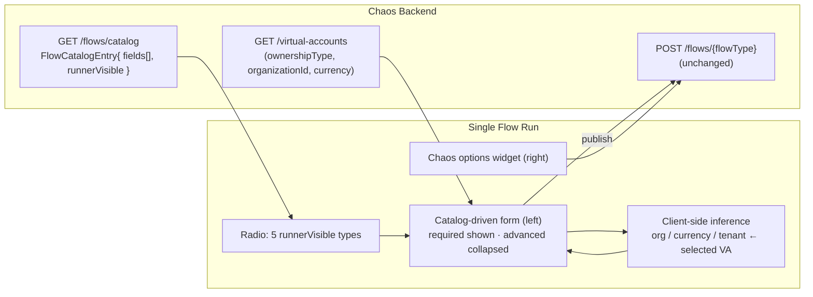

# Phase 11 - Single Flow Run Redesign

## Summary
Reworks the chaos **Single Flow** runner into a **Single Flow Run** console: the side-nav
entry is renamed, the transaction type is chosen by **radio** (not a dropdown) from a
focused set of **five** transaction types, and the screen splits into a **two-column
layout** — the catalog-driven transaction form on the **left**, the chaos-options widget on
the **right**. The form now distinguishes **required-but-prefilled** fields (shown) from
**non-required-but-inferable** fields (collapsed), autogenerates transaction-request UUIDs,
scopes the source/destination VA pickers by **account kind** (Organization vs System), and
prefills/infers `organization_id`, `currency`, and `tenant_id` from the selected VA —
**client-side**. Backed by an enriched, field-descriptor flow catalog
([ADR-014](../../decisions/014-flow-catalog-field-descriptors-and-client-side-inference.md)).

## Motivation
The current runner ([Phase 005 / task 006](../005-frontend-admin/006-chaos-runner-single-and-csv.md))
renders every flow's fields as an undifferentiated grid of text inputs behind a 12-entry
dropdown, with chaos options stacked in the same column. Idea `004_single_flow_run.md` asks
for a sharper operator experience: pick a transaction type up-front, see only what you must
fill, let everything inferable be inferred (but overridable), and keep chaos options visually
separate from the "what am I sending" form. This makes the common case (fire a well-formed
top-up) a two-field exercise while keeping the full surface one expand away.

## User-Facing Changes
- **Side nav:** "Single Flow" → **"Single Flow Run"**.
- **Transaction type** chosen via a **radio group** of five options, default **Top-up**:
  Top-up, Inter-VA Transfer, Treasury Sweep, Treasury Prefund, Treasury Transfer.
  `Organization Onboarded` and `Organization VA Updated` are **removed** from this page.
  (Settlement / Collection / Disbursement are **deferred** — designed to re-add via a catalog
  flag, no UI rework; see Decision in [ADR-014](../../decisions/014-flow-catalog-field-descriptors-and-client-side-inference.md).)
- **Two-column layout:** transaction form (left) + chaos-options widget (right), responsive
  (stacks on narrow screens).
- **Form behavior:** required fields shown (prefilled, editable); non-required fields
  **collapsed** under an "Advanced / inferred" section; request id is an **autogenerated
  UUID** with a regenerate control; `amount` defaults to `1000.0000`; VA pickers are filtered
  to the field's account kind; `organization_id`/`currency`/`tenant_id` auto-fill from the
  selected VA.
- **API (additive):** `GET /api/v0/flows/catalog` entries gain `fields[]` (descriptors) and a
  `runnerVisible` flag; the legacy `requiredFields`/`optionalFields`/`csvColumns` lists remain.

## Architecture Impact
Touches `com.softspark.chaos.flow` (the catalog DTO + provider) and the bootstrap **slot seed
config** (`chaos-bootstrap.yml`) on the backend, and the `features/chaos` +
`components/layout` modules on the frontend. **No new tables, no new endpoints, no new Kafka
surface**, and `FlowController.publish` is unchanged; the only request-contract change is an
*optional* `idempotencyKey` field **iff** the team takes that option (see Edge Cases /
[ADR-014](../../decisions/014-flow-catalog-field-descriptors-and-client-side-inference.md)).
The architectural moves are: (1) enrich the catalog into a **field-descriptor** contract;
(2) do all prefill/inference **client-side** off the existing `VirtualAccountResponse`
(`ownershipType`, `organizationId`, `currency`); and (3) **align the publish path** —
tracing the builders showed VA ids flow only through `slotOverrides` of **seeded** slots, so
the redesign must seed the currently-missing Organization-account slots (Top-up `source`,
Inter-VA `source`+`destination`) and Treasury-Transfer slots, and guarantee every
builder-`getRequired` field has a default or inference so a collapsed form still publishes.
See [ADR-014](../../decisions/014-flow-catalog-field-descriptors-and-client-side-inference.md).

## Edge Cases
- **Unconfigured slot silently drops the picked VA** (the trap the build-out must avoid):
  `SlotResolver` only resolves slots with a `flow_slot_config` row, so a `slotOverrides` entry
  for an unseeded slot is ignored and the VA id publishes empty. Today Top-up has only a
  `destination` slot, and Inter-VA / Treasury-Transfer have **none** — task 001 seeds the
  missing ones. Without the seed, the new source/destination pickers would publish blanks.
- **Collapsed advanced section must still publish:** several builder-`getRequired` fields
  (`organization_id`, `approved_by`, `narrative`, `initiated_by`, `completed_by`, channels)
  are *non-required in the UI*; they only stay valid because the descriptor always fills them
  via inference or a `defaultValue`. A default run with Advanced untouched must yield `200`.
- **`idempotency_key` has no transport** in the current `PublishFlowRequest` (server derives
  `<event-type>:<eventId>`). Decision: drop the field (server-derived) **or** add an optional
  `idempotencyKey` override (recommended — cross-run idempotency chaos). Flagged in
  [ADR-014](../../decisions/014-flow-catalog-field-descriptors-and-client-side-inference.md).
- **Treasury org-id fields don't exist** in the treasury payloads — the idea lists them but
  the builders never read them; those descriptors are omitted (inference is Top-up/Inter-VA only).
- **System-account source (Treasury):** `TENANT_FROM_SOURCE_VA` yields blank (ownership ≠
  ORGANIZATION); `ORG_FROM_*_VA` yields the VA's `organizationId`, which may be `null` for
  system accounts — leave the inferred field empty, do not error.
- **VA changed after inference:** re-picking a VA re-runs inference and overwrites the
  inferred fields **only if the operator hasn't manually edited them** (manual edits win).
- **Empty/oversized VA list** for an account kind: picker shows an empty/"no accounts" state;
  the field falls back to manual entry so a run is never blocked by registry state.
- **Regenerated UUID** must replace the request id everywhere it's mirrored (e.g. an
  idempotency key derived from it) consistently within the form.
- **Treasury channel defaults** differ per sub-type (Prefund src=bank/dest=momo; Sweep
  src=momo/dest=bank; Transfer src=momo/dest=momo) — defaults come from the descriptor, not
  hard-coded in the component.
- **Label vs wire-name mismatch** (Inter-VA "Source Payment Reference"→`narrative`; Treasury
  "Initiated By/At"→`completed_by`/`completed_at`) — display the idea's label, send the wire
  name; never rename the wire field (ledger contract). Flagged in
  [ADR-014](../../decisions/014-flow-catalog-field-descriptors-and-client-side-inference.md).

## Testing Strategy
- **Backend:** catalog descriptor test per `runnerVisible` flow — asserts each field's
  `kind`/`required`/`advanced`/`defaultValue`/`autogen`/`inference`/`accountKind`, that the
  derived legacy lists still match today's values, and that exactly the five idea-listed
  flows are `runnerVisible`.
- **Frontend (MSW):** radio renders five options (Top-up default); selecting a type renders
  required fields shown + advanced collapsed; UUID seeded + regenerate; amount default
  `1000.0000`; VA picker filtered by account kind; selecting a source VA fills
  org/currency/tenant; tenant blank for a system source; chaos widget renders in the right
  column; publish payload matches the assembled form values.
- Regression: the CSV batch upload page (which consumes the legacy list fields) is unaffected.

## Deployment Strategy
No feature flag, no migration, no data backfill — the catalog change is additive and the
publish contract is unchanged, so old and new clients interoperate during rollout. Auth and
the target-cluster safety label are inherited from the existing runner. Ships as a normal
frontend + backend deploy; the deferred flows re-enter later by flipping `runnerVisible`.

## Tasks
- [001 - Flow catalog field descriptors & runner scoping (backend)](./001-flow-catalog-field-descriptors.md) — enrich `FlowCatalogEntry` with `fields[]` + `runnerVisible`; descriptors for the five flows.
- [002 - Single Flow Run shell: nav rename, radio selector, two-column layout (frontend)](./002-single-flow-run-shell-and-layout.md) — rename nav, radio of five types, left form / right chaos widget.
- [003 - Catalog-driven transaction-type forms: collapse, VA pickers, autogen & inference (frontend)](./003-transaction-type-forms-and-inference.md) — descriptor renderer, advanced collapse, account-kind VA pickers, UUID autogen, client-side prefill/inference.

## Parallel Tasks
- **001 is the unblocker** for 003 — both the descriptor *contract* (form rendering) and the
  *publish-path fixes* (seeded slots + field defaults) it carries. 003's UI can be stubbed
  against a fixture of the descriptor shape, but **end-to-end publishing of a non-empty source
  VA requires 001's slot seeding** to have landed.
- **002 is independent of 001** — it's the layout skeleton (nav, radio, two-column shell) and
  can proceed in parallel with 001.
- **003 depends on 001 (contract + slot seeding) and 002 (the shell it renders into)** and
  lands last.
- Dependency chain: `001 ─┐` and `002 ─┴─→ 003`. Within 001, do the **slot-seed + field-default
  alignment first** (it's the correctness-critical part) and the descriptor enrichment alongside.
