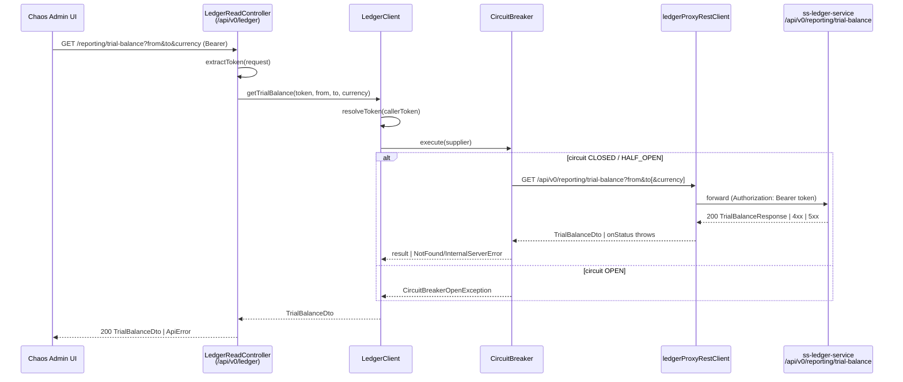

# Task 001 - Ledger trial-balance read proxy (backend)

## Functional Requirements

- Expose `GET /api/v0/ledger/reporting/trial-balance` on the chaos backend that read-proxies to
  `ss-ledger-service`'s `GET /api/v0/reporting/trial-balance`, returning the **unadjusted trial
  balance for a period** unchanged ([ADR-015](../../decisions/015-trial-balance-via-ledger-read-proxy.md)).
- Accept query params: `from` (required, ISO-8601 `Instant`), `to` (required, ISO-8601
  `Instant`, exclusive upper bound), `currency` (optional, ISO-4217 string; omit = all currencies).
- Forward all three params verbatim to the ledger and return its `TrialBalanceResponse` body as a
  chaos-side `TrialBalanceDto` with the **same field names and semantics** (transparent gateway).
- Run the call through the **existing ledger read-proxy machinery**: the `ledgerProxyRestClient`
  bean, per-request Bearer token forwarding (caller token → static service token fallback), the
  `CircuitBreaker`, and the existing `4xx → NotFoundException` / `5xx → InternalServerErrorException`
  status translation.
- Require a verified AUTH SERVICE token, identical to every other `/api/v0/**` endpoint.

## Acceptance Criteria

- [ ] `GET /api/v0/ledger/reporting/trial-balance?from=...&to=...` returns `200` with a body
      containing `from`, `to`, `currency`, `totalDebits`, `totalCredits`, `isBalanced`,
      `numberOfAccounts`, and `accounts[]` (each row: `accountId`, `accountCode`, `accountName`,
      `accountOwnerId`, `accountOwnershipType`, `currency`, `totalDebits`, `totalCredits`,
      `netMovement`).
- [ ] `currency` is optional; when present it is forwarded as a query param, when absent it is omitted.
- [ ] Missing `from` or `to` yields a `400` (Spring missing-required-param) before any ledger call.
- [ ] When the ledger returns `400` (e.g. `from >= to`, or span > 366 days), the proxy surfaces it
      as the standard chaos `ApiError` for a 4xx (`NotFoundException` path) — no `500`.
- [ ] When the ledger is down or the circuit is open, the endpoint returns the same
      "ledger temporarily unavailable" `InternalServerErrorException` other proxied reads return.
- [ ] No request without a valid bearer token reaches the ledger.
- [ ] Swagger UI lists the endpoint under the existing **"Ledger Proxy"** tag with `bearerAuth`.
- [ ] The endpoint reuses the existing `CircuitBreaker` instance/config — no new RestClient bean,
      no new circuit breaker, no new package.

## Technical Design

Target **Java 25 / Spring Boot 4** (project baseline — [ADR-001](../../decisions/001-target-java-25-and-spring-boot-4.md)).
DTOs are `record`s (project convention, no Lombok). All new code lands in the existing
`com.softspark.chaos.ledgerproxy` package per [ADR-015](../../decisions/015-trial-balance-via-ledger-read-proxy.md).

### Request flow



### DTOs (mirror the ledger response, camelCase)

```java
// com.softspark.chaos.ledgerproxy.TrialBalanceDto
public record TrialBalanceDto(
    Instant from,
    Instant to,
    @Nullable String currency,
    BigDecimal totalDebits,
    BigDecimal totalCredits,
    boolean isBalanced,
    int numberOfAccounts,
    List<TrialBalanceEntryDto> accounts) {}

// com.softspark.chaos.ledgerproxy.TrialBalanceEntryDto
public record TrialBalanceEntryDto(
    String accountId,            // ledger account UUID (kept as String, matching LedgerAccountDto)
    String accountCode,
    String accountName,
    @Nullable String accountOwnerId,
    String accountOwnershipType, // "SYSTEM" | "ORGANIZATION" (string, not enum — gateway is transparent)
    String currency,
    BigDecimal totalDebits,
    BigDecimal totalCredits,
    BigDecimal netMovement) {}
```

> Note: `isBalanced` deserializes from the ledger's `isBalanced` JSON property. Verify Jackson maps
> the `boolean isBalanced` record component to the `"isBalanced"` key (it does by default for a
> record accessor named `isBalanced`); add `@JsonProperty("isBalanced")` if the project's Jackson
> config strips the `is` prefix.

### Controller handler (added to existing `LedgerReadController`)

```java
@GetMapping("/reporting/trial-balance")
@Operation(summary = "Trial balance for a period (read-through to the ledger)",
           security = @SecurityRequirement(name = "bearerAuth"))
public ResponseEntity<TrialBalanceDto> getTrialBalance(
    @RequestParam Instant from,
    @RequestParam Instant to,
    @RequestParam(required = false) String currency,
    HttpServletRequest request) {
  var token = extractToken(request);
  try {
    return ResponseEntity.ok(ledgerClient.getTrialBalance(token, from, to, currency));
  } catch (CircuitBreakerOpenException e) {
    throw new InternalServerErrorException("Ledger service temporarily unavailable");
  }
}
```

### Client method (added to existing `LedgerClient`, mirrors `listAccounts`)

```java
public TrialBalanceDto getTrialBalance(
    String callerToken, Instant from, Instant to, @Nullable String currency) {
  var token = resolveToken(callerToken);
  return circuitBreaker.execute(() ->
      restClient.get()
          .uri(uriBuilder -> {
            var b = uriBuilder.path("/api/v0/reporting/trial-balance")
                .queryParam("from", from)
                .queryParam("to", to);
            if (currency != null && !currency.isBlank()) {
              b = b.queryParam("currency", currency);
            }
            return b.build();
          })
          .header("Authorization", "Bearer " + token)
          .retrieve()
          .onStatus(HttpStatusCode::is4xxClientError, (req, resp) -> {
            throw new NotFoundException("Ledger returned: " + resp.getStatusCode().value());
          })
          .onStatus(HttpStatusCode::is5xxServerError, (req, resp) -> {
            throw new InternalServerErrorException("Ledger error: " + resp.getStatusCode().value());
          })
          .body(TrialBalanceDto.class));
}
```

## Implementation Notes

Files to create:
- `chaos-machine/src/main/java/com/softspark/chaos/ledgerproxy/TrialBalanceDto.java`
- `chaos-machine/src/main/java/com/softspark/chaos/ledgerproxy/TrialBalanceEntryDto.java`

Files to modify:
- `chaos-machine/src/main/java/com/softspark/chaos/ledgerproxy/LedgerReadController.java`
  — add the `@GetMapping("/reporting/trial-balance")` handler (reuse `extractToken`).
- `chaos-machine/src/main/java/com/softspark/chaos/ledgerproxy/LedgerClient.java`
  — add `getTrialBalance(...)`, reusing the injected `circuitBreaker`, `restClient`, and
  `resolveToken` already present for the account/transaction reads.

Notes:
- `from`/`to` bind directly to `java.time.Instant` via Spring's default ISO-8601 conversion — no
  custom converter needed. The frontend sends `2026-06-01T00:00:00.000Z`-style strings.
- **Do not re-validate** `from < to` or the 366-day span in the proxy — the ledger is
  authoritative ([ADR-015](../../decisions/015-trial-balance-via-ledger-read-proxy.md)); forward
  its `400`. (A client-side guard lives in task 002 for UX.)
- The trial balance is a single aggregate object, **not a page** — return `TrialBalanceDto`
  directly, do **not** wrap it in `PageResponse`/`CursorPageResponse`.
- No `application.yml`, build, or dependency changes — everything reuses existing
  `ledger.*` config and the `ledgerProxyRestClient` bean.

## Non-Functional Requirements

- **Resilience:** inherits the proxy's connect/read timeouts (5s/30s default) and the circuit
  breaker (5 failures → open 30s → half-open probe). A slow ledger never hangs the chaos app.
- **Security:** bearer token required and forwarded; no token leakage to logs (the existing
  `LoggingClientHttpRequestInterceptor` already redacts auth).
- **Payload size:** the report can list many accounts for a wide period; it is unpaged by the
  ledger contract. Acceptable — typical operator periods (a month/quarter) yield bounded rows.
  If payloads grow problematic, revisit currency-scoping defaults (out of scope here).

## Dependencies

- `ss-ledger-service` `ReportingController` at `GET /api/v0/reporting/trial-balance` (exists and
  verified). No coordination needed — read-only, additive on the chaos side.
- Existing `ledgerproxy` infrastructure from
  [Phase 004 / task 002](../004-gateway-auth-ledger-proxy/002-ledger-read-proxy.md).
- **Blocks** task 002 (frontend) for true end-to-end; the frontend can be built against an MSW
  fixture of `TrialBalanceDto` in parallel.

## Risks & Mitigations

- **`isBalanced` JSON mapping** (the `is`-prefix Jackson pitfall): covered by a deserialization
  unit test asserting `true`/`false` round-trips from the ledger's `"isBalanced"` key; add
  `@JsonProperty` if it fails.
- **Ledger path divergence** (`/api/v0/ledger/reporting/...` vs ledger `/api/v0/reporting/...`):
  documented in [ADR-015](../../decisions/015-trial-balance-via-ledger-read-proxy.md); the client
  targets the ledger's real path, the controller exposes the chaos path.
- **Field drift** if the ledger changes its `TrialBalanceResponse`: the DTO is a thin mirror;
  the contract test (below) pins the field set and fails loudly on drift.

## Testing Strategy

- **Unit (Mockito + AssertJ):** `LedgerReadController` test — mocks `LedgerClient`, asserts the
  handler forwards `from`/`to`/`currency`, returns `200` with the DTO, and maps
  `CircuitBreakerOpenException → InternalServerErrorException`.
- **Client test (MockRestServiceServer / WireMock):** asserts `LedgerClient.getTrialBalance`
  issues `GET /api/v0/reporting/trial-balance` with the right query params (currency present vs
  omitted), forwards the bearer token, and translates `4xx`/`5xx` to the project exceptions.
- **DTO deserialization test:** a captured ledger `TrialBalanceResponse` JSON sample deserializes
  cleanly into `TrialBalanceDto`/`TrialBalanceEntryDto`, including `isBalanced` and a null
  `accountOwnerId`/`currency`.
- **Integration (`@SpringBootTest` + WireMock ledger stub):** full HTTP round-trip through the
  controller with a stubbed ledger, including the `400`-passthrough case.
- Fold these into the Phase 006 backend suites (`006/001`, `006/002`).

## Deployment Strategy

Additive, read-only, no migration and no Kafka surface — ships as a normal backend deploy. Auth
and target-cluster safety are inherited. No feature flag needed; the endpoint is inert until the
frontend (task 002) calls it.
