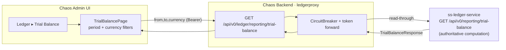

# Phase 12 - Trial Balance Reporting

## Summary
Adds a **Trial Balance** report to the chaos admin: a new side-nav item under **Ledger** and a
read-only page that shows the **unadjusted trial balance over a selected period** —
debit/credit totals, a balanced/out-of-balance indicator, and a per-account breakdown. The data
is computed authoritatively by `ss-ledger-service` (`GET /api/v0/reporting/trial-balance`); the
chaos backend **read-proxies** it through the existing ledger proxy at
`GET /api/v0/ledger/reporting/trial-balance` ([ADR-015](../../decisions/015-trial-balance-via-ledger-read-proxy.md)).

## Motivation
Idea `005_trial_balance.md` asks to "add a Trial Balance side nav item" and "consume
`/api/v0/reporting/trial-balance` to display unadjusted trial balance over a selected period."
Operators driving chaos at the ledger need a quick reconciliation read — does the ledger still
balance after a run, and where did movement land — without leaving the chaos console or querying
the ledger directly (which the single-gateway topology forbids,
[ADR-003](../../decisions/003-backend-as-single-api-gateway.md)). The ledger already does the
math; this phase is the thin gateway + UI to surface it.

## User-Facing Changes
- **Side nav:** new **Trial Balance** item in the **Ledger** group (alongside Transactions).
- **New page** `/trial-balance`:
  - pick a period two ways — a **month quick-picker** and editable **From / To** date inputs;
  - optional **currency** filter (default "All currencies");
  - **summary header**: total debits, total credits, **Balanced / Out of balance** badge,
    number of accounts, echoed period;
  - **per-account table**: code, name, ownership type, currency, debits, credits, net movement.
- **API (additive):** chaos backend gains `GET /api/v0/ledger/reporting/trial-balance`
  (`from`, `to`, optional `currency`) under the existing **Ledger Proxy** Swagger tag.

## Architecture Impact
No new tables, no Kafka surface, no new persistence. The backend change is **additive within the
existing `com.softspark.chaos.ledgerproxy` package** — a handler on `LedgerReadController` and a
method on `LedgerClient`, reusing the configured `ledgerProxyRestClient`, the per-request bearer
token forwarding, the `CircuitBreaker`, and the standard `4xx/5xx` translation. The chaos machine
computes nothing and stores nothing here — it stays a transparent read-through gateway
([ADR-003](../../decisions/003-backend-as-single-api-gateway.md),
[ADR-015](../../decisions/015-trial-balance-via-ledger-read-proxy.md)). The frontend adds one
feature module mirroring the `features/transactions` read-page pattern (minus pagination).

## Edge Cases
- **`to` is exclusive:** a "June 2026" report sends `from=2026-06-01`, `to=2026-07-01`. The UI
  encapsulates this so operators think in whole periods; the header shows the human period.
- **Invalid period:** `from >= to` or span > 366 days → the ledger returns `400`. The UI guards
  the obvious cases client-side; any that slip through surface as a graceful error, not a crash.
- **Out of balance:** `isBalanced=false` is a *valid* result (the whole point during chaos) — it
  renders a warning badge, not an error. The ledger separately logs a consistency discrepancy.
- **Ledger down / circuit open:** the proxy returns the standard "temporarily unavailable" error;
  the page shows a Retry. Chaos-induced ledger stress must not white-screen the report.
- **SYSTEM vs ORGANIZATION rows:** `accountOwnerId` is null for SYSTEM accounts → render `—`.
- **Empty period:** no account activity → `accounts: []` with zero totals → empty-state panel.
- **Currency scoping:** omitting `currency` aggregates all currencies (rows may mix currency
  codes); the per-row `currency` column keeps that legible. Selecting one scopes the report.
- **BigDecimal precision:** amounts are carried and formatted as strings end-to-end (no float parse).
- **`isBalanced` JSON mapping:** guard the Jackson `is`-prefix pitfall on the backend DTO (test-covered).

## Testing Strategy
- **Backend:** controller unit test (param forwarding + circuit-open → 500), client test against a
  mock ledger (query params, token, 4xx/5xx translation), DTO deserialization test on a captured
  ledger sample (incl. `isBalanced` + null owner), and a `@SpringBootTest` + WireMock integration
  round-trip including the `400`-passthrough. Folds into the Phase 006 backend suites.
- **Frontend:** MSW-backed component tests — nav/route, default-month load, picker↔date sync,
  currency scoping, balanced/out-of-balance badge, loading/error/empty states, and the
  client-side period guard. Folds into the Phase 006 frontend suite.

## Deployment Strategy
Additive, read-only, no migration, no Kafka, no feature flag. Backend and frontend can ship
independently — the endpoint is inert until the page calls it, and the page degrades to its error
state if the endpoint isn't deployed yet. Auth and target-cluster safety are inherited from the
existing proxy and shell. A normal backend + frontend deploy.

## Tasks
- [001 - Ledger trial-balance read proxy (backend)](./001-ledger-trial-balance-read-proxy.md) —
  `GET /api/v0/ledger/reporting/trial-balance` on `LedgerReadController` + `LedgerClient.getTrialBalance` + DTOs, reusing the existing proxy machinery.
- [002 - Trial Balance report page (frontend)](./002-trial-balance-report-page.md) —
  nav item, `/trial-balance` route, `getTrialBalance` API fn, and the read-only report page (period + currency filters, summary, table, states).

## Parallel Tasks
- **001 and 002 can proceed in parallel.** 002 builds against an **MSW fixture** of
  `TrialBalanceResponse` and wires to the live endpoint once 001 lands. True end-to-end
  (real data) depends on 001.
- Within 001, the DTO + client method gate the controller handler (trivial ordering).
- Dependency chain: `001 ─(live data)─→ 002`; otherwise independent.
