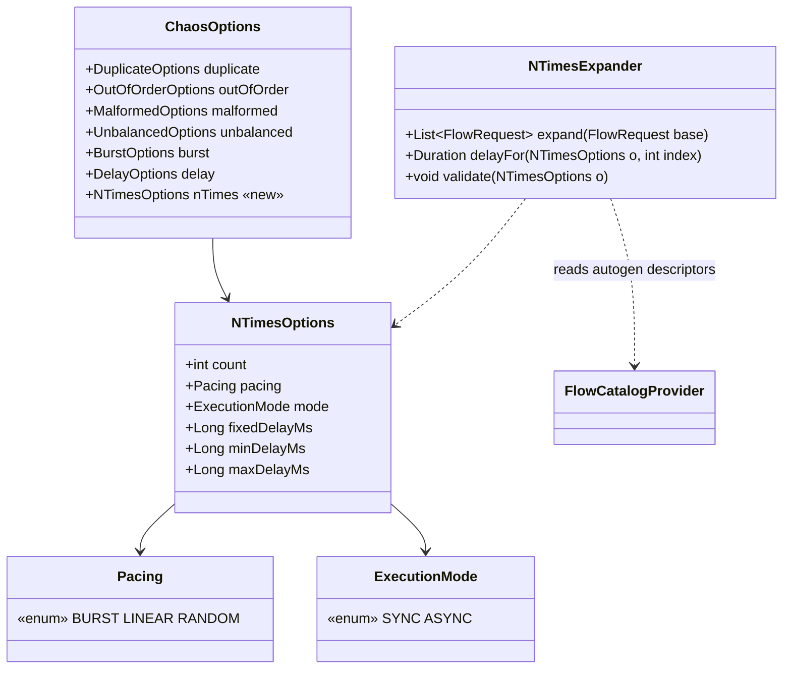

# Task 001 - N-Times Contract & Distinct-Iteration Core

## Functional Requirements
- Add a new mutually-exclusive **N-Times** option to `ChaosOptions` describing: how many times to
  run the flow (`count`), the timing **pacing** (`BURST` | `LINEAR` | `RANDOM`), the **execution
  mode** (`SYNC` | `ASYNC`), and the pacing delay parameters.
- Provide a **shared expander** that turns one `FlowRequest` into **N per-iteration
  `FlowRequest`s** which, when each is executed by `FlowEngine`, yield **N genuinely-distinct
  transactions** against the **same** source/destination accounts:
  - each iteration carries a **fresh** business transaction id (`*_request_id`) so the ledger
    does not dedup it;
  - each iteration will get a fresh event id (→ fresh `"<event-type>:<eventId>"` idempotency key)
    from `FlowEngine` — the expander must **not** fight that;
  - all N iterations share **one correlation id** for grouping;
  - slots (VA ids), `amount`/`grossAmount`/`netAmount`, `currency`, `channel`, and organization
    ids are **held constant**.
- Extend `ChaosLimits` with N-Times caps and validate every N-Times request against them,
  rejecting over-cap / malformed requests with `400` (consistent with the other strategies).

## Acceptance Criteria
- [ ] `ChaosOptions` gains a `@Nullable NTimesOptions nTimes` field; existing fields/behaviour
      unchanged; "first non-null strategy wins" still holds.
- [ ] `NTimesOptions(int count, Pacing pacing, ExecutionMode mode, Long fixedDelayMs, Long
      minDelayMs, Long maxDelayMs)` exists with `Pacing{BURST,LINEAR,RANDOM}` and
      `ExecutionMode{SYNC,ASYNC}`.
- [ ] `NTimesExpander.expand(FlowRequest base)` returns a list of exactly `count` `FlowRequest`s.
- [ ] Every returned request has a **distinct** value for each `autogen = UUID_V4` field
      (the `*_request_id`); a parameterized test over all `runnerVisible` flows asserts the field
      is found and re-rolled.
- [ ] All returned requests share **one** correlation id (the base's override if present, else a
      single generated id); slots, amounts, currency, channel and org-id `flowFields` are
      **identical** across all N.
- [ ] `NTimesExpander.delayFor(iterationIndex)` (or a `pacingPlan`) yields `Duration.ZERO` for
      `BURST`, `fixedDelayMs` for `LINEAR`, and a value in `[minDelayMs, maxDelayMs]` for
      `RANDOM` (first iteration has no preceding gap).
- [ ] Validation rejects, with `BadRequestException` (→ 400): `count < 1`; `count > maxNTimes`;
      `LINEAR` without `fixedDelayMs` or `fixedDelayMs > maxDelayMs`; `RANDOM` without
      `min/maxDelayMs`, `minDelayMs < 0`, `minDelayMs > maxDelayMs`, or `maxDelayMs >
      limits.maxDelayMs`.
- [ ] `ChaosLimits` exposes `maxNTimes` (default 100), `maxNTimesSync` (25), `maxSyncDurationMs`
      (60 000); per-gap delays reuse the existing `maxDelayMs` (30 000).

## Technical Design
Target **Java 25**, Spring Boot 4, `record-builder` (no Lombok) — matching the module.

New/changed types in `com.softspark.chaos.flow.chaos`:

**Distinctness — the crux.** The business transaction id lives in `FlowRequest.flowFields()`
(e.g. `topup_request_id`, `transfer_request_id`, `sweep_request_id`) and the builders read it via
`FlowFields.getRequired(...)`. The Phase 011 catalog marks it `autogen = UUID_V4`
([ADR-014](../../decisions/014-flow-catalog-field-descriptors-and-client-side-inference.md)). The
expander therefore:

1. Resolves the flow's `FlowFieldDescriptor`s via `FlowCatalogProvider.catalog()`
   (filter by `flowType`).
2. Computes the set of **autogen** field names (`autogen == AutogenRule.UUID_V4`); if empty,
   falls back to any `flowFields` key ending in `_request_id`.
3. Generates one shared `correlationId` (`base.correlationId()` if non-null, else `Ids.generate()`
   or a UUID).
4. For `i` in `0..count-1`, copies `base` via `FlowRequestBuilder` and **overwrites** each
   autogen key with a fresh `UUID.randomUUID().toString()`, setting `correlationId` to the shared
   value. Everything else (slots, amounts, currency, channel, other fields) is carried verbatim.

`FlowEngine.execute` already derives a fresh `eventId` and re-derives `"<event-type>:<eventId>"`
per call, so executing each of the N requests yields a fresh idempotency key automatically — the
expander deliberately does **not** set event ids or idempotency keys.

**Why not extend `ChaosPlan.expand`?** `ChaosPlan` only sees the already-built base envelope and
would have to JSON-patch a typed payload's request id (à la `MalformedMutators`). Re-running the
builder per iteration from a re-rolled `FlowRequest` is cleaner and type-safe, so the iteration
lives **above** `ChaosPlan` (consumed by Task 002 in-line and Task 003 in the runner). N-Times is
thus a meta-strategy, not a `PreparedSend` expansion. (Optionally add an `NTimes` record to the
`ChaosStrategy` sealed interface for labelling symmetry, but the executed logic keys off
`ChaosOptions.nTimes()`.)

## Implementation Notes
Files to create (`chaos-machine/src/main/java/com/softspark/chaos/flow/chaos/`):
- `NTimesOptions.java` — `@RecordBuilder` record as above; nullable delay fields via
  `org.springframework.lang.Nullable`.
- `Pacing.java`, `ExecutionMode.java` — enums.
- `NTimesExpander.java` — `@Component`; constructor-injects `FlowCatalogProvider` (read autogen
  descriptors). Methods: `validate(NTimesOptions)`, `List<FlowRequest> expand(FlowRequest)`,
  `Duration delayFor(NTimesOptions, int index)`. Use `java.util.UUID` for fresh ids and
  `java.util.random`/`java.util.concurrent.ThreadLocalRandom` for RANDOM gaps. Throw
  `com.softspark.chaos.exception.BadRequestException` on cap/validation failures.

Files to modify:
- `ChaosOptions.java` — add `@Nullable NTimesOptions nTimes` to the record (and Javadoc).
- `ChaosLimits.java` — add `@DefaultValue("100") int maxNTimes`, `@DefaultValue("25") int
  maxNTimesSync`, `@DefaultValue("60000") long maxSyncDurationMs`.
- (Optional) `ChaosStrategy.java` — add `record NTimes(int count, Pacing pacing) implements
  ChaosStrategy {}` for symmetry.

Notes:
- `FlowFields`/`FlowRequest`/`FlowRequestBuilder` are existing; the expander copies via
  `FlowRequestBuilder.builder()....build()` and replaces only the autogen keys + correlation id.
- Keep the expander **pure** (no publishing, no persistence) so both execution paths reuse it and
  it is trivially unit-testable.
- `FlowCatalogProvider.catalog()` is already injectable (used by `FlowController`).

## Non-Functional Requirements
- The expander is allocation-light and side-effect-free; expanding `count` requests is O(count).
- No weakening of producer durability or harness correctness; this task adds no I/O.
- Caps must make abusive inputs impossible to express (count, gaps), preserving ARCHITECTURE §9
  safety rails.

## Dependencies
- Phase 011 / Task 001 field descriptors (`FlowFieldDescriptor.autogen`) and
  `FlowCatalogProvider` ([ADR-014](../../decisions/014-flow-catalog-field-descriptors-and-client-side-inference.md)).
- Existing `FlowRequest`, `FlowRequestBuilder`, `FlowFields`, `ChaosOptions`, `ChaosLimits`.
- [ADR-016](../../decisions/016-n-times-distinct-transaction-chaos-strategy.md).

## Risks & Mitigations
- *A flow's business id is not the `*_request_id` / not marked autogen* → expander would emit
  duplicate-keyed events. **Mitigation:** parameterized test over all `runnerVisible` flows
  asserting an autogen field exists and is re-rolled; the `_request_id` suffix fallback.
- *Caller sets a fixed correlation id expecting per-iteration uniqueness* → none lost: correlation
  is grouping, distinctness comes from event id + request id. Documented in the field Javadoc.
- *Random-gap distribution surprises* → `delayFor` is unit-tested for inclusive bounds and
  `min == max` degeneracy.

## Testing Strategy
- **JUnit 5 + AssertJ** unit tests for `NTimesExpander`:
  - count, distinct `*_request_id` per iteration, shared correlation id, invariants on
    slots/amount/currency/channel/org ids;
  - `validate` rejection matrix (count bounds, missing/oversized pacing params) asserting
    `BadRequestException`;
  - `delayFor` for each pacing incl. `min == max` and first-iteration-no-gap.
- **Parameterized** test across the catalog's `runnerVisible` flows confirming each has exactly
  one re-rollable business id field.
- Mockito for `FlowCatalogProvider` where convenient; otherwise wire the real provider.

## Deployment Strategy
Pure code addition; no migration, no config required (caps have defaults). Ships with the rest of
Phase 013. Inert until Task 002/003 invoke it.
