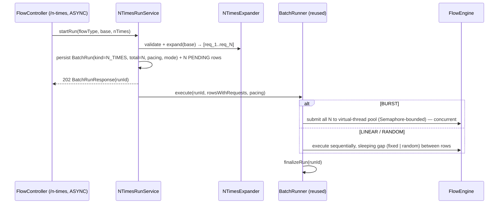

# Task 003 - Asynchronous Run-Tracked N-Times Execution

## Functional Requirements
- Execute a `mode = ASYNC` N-Times request as a **tracked run**: kick it off in the background,
  return a **run handle** immediately (`202`), and let the run be polled for progress/results
  through the existing run endpoints.
- **Reuse the Phase 003 batch runner and run tables** rather than building a parallel subsystem;
  distinguish N-Times runs from CSV batches with a `kind` discriminator.
- Honour pacing with mode-appropriate concurrency:
  - `BURST` → publish the N distinct events **concurrently** across the bounded virtual-thread
    pool (genuine contention spike on the same account pair);
  - `LINEAR` / `RANDOM` → publish **sequentially** with the configured gap (fixed or random).
- Own the **ASYNC** branch of `POST /api/v0/flows/{flowType}/n-times`.

## Acceptance Criteria
- [ ] An ASYNC N-Times request returns `202` with a run handle (`BatchRunResponse` shape) and the
      run completes asynchronously with `total = count`.
- [ ] The run and its rows are retrievable via the existing `GET /api/v0/batches/{id}` and
      `GET /api/v0/batches/{id}/rows` (now also returning `kind = N_TIMES` runs).
- [ ] Each published event is a **distinct** transaction (distinct idempotency key + distinct
      `*_request_id`), all sharing **one** correlation id; each `publish_record` is labelled
      `NTIMES:<pacing>:<i>/<count>`.
- [ ] `BURST` async actually overlaps publishes (bounded by `chaos.batch.workers`); `LINEAR`/
      `RANDOM` async run one-at-a-time with the configured gap (random gap within
      `[minDelayMs, maxDelayMs]`).
- [ ] `batch_run` carries a `kind` (`CSV` default | `N_TIMES`) and the pacing/mode; `filename` is
      nullable for N-Times runs.
- [ ] Run finalization yields `COMPLETED` / `COMPLETED_WITH_FAILURES` / `FAILED` from row counts,
      reusing the existing logic.
- [ ] CSV batch behaviour is unchanged (existing rows default to `kind = CSV`).

## Technical Design
Target **Java 25**, Spring Boot 4, SQLite + Flyway.

N-Times async = "a batch of N synthetic rows of one flow, each a distinct transaction." The
`NTimesExpander` (Task 001) produces the N distinct `FlowRequest`s; a thin service materializes a
run + N rows and submits them to the (lightly extended) `BatchRunner`.

**Reusing `BatchRunner`.** Today `BatchRunner.execute(runId, rows, maxRatePerSecond, chaos)` runs
all rows through a `Semaphore(maxWorkers)` + virtual-thread executor, with a fixed pre-submit rate
delay derived from `maxRatePerSecond`. N-Times needs two pacing shapes the current runner *almost*
covers:
- **BURST** = `maxWorkers`-wide concurrency, no delay → already expressible (null rate, full
  parallelism).
- **LINEAR** = parallelism 1 + fixed gap → expressible by forcing a 1-permit semaphore + a fixed
  delay.
- **RANDOM** = parallelism 1 + **random** gap → **not** expressible (the runner only does a fixed
  rate delay).

Two viable shapes (implementer's choice, both in ADR-016 spirit):
1. **Extend `BatchRunner`** with a pacing-aware overload `execute(runId, rows, PacingPlan)` where
   `PacingPlan` encapsulates `{ concurrency, delaySupplier }` — `BURST` → `{maxWorkers, ()->0}`;
   `LINEAR` → `{1, ()->fixedDelayMs}`; `RANDOM` → `{1, ()-> rnd[min,max]}`. The existing CSV path
   maps `maxRatePerSecond` to `{maxWorkers, fixed}` unchanged.
2. **Dedicated `NTimesRunner`** mirroring `BatchRunner`'s structure if extending it risks the CSV
   path. Prefer (1) to avoid duplication; guard the CSV path with its existing tests.

**Run model.** Add `kind` to `BatchRun` (enum `RunKind { CSV, N_TIMES }`, `@Enumerated(STRING)`,
default `CSV`) plus `pacing`/`mode` columns (nullable strings). `filename` becomes nullable
(`BatchRunResponse.filename` is already `@Nullable`). N-Times rows reuse `BatchRow`
(`row_number = iteration index`); `publish_record.batch_id`/`batch_row_id` already link history to
the run (`HistoryWriter.recordBatch(...)`), so reuse `recordBatch` with the `NTIMES:<pacing>:i/N`
label to keep the run's history grouped and findable.

## Implementation Notes
Flyway migration `chaos-machine/src/main/resources/db/migration/V10__n_times_runs.sql`:
- `ALTER TABLE batch_run ADD COLUMN kind TEXT NOT NULL DEFAULT 'CSV';`
- `ALTER TABLE batch_run ADD COLUMN pacing TEXT;` and `ADD COLUMN mode TEXT;`
- Relax `filename` to nullable if the baseline declared it `NOT NULL` (SQLite: rebuild table or
  rely on app-level nullability — confirm against `V4__publish_history_batch.sql`).

Files to create:
- `batch/enumeration/RunKind.java` — `{ CSV, N_TIMES }`.
- `flow/NTimesRunService.java` (or `batch/service/NTimesRunService.java`) — `@Component`; injects
  `NTimesExpander`, `BatchRunRepository`, `BatchRowRepository`, the runner. `startRun(...)`:
  validate, expand, persist `BatchRun(kind=N_TIMES, flowType, total=count, pacing, mode,
  status=RUNNING)` + N `BatchRow(PENDING, rowNumber=i)`, submit to the runner, return
  `BatchRunResponse`.
- (If shape 1) `batch/service/PacingPlan.java` — `{ int concurrency, LongSupplier delayMs }` (or
  an enum-driven factory).

Files to modify:
- `batch/model/BatchRun.java` — add `kind` (`@Enumerated(STRING)`), `pacing`, `mode`; getters/
  setters.
- `batch/dto/BatchRunResponse.java` (+ mapper in `BatchService`) — surface `kind`/`pacing`/`mode`
  so the UI can label N-Times runs.
- `batch/service/BatchRunner.java` — add the pacing-aware overload (shape 1) and route the
  delay/concurrency accordingly; keep `execute(..., maxRatePerSecond, chaos)` delegating for CSV.
- `flow/controller/FlowController.java#nTimes` — `mode == ASYNC` branch: call
  `NTimesRunService.startRun(...)`, return `ResponseEntity.accepted().body(runResponse)`.

Notes:
- The expander strips `nTimes` from each row's chaos so `flowEngine.execute(req_i)` runs the
  normal single path; the label is applied at history-write time via `recordBatch`.
- Concurrency stays bounded by the existing `chaos.batch.workers` (20) semaphore — N-Times BURST
  does not need a new pool. Optionally cap N-Times concurrency separately if desired
  (`chaos.limits.max-n-times-concurrency`), else reuse `chaos.batch.workers`.
- Reuse `BatchRunner.finalizeRun` verbatim.

## Non-Functional Requirements
- Background execution on virtual threads; the request returns in O(1) after persisting the run +
  rows. Long/concurrent runs never touch the request thread.
- Concurrency bounded by the existing semaphore; back-pressure and idempotent producer durability
  unchanged.
- Run + row writes are transactional per the existing batch pattern (`@Transactional processRow`/
  `finalizeRun`).

## Dependencies
- **Task 001** (`NTimesExpander`, `NTimesOptions`, caps).
- **Task 002** for the shared `/n-times` controller method (coordinate the `mode` split; this task
  owns the ASYNC branch).
- Existing `BatchRunner`, `BatchRun`/`BatchRow`, repositories, `BatchService`,
  `HistoryWriter.recordBatch`, run endpoints.
- [ADR-016](../../decisions/016-n-times-distinct-transaction-chaos-strategy.md),
  [ADR-002](../../decisions/002-sqlite-persistence-with-jpa-and-flyway.md) (Flyway),
  [ADR-007](../../decisions/007-csv-batch-execution-model.md) (batch execution model).

## Risks & Mitigations
- *Extending `BatchRunner` regresses CSV batches* → keep the existing signature delegating; full
  CSV regression tests (Phase 006) must stay green; prefer the pacing-plan overload over rewiring
  the CSV path.
- *`kind`/`filename` migration breaks existing rows* → `DEFAULT 'CSV'` + nullable filename;
  migration test on a populated DB.
- *RANDOM gap unbounded* → `delaySupplier` clamps to `[minDelayMs, maxDelayMs]` (validated in
  Task 001).
- *Naming confusion (a "batch" that isn't a CSV)* → `kind`/`pacing`/`mode` on the response + UI
  copy; a future `flow_run` rename is noted in ADR-016 as out of scope.

## Testing Strategy
- **Unit**: `NTimesRunService.startRun` persists `kind=N_TIMES`, `total=count`, N rows, returns a
  handle (mocked runner/repos). `BatchRunner` pacing-plan mapping (BURST→wide+0; LINEAR→1+fixed;
  RANDOM→1+random-in-range).
- **Integration (Testcontainers Kafka + SQLite)**: ASYNC run completes with `total=N`,
  `succeeded=N`; `publish_record`s show N distinct idempotency keys + `*_request_id`s, one
  correlation id, `NTIMES:` labels; BURST overlap observed (timing/semaphore); LINEAR/RANDOM gaps
  enforced; run/rows fetchable via `/batches/{id}` and `/rows`.
- **Migration test**: `V10` applies cleanly to a DB seeded with V1–V9; existing batch rows read
  back as `kind=CSV`.
- **MockMvc**: ASYNC → `202` with run handle.

## Deployment Strategy
One backward-compatible Flyway migration (defaulted/nullable columns) + additive service/runner
overload. No feature flag; existing CSV batches keep working. Ships within Phase 013.
