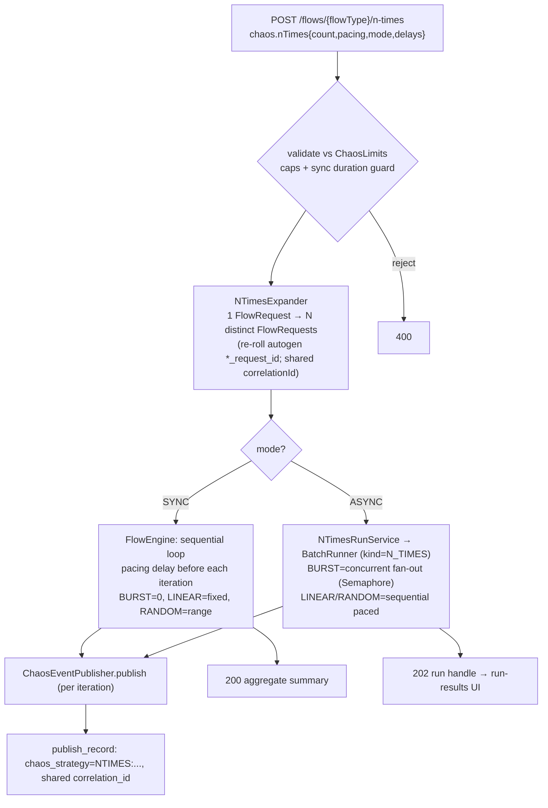
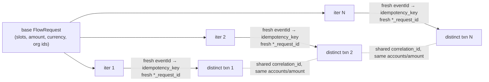

# Phase 13 - N-Times Chaos Strategy

## Summary
Adds a new **N Times** chaos strategy that runs a single flow **N times against the same
source/destination accounts**, producing N **genuinely-distinct** transactions (fresh event id,
fresh derived idempotency key, fresh payload `*_request_id` per iteration) rather than the
duplicate-keyed copies the existing **Burst** strategy produces. N-Times offers three pacings —
**BURST** (no delay), **LINEAR** (fixed gap), **RANDOM** (random gap) — and runs in either of two
execution modes: **SYNC** (in-line, sequential, capped) or **ASYNC** (run-tracked, reusing the
Phase 003 batch runner; BURST fans out concurrently across virtual threads). Backed by
[ADR-016](../../decisions/016-n-times-distinct-transaction-chaos-strategy.md).

## Motivation
The chaos surface (Phase 003) can duplicate, malform, unbalance, delay, reorder and **burst** an
event, but every volume strategy emits the **same logical transaction**: Burst rebuilds copies
that keep the base idempotency key and never re-roll the business `*_request_id`, so a ledger that
dedups collapses them to one effect. There is no way to ask "post **N real, independent**
transfers between this exact pair of accounts" to probe how the ledger handles accumulation,
ordering, locking/contention on a single account pair, and sustained throughput of *valid* work.
Idea `006_N_TIMES_chaos_strategy.md` fills that gap, and the user wants both a quick in-line run
and a heavier, concurrent, progress-tracked run.

## User-Facing Changes
- **Chaos options widget** (Single Flow Run, right column) gains an **"N Times"** strategy with:
  **Count**, **Pacing** (Burst / Linear / Random), **Mode** (Sync / Async), and pacing inputs
  (Linear → fixed delay ms; Random → min/max delay ms). Copy distinguishes it from **Burst**
  ("N Times = N distinct transactions; Burst = duplicate event").
- **SYNC** N-Times publishes inline and shows an **aggregate result** (count, succeeded, failed,
  shared correlation id, event ids). **ASYNC** N-Times returns a **run** and hands off to the
  existing run-results view (now showing both CSV batches and N-Times runs).
- **API (additive):** `POST /api/v0/flows/{flowType}/n-times` → `200` aggregate (SYNC) or `202`
  run handle (ASYNC). N-Times runs are listable/pollable through the existing run endpoints.
- No change to the 12 ledger flow contracts, the envelope shape, or the publish history schema
  beyond a `kind` discriminator on run tracking.

## Architecture Impact
Touches `com.softspark.chaos.flow` (chaos contract + a new `NTimesExpander` + `FlowEngine`
integration + a dedicated controller route) and reuses `com.softspark.chaos.batch`
(`BatchRunner`, `BatchRun`/`BatchRow`) for the async path behind a `kind` discriminator. One
Flyway migration (nullable `filename`, `kind`, pacing/mode columns on `batch_run`). The
distinctness mechanism reuses the Phase 011 `autogen = UUID_V4` field descriptors
([ADR-014](../../decisions/014-flow-catalog-field-descriptors-and-client-side-inference.md)) as
the source of truth for which `flowFields` key is the business transaction id. See
[ADR-016](../../decisions/016-n-times-distinct-transaction-chaos-strategy.md).

Each iteration's identity (what changes vs what is held):

## Edge Cases
- **Request id not marked `autogen`.** The expander re-rolls fields with `autogen = UUID_V4`;
  if a flow marks none, it falls back to re-rolling any `flowFields` key ending `_request_id`.
  Task 001 verifies every `runnerVisible` flow has exactly one such field, else N-Times could
  emit duplicate-keyed (deduped) events — defeating the strategy.
- **Correlation id sharing.** All N share one correlation id (caller override or generated
  once). This is intentional grouping; it must not be re-derived per iteration (would lose the
  grouping) nor used as an idempotency key.
- **SYNC long/concurrent abuse.** SYNC rejects `count > maxNTimesSync` and rejects a projected
  `count × effective-max-gap > maxSyncDurationMs` with a `400` suggesting ASYNC. SYNC `BURST`
  is never concurrent (it would block the request thread); concurrency is ASYNC-only.
- **Caps.** `count > maxNTimes` → 400; `LINEAR fixedDelayMs > maxDelayMs` → 400; `RANDOM`
  requires `0 ≤ minDelayMs ≤ maxDelayMs ≤ limits.maxDelayMs` else 400; missing pacing params
  for the chosen pacing → 400.
- **Mutual exclusivity.** `nTimes` is one of the mutually-exclusive `ChaosOptions`; if combined
  with another strategy, N-Times wins per the dedicated endpoint, and the plain publish endpoint
  rejects any body carrying `chaos.nTimes`.
- **Partial failure (SYNC).** A publish failure mid-run records a failed `publish_record` and is
  counted in the aggregate; the loop continues (best-effort), mirroring batch semantics.
- **Async run finalization** reuses `BatchRunner.finalizeRun`: `COMPLETED` /
  `COMPLETED_WITH_FAILURES` / `FAILED` from row counts.
- **`amount` zero / missing slots** behave exactly as a single run would (no new validation);
  N-Times changes identity and cadence only.
- **Interruptions** (`InterruptedException`) during pacing sleeps restore the interrupt flag and
  stop the run cleanly, as the batch runner already does.

## Testing Strategy
- **Unit** — `NTimesExpander`: N requests produced; each has a *distinct* `*_request_id`; shared
  correlation id; slots/amount/currency/org ids unchanged; cap/validation rejections (count,
  pacing params, sync duration guard). Pacing→delay mapping (BURST=0, LINEAR=fixed,
  RANDOM∈[min,max]).
- **Integration (Testcontainers Kafka)** — SYNC run of N publishes **N records with N distinct
  idempotency keys and N distinct `*_request_id`s** sharing one correlation id; ASYNC run
  completes with `total=N` and reuses run/row tracking; ASYNC `BURST` actually overlaps
  (concurrency observed via the semaphore/timing); cap rejections return `400`; plain publish
  endpoint rejects `chaos.nTimes`.
- **Frontend (MSW)** — N Times strategy renders count/pacing/mode/delay inputs; SYNC shows the
  aggregate; ASYNC navigates to run-results; high-volume confirmation appears; payload shape
  matches the contract.
- Folds into the Phase 006 suites; the CSV batch page and other chaos strategies are regression-
  checked as unaffected.

## Deployment Strategy
Additive: one Flyway migration (backward-compatible nullable/defaulted columns), a new endpoint,
and an additive chaos-options entry. No feature flag; old clients that never send `chaos.nTimes`
are unaffected. Auth and the target-cluster safety label are inherited from the existing runner.
Ships as a normal backend + frontend deploy. Caps default conservatively and are tunable via
`chaos.limits.*` / `chaos.batch.workers`.

## Tasks
- [001 - N-Times contract & distinct-iteration core](./001-n-times-contract-and-distinct-iteration-core.md) — `NTimesOptions`/`Pacing`/`ExecutionMode`, extended `ChaosLimits`, validation, and the `NTimesExpander` shared by both paths.
- [002 - Synchronous N-Times execution](./002-synchronous-n-times-execution.md) — in-line sequential run with pacing delays, aggregate result, dedicated endpoint (SYNC branch), sync duration guard, history labelling.
- [003 - Asynchronous run-tracked N-Times execution](./003-asynchronous-run-tracked-n-times-execution.md) — reuse `BatchRunner`/run tables behind a `kind` discriminator; concurrent BURST fan-out; sequential paced LINEAR/RANDOM (random-delay runner extension); endpoint ASYNC branch.
- [004 - Frontend: N Times option & sync/async result handling](./004-frontend-n-times-option-and-run-handling.md) — chaos-options-panel N Times strategy, `api.ts` types, single-flow-page sync-aggregate vs async-run handoff, run-results reuse, confirmation copy.

## Parallel Tasks
- **001 is the unblocker** — both 002 and 003 consume `NTimesOptions` and the `NTimesExpander`.
- **002 and 003 are independent of each other** and can proceed in parallel once 001 lands
  (002 = in-line loop; 003 = runner reuse + migration). They converge only at the shared
  dedicated endpoint, which routes on `mode` (split the controller method so each task owns its
  branch).
- **004 depends on the endpoint contract from 002 (SYNC response) and 003 (ASYNC run handle);**
  its UI can be stubbed against the ADR-016 contract shape but end-to-end SYNC needs 002 and
  end-to-end ASYNC needs 003.
- Dependency chain: `001 ─→ (002 ‖ 003) ─→ 004`.
