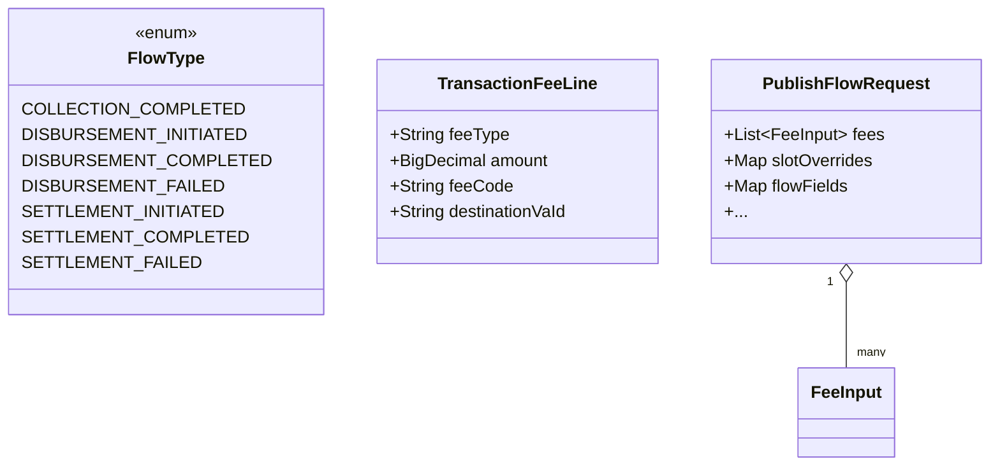

# Task 001 - Inbound contract alignment: lifecycle event models, builders & fee lines (backend)

## Functional Requirements
- Correct the chaos `v1` event models and builders for **Collection** and
  **Disbursement** so the published `EventEnvelope<T>` matches the **authoritative
  `ss-ledger-service` contract** (verified source + `bin/kafka-payload-samples.md`).
- Add the two missing disbursement lifecycle phases: **`DISBURSEMENT_INITIATED`** and
  **`DISBURSEMENT_FAILED`** (flow types, models, builders), joining the existing
  `DISBURSEMENT_COMPLETED`.
- Reconcile the **Settlement** completed model to the ledger (`settlement_va_id`
  destination + `source_va_id` + `source_organization_id` + required
  `completion_reference`); leave initiated/failed as-is except where the contract
  differs.
- Introduce a shared **`TransactionFeeLine`** model carrying `fee_code`, and an optional
  typed **`fees[]`** on `PublishFlowRequest`; builders emit a real fee **list** for
  Collection and Disbursement-completed (with the gross−net single-fee fallback retained
  when `fees` is absent).
- Seed the missing **org-account slots** so the runner's VA pickers route through
  `slotOverrides` (the Phase 011 trap).
- Align builder `source()` strings to the samples (`payment-service` for
  collection/disbursement; `settlements-service` for settlement).

## Acceptance Criteria
- [ ] `FlowType` contains `DISBURSEMENT_INITIATED` and `DISBURSEMENT_FAILED` (and keeps
      `DISBURSEMENT_COMPLETED`, `COLLECTION_COMPLETED`, `SETTLEMENT_*`).
- [ ] `CollectionCompletedEventData` fields exactly: `transaction_id`, `source_va_id`,
      `destination_va_id`, `provider_id`, `provider_reference_id`, `gross_amount`,
      `net_amount`, `currency`, `fees[]`, `commission_split_id` (nullable),
      `completed_at`, `merchant_ref_id`. Old fields (`collection_request_id`,
      `merchant_reference`, `provider_collection_id`) are removed.
- [ ] `DisbursementInitiatedEventData` fields exactly: `transaction_id`, `merchant_id`,
      `virtual_account_id`, `merchant_ref_id`, `narration` (nullable),
      `principal_amount`, `fee_amount`, `currency`, `disbursement_subtype`,
      `credit_provider_id`, `credit_account_id`, `source_country`,
      `destination_country`, `corridor`, `fx_quote_reference` (nullable),
      `correlation_id`, `requested_at`, `authorised_principal` (`{user_id,
      key_fingerprint}`).
- [ ] `DisbursementCompletedEventData` fields exactly: `transaction_id`, `source_va_id`,
      `destination_va_id`, `reservation_id`, `disbursement_subtype`, `provider_id`,
      `provider_reference_id`, `principal_amount`, `currency`, `fees[]`,
      `recipient_reference` (nullable), `destination_country` (nullable), `corridor`
      (nullable), `applied_fx_rate` (nullable), `completed_at`, `merchant_ref_id`.
- [ ] `DisbursementFailedEventData` fields exactly: `transaction_id`,
      `virtual_account_id`, `reservation_id`, `disbursement_subtype`, `provider_id`,
      `provider_reference_id` (nullable), `principal_amount`, `currency`,
      `failure_reason`, `failure_code` (nullable), `failed_at`, `merchant_ref_id`.
- [ ] `SettlementCompletedEventData` emits `settlement_va_id` (destination — **confirmed**;
      the prior `destination_va_id` name is corrected), `source_va_id`,
      `source_organization_id`, and required `completion_reference`. Settlement
      initiated/failed match the ledger (failed gains optional `destination_va_id`).
- [ ] `TransactionFeeLine(feeType, amount, feeCode, destinationVaId)` exists and is used
      by collection + disbursement-completed; the legacy per-flow `FeeEntry` inner
      records are removed/replaced.
- [ ] `PublishFlowRequest` has optional `List<FeeInput> fees`; builders populate the
      payload `fees[]` from it; collection computes `gross = net + Σ fee.amount` and
      emits both `gross_amount` and `net_amount`.
- [ ] `chaos-bootstrap.yml` seeds `COLLECTION_COMPLETED.destination` (org, no role),
      `DISBURSEMENT_COMPLETED.source` (org, no role),
      `DISBURSEMENT_COMPLETED.destination` (`SETTLEMENT_ACCOUNT`), and
      `SETTLEMENT_COMPLETED.source` (org, no role).
- [ ] Builders use the ledger-required `transactionReference` source field per phase
      (collection `transaction_id`; disb-initiated `correlation_id`; disb-completed
      `provider_reference_id`; settlement-completed `completion_reference`) and never
      leave it blank for a default run.
- [ ] Each builder is registered in `FlowBuilderRegistry` and resolvable for its
      `FlowType`.

## Technical Design
Target **Java 25 / Spring Boot 4** ([ADR-001](../../decisions/001-target-java-25-and-spring-boot-4.md)),
`record-builder`, no Lombok. See
[ADR-019](../../decisions/019-dynamic-fee-lines-and-catalog-descriptor-extensions.md)
and [ADR-017](../../decisions/017-lifecycle-transaction-flows-and-outcome-orchestration.md).

### Field tables (authoritative — `req` = required by the ledger)

**`collection.completed`** — topic `collection.completed`, source `payment-service`,
key `destination_va_id`. `transactionReference = transaction_id`.

| wire | source in builder | req |
|---|---|---|
| `transaction_id` | flowFields (UUID autogen) | ✓ |
| `source_va_id` | slot `source` (PLATFORM_FLOAT) | ✓ |
| `destination_va_id` | slot `destination` (org) | ✓ |
| `provider_id` | flowFields | ✓ |
| `provider_reference_id` | flowFields | ✓ |
| `gross_amount` | computed `net + Σfees` | ✓ |
| `net_amount` | `request.amount`/`net_amount` | ✓ |
| `currency` | top-level/inferred | ✓ |
| `fees[]` | `request.fees` → `TransactionFeeLine` | ✓ |
| `commission_split_id` | flowFields | — |
| `completed_at` | `getTimestampOrNow` | ✓ |
| `merchant_ref_id` | flowFields (ULID) | ✓ |

**`disbursement.initiated`** — topic `disbursement.initiated`, source `payment-service`,
key `virtual_account_id` (or `transaction_id` — preserve current partition convention).
`transactionReference = correlation_id` (fallback `merchant_ref_id`).

| wire | source | req |
|---|---|---|
| `transaction_id` | flowFields (UUID autogen) | ✓ |
| `merchant_id` | flowFields (inferred org) | ✓ |
| `virtual_account_id` | flowFields VA (`slotName=null`) | ✓ |
| `merchant_ref_id` | flowFields (ULID) | ✓ |
| `narration` | flowFields (ULID/text default) | — |
| `principal_amount` | `request.amount`/flowFields | ✓ |
| `fee_amount` | flowFields (default `10`) | ✓ |
| `currency` | top-level/inferred | ✓ |
| `disbursement_subtype` | flowFields SELECT (`DOMESTIC`) | ✓ |
| `credit_provider_id` | flowFields | ✓ |
| `credit_account_id` | flowFields | ✓ |
| `source_country` | flowFields COUNTRY (`GH`) | ✓ |
| `destination_country` | flowFields COUNTRY (`GH`) | ✓ |
| `corridor` | derived `src-dst` | ✓ |
| `fx_quote_reference` | flowFields | — |
| `correlation_id` | top-level/autogen | ✓ |
| `requested_at` | `getTimestampOrNow` | ✓ |
| `authorised_principal` | `{user_id, key_fingerprint}` defaults | ✓ |

**`disbursement.completed`** — topic `disbursement.completed`, source `payment-service`,
key `transaction_id`/source VA. `transactionReference = provider_reference_id`.

| wire | source | req |
|---|---|---|
| `transaction_id` | carry-over (same as initiated) | ✓ |
| `source_va_id` | slot `source` (org) | ✓ |
| `destination_va_id` | slot `destination` (SETTLEMENT_ACCOUNT) | ✓ |
| `reservation_id` | poll/manual/placeholder ([ADR-018](../../decisions/018-reservation-id-via-ledger-read-proxy-poll.md)) | ✓ |
| `disbursement_subtype` | carry-over | ✓ |
| `provider_id` | flowFields | ✓ |
| `provider_reference_id` | flowFields (autogen) | ✓ |
| `principal_amount` | carry-over | ✓ |
| `currency` | carry-over/inferred | ✓ |
| `fees[]` | `request.fees` | ✓ |
| `recipient_reference` | flowFields | — |
| `destination_country`/`corridor`/`applied_fx_rate` | flowFields (cross-border) | — |
| `completed_at` | `getTimestampOrNow` | ✓ |
| `merchant_ref_id` | carry-over/flowFields | ✓ |

**`disbursement.failed`** — topic `disbursement.failed`, source `payment-service`,
key `transaction_id`/VA.

| wire | source | req |
|---|---|---|
| `transaction_id` | carry-over | ✓ |
| `virtual_account_id` | flowFields VA (`slotName=null`) carry-over | ✓ |
| `reservation_id` | as completed | ✓ |
| `disbursement_subtype` | carry-over | ✓ |
| `provider_id` | flowFields | ✓ |
| `provider_reference_id` | flowFields | — |
| `principal_amount` | carry-over | ✓ |
| `currency` | carry-over | ✓ |
| `failure_reason` | flowFields (default) | ✓ |
| `failure_code` | flowFields SELECT | — |
| `failed_at` | `getTimestampOrNow` | ✓ |
| `merchant_ref_id` | carry-over | ✓ |

**Settlement** — topics `organization.va.settlement.{initiated,completed,failed}`,
source `settlements-service`. Initiated/failed already align (failed gains optional
`destination_va_id`). Completed reconciled: `settlement_request_id`,
`source_organization_id`, `source_va_id` (slot `source`, org), **`settlement_va_id`**
(slot `destination`, SETTLEMENT_ACCOUNT), `amount`, `currency`, `completion_reference`
(req, autogen, `transactionReference`), `completed_by`, `completed_at`.

## Implementation Notes
- `flow/model/FlowType.java`: add the two disbursement phases.
- `flow/model/v1/`: rewrite `CollectionCompletedEventData`,
  `DisbursementCompletedEventData`; add `DisbursementInitiatedEventData`,
  `DisbursementFailedEventData`; reconcile `SettlementCompletedEventData` (+ optional
  `destination_va_id` on `SettlementFailedEventData`). Add a shared
  `flow/model/v1/TransactionFeeLine.java` (replaces the per-record `FeeEntry`).
  Keep `@JsonNaming(SnakeCaseStrategy.class)` + `@RecordBuilder` (use the generated
  builder per the record-builder convention — never positional `new` for changesets).
- `flow/builder/`: rewrite `CollectionFlowBuilder`, `DisbursementFlowBuilder`
  (→ completed); add `DisbursementInitiatedFlowBuilder`, `DisbursementFailedFlowBuilder`;
  update `SettlementCompletedFlowBuilder`. Read fees via a small helper that maps
  `request.fees()` → `List<TransactionFeeLine>` (autogen `fee_code` when blank); collection
  computes gross. `authorised_principal` assembled from `authorised_user_id`/
  `authorised_key_fingerprint` flowFields with defaults.
- `flow/dto/PublishFlowRequest.java`: add `List<FeeInput> fees` (default empty) +
  `flow/dto/FeeInput.java` (`feeType, amount, feeCode, destinationVaId`).
- `flow/dto/AutogenRule.java`: add `ULID`; ULID minting via `base.Ids` server-side.
- `chaos-bootstrap.yml` (`chaos.bootstrap.flow-slots`): add the four slot rows above.
  `ChartOfAccountsBootstrap` upserts idempotently — no migration.
- Avoid reserved-keyword identifiers (use `line`/`row`, never `record`).
- Topics resolve via `TopicCatalog`/`kafka.TopicCatalog` for the (existing) topic names.

## Non-Functional Requirements
- Builders stay pure/in-memory; no new I/O. Decimal precision preserved (BigDecimal,
  `1000.0000` formatting, no scientific notation).
- Wire stays snake_case via `@JsonNaming`; enum values serialize by name.

## Dependencies
- The verified ledger contract (recon) + `bin/kafka-payload-samples.md`.
- Phase 011 catalog/builder machinery; `SlotResolver`, `FlowFields`, `FlowBuilderRegistry`.
- Consumed by tasks 002 (descriptors), 004 (runner), 005/006 (frontend).

## Risks & Mitigations
- **Settlement destination = `settlement_va_id`** (confirmed; the builder currently
  emits the wrong `destination_va_id`) → a builder test asserts the emitted destination
  key. ([ADR-019](../../decisions/019-dynamic-fee-lines-and-catalog-descriptor-extensions.md).)
- **Corrected payloads replace wrong ones** → golden builder tests pin the new field
  sets; derived CSV columns follow automatically (no migration concern).
- **Unconfigured slot drops the VA** → a bootstrap/slot test asserts a row for every
  `VA_REF.slotName` of each new runner flow (covered fully in task 002's catalog test).
- **`fee_code` blank** (ledger requires it) → builder autogens when absent.

## Testing Strategy
JUnit 5 + AssertJ unit tests per builder asserting the exact emitted envelope/payload
fields and `transactionReference` source; fee-list mapping incl. `fee_code`; collection
`gross = net + Σfees`; `authorised_principal` shape; settlement destination key. A
parameterized "required-only inputs → valid envelope" test per phase. Integration
(Testcontainers Kafka, Phase 003 harness): publish each phase, assert payload validates
and slots resolve non-empty.

## Deployment Strategy
Additive; the Collection/Disbursement payloads are corrected in place (the old shapes
were wrong). One config edit (`chaos-bootstrap.yml`), no migration. Ships with task 002.
