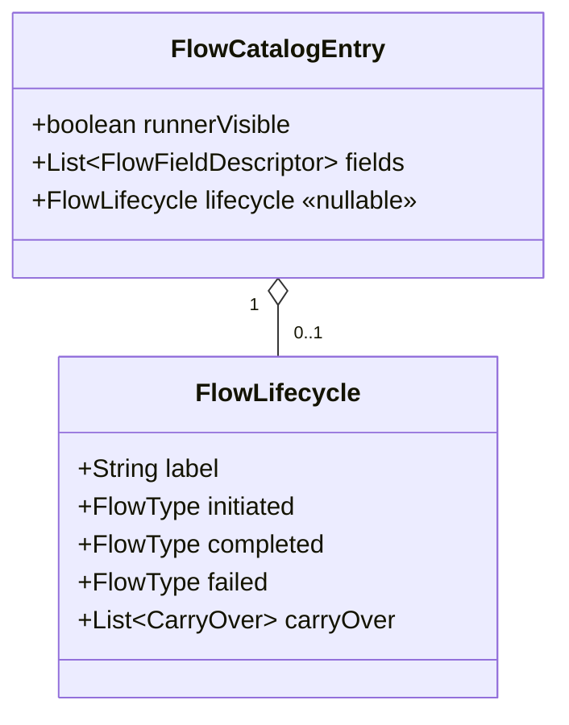

# Task 002 - Catalog descriptors, lifecycle metadata & new field kinds (backend)

## Functional Requirements
- Make **Collection**, **Settlement**, and **Disbursement** appear in the Single Flow
  Run via the catalog: Collection and the two lifecycle **initiated** phases become
  `runnerVisible = true`; the completed/failed phases stay `runnerVisible = false` but
  gain full descriptors (the wizard renders them).
- Extend `FlowFieldDescriptor` rendering with the new kinds/rules from
  [ADR-019](../../decisions/019-dynamic-fee-lines-and-catalog-descriptor-extensions.md):
  `FieldKind.FEE_LIST`, `FieldKind.COUNTRY`, `AutogenRule.ULID`, a **derived corridor**,
  `authorised_principal` fields, and `VA_REF` routing to `flowFields` when
  `slotName = null`.
- Add a **`FlowLifecycle`** descriptor grouping each lifecycle's phases and declaring the
  **carry-over** from `initiated` into completed/failed; attach it to the initiated entry.
- Keep everything **additive/backward-compatible**: derived
  `requiredFields`/`optionalFields`/`csvColumns` still hold (now reflecting task 001's
  corrected fields), and Phase 011's five flows are unchanged.

## Acceptance Criteria
- [ ] `runnerVisible = true` for exactly: the Phase 011 five **plus**
      `COLLECTION_COMPLETED`, `SETTLEMENT_INITIATED`, `DISBURSEMENT_INITIATED`.
      `*_COMPLETED`/`*_FAILED` lifecycle phases are `runnerVisible = false`.
- [ ] `FlowCatalogEntry` carries an optional `FlowLifecycle lifecycle`
      (`null` for non-lifecycle entries; set on the two initiated entries).
- [ ] `FlowLifecycle` has `label`, `initiated`, `completed`, `failed`, and
      `carryOver: List<CarryOver(fromField, toField)>`; the radio label for a lifecycle
      type is `lifecycle.label` ("Settlement", "Disbursement").
- [ ] `FieldKind` includes `FEE_LIST` and `COUNTRY`; `AutogenRule` includes `ULID`.
- [ ] Collection descriptors: `transaction_id` (UUID autogen, req), `source_va_id`
      (VA_REF SYSTEM·`source`, req), `destination_va_id` (VA_REF ORGANIZATION·
      `destination`, req), `amount` (AMOUNT `1000.0000`, req, labeled "Net Amount"),
      `fees` (FEE_LIST, req), and advanced `provider_id`/`provider_reference_id`
      (autogen)/`currency` (inferred)/`commission_split_id`/`completed_at`/
      `merchant_ref_id` (ULID).
- [ ] Disbursement-initiated descriptors: `transaction_id` (UUID, req),
      `virtual_account_id` (VA_REF ORGANIZATION, `slotName=null`, req), `amount`
      (principal, req), `fee_amount` (AMOUNT default `10`, req), plus advanced
      `merchant_ref_id`(ULID)/`narration`(ULID)/`currency`(inferred)/
      `disbursement_subtype` (SELECT `DOMESTIC`)/`credit_account_id`/`credit_provider_id`/
      `source_country`(COUNTRY `GH`)/`destination_country`(COUNTRY `GH`)/`corridor`
      (derived)/`correlation_id`(autogen)/`authorised_principal` fields.
- [ ] Disbursement-completed descriptors: `transaction_id` (req, carry-over),
      `source_va_id` (VA_REF ORGANIZATION·`source`, req), `destination_va_id` (VA_REF
      SYSTEM·`destination`, req, defaults SETTLEMENT_ACCOUNT), `reservation_id` (req,
      carry-over/poll), `principal_amount` (req, carry-over), a `fees` FEE_LIST, plus
      advanced `provider_id`/`provider_reference_id`(autogen)/`merchant_ref_id`(ULID)/
      `corridor`/`completed_at`/`recipient_reference`.
- [ ] Disbursement-failed descriptors: `transaction_id`/`virtual_account_id`(VA_REF
      `slotName=null`)/`reservation_id`/`principal_amount` (req, carry-over) + advanced
      `merchant_ref_id`/`currency`/`disbursement_subtype`/`failure_reason`/`failure_code`
      (SELECT)/`failed_at`/`provider_id`/`provider_reference_id`.
- [ ] Settlement descriptors match the idea (initiated: `settlement_request_id` UUID,
      `virtual_account_id` VA_REF ORGANIZATION `slotName=null`, `amount`; advanced
      `organization_id`(inferred)/`currency`/`destination_bank_account`(ULID)/
      `destination_bank` SELECT `ABSA`/`approved_by`/`approved_at`; completed/failed per
      task 001's reconciled fields with `completion_reference` autogen).
- [ ] Every builder-`getRequired` field is guaranteed present when collapsed (autogen /
      inference / default), so a default run of each runner-visible flow publishes `200`.
- [ ] A slot row exists for every `VA_REF` with non-null `slotName` of each runner flow
      (test catches the missing org slots seeded in task 001).
- [ ] Derived legacy lists equal the (task-001-corrected) field sets; OpenAPI exposes the
      new enums/`FlowLifecycle`.

## Technical Design
Target Java 25 / Spring Boot 4. Extends ADR-014's descriptor model.

### `FlowLifecycle` + `CarryOver`
```java
@RecordBuilder
public record FlowLifecycle(
    String label, FlowType initiated, FlowType completed, FlowType failed,
    List<CarryOver> carryOver) {}
public record CarryOver(String fromField, String toField) {}
```
Disbursement carry-over (initiated → completed/failed): `transaction_id`→`transaction_id`,
`virtual_account_id`→`source_va_id` (completed) / `virtual_account_id` (failed),
`principal_amount`→`principal_amount`, `disbursement_subtype`→`disbursement_subtype`,
`currency`→`currency`, `merchant_ref_id`→`merchant_ref_id`. Settlement carry-over:
`settlement_request_id`, `virtual_account_id`→`source_va_id`(completed)/
`virtual_account_id`(failed), `amount`, `currency`, `organization_id`→
`source_organization_id`(completed)/`organization_id`(failed).

### New descriptor mechanics
- **`FEE_LIST`** — descriptor `name = "fees"`; the renderer produces N rows → the
  request's typed `fees[]`. Row template (encoded in the descriptor or implied by kind):
  `amount` (AMOUNT) + `destination_va_id` (VA_REF SYSTEM, fee-revenue) + autogen
  `fee_code` + fixed `fee_type` (`PLATFORM_FEE` collection / per-flow).
- **`COUNTRY`** — SELECT whose options the frontend sources from supported countries
  (Phase 010); `defaultValue = "GH"`. Backend marks the kind; options are client-fetched.
- **`AutogenRule.ULID`** — client seeds via ULID; server mints via `base.Ids` when blank.
- **Derived `corridor`** — kind `TEXT`, advanced; the renderer computes
  `"{source_country}-{destination_country}"` and recomputes on country change; editable.
  (No new enum strictly required — a `derived`/computed flag or an inference-style rule
  `CORRIDOR_FROM_COUNTRIES`; pick the lighter option and document it.)
- **`authorised_principal`** — two advanced TEXT fields `authorised_user_id`
  (default e.g. `chaos-operator`) + `authorised_key_fingerprint` (default `ab:cd:ef:00`);
  the builder (task 001) assembles the nested map.
- **`VA_REF` with `slotName = null`** — the descriptor still declares `accountKind`
  (for picker filtering) but no slot; the frontend routes the value to `flowFields[name]`.



## Implementation Notes
- `flow/dto/`: add `FlowLifecycle.java` + `CarryOver.java`; extend `FieldKind`
  (`FEE_LIST`, `COUNTRY`), `AutogenRule` (`ULID`); add `lifecycle` to
  `FlowCatalogEntry` (nullable, derived lists unchanged).
- `flow/builder/FlowCatalogProvider.java`: promote collection + the two initiated flows
  to `runnerEntry` with rich descriptor lists; give completed/failed rich descriptors but
  `runnerVisible=false`; attach `FlowLifecycle` to the initiated entries. Reuse the
  existing descriptor factory helpers; add `feeList(...)`, `country(...)`, `ulid(...)`,
  `derivedCorridor(...)` helpers.
- Add `@Schema` descriptions on the new enums for Swagger.
- Keep the global advanced fields (`correlation_id`, `tenant_id`) per ADR-014, except
  where a flow already owns `correlation_id` as a first-class field (disbursement-initiated).

## Non-Functional Requirements
- Catalog stays static/in-memory, O(flows), sub-millisecond; no new I/O.
- Enum names serialize snake-safe (`FEE_LIST`, `ULID`, `COUNTRY`).

## Dependencies
- **Task 001** (the corrected flow types + fields the descriptors describe).
- Consumed by tasks 005/006/007 (frontend renderer + wizard) and task 004 (carry-over
  reuse).

## Risks & Mitigations
- **Collapsed advanced → 400** because a builder-required field is blank → a test runs
  each runner flow with required-only inputs and asserts a valid envelope.
- **Slot-name drift** → bootstrap/slot test asserts a row for every non-null
  `VA_REF.slotName` of each runner flow.
- **Descriptor/renderer coupling** for new kinds → keep each kind minimal and mirror it
  in the TS renderer (tasks 005/006); a WebMvc slice test round-trips the JSON.

## Testing Strategy
JUnit 5 + AssertJ on `FlowCatalogProvider`: per new flow assert each descriptor's
metadata per the tables; assert the `FlowLifecycle` grouping + carry-over pairs; assert
exactly the eight `runnerVisible` flows; assert derived legacy lists equal task-001
values; bootstrap/slot coverage test. WebMvc slice on `GET /flows/catalog` includes
`lifecycle` + new kinds and round-trips enum names.

## Deployment Strategy
Additive, backward-compatible catalog change — no flag, no migration. Ships with the
frontend tasks; old clients ignore new fields.
