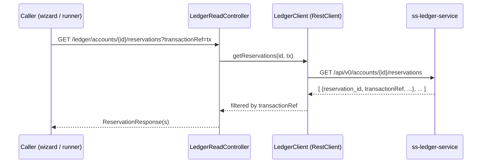

# Task 003 - Reservation read-proxy & lookup service (backend)

## Functional Requirements
- Expose a read-through proxy of the ledger's reservations endpoint so the chaos machine
  can fetch the `reservation_id` the ledger created for a disbursement, filtered by
  `transactionRef` (= `transaction_id`).
- Provide a `ReservationLookup` service that **polls until the reservation is present or a
  timeout elapses**, reusable by the interactive wizard (via HTTP) and the RANDOM
  lifecycle runner (in-process).
- Add no new tables, no Kafka, no persistence — reuse the existing `ledgerproxy`
  read-through (timeouts/retries/circuit breaker). See
  [ADR-018](../../decisions/018-reservation-id-via-ledger-read-proxy-poll.md).

## Acceptance Criteria
- [ ] `GET /api/v0/ledger/accounts/{accountId}/reservations?transactionRef={ref}` returns
      the account's reservations filtered by `transactionRef`, through the existing
      `LedgerReadController` + `LedgerClient`. The ledger does **not** filter server-side
      yet, so `LedgerClient` **fetches the full list and filters in-process** while still
      **passing the `transactionRef` (UUID) query param through** (forward-compat: O(1) at
      the ledger once it supports the filter, with no client change).
- [ ] A `ReservationLookup.find(accountId, transactionRef, timeout)` returns the resolved
      `reservation_id` (first match) or empty on timeout, polling on a bounded interval.
- [ ] The proxy degrades gracefully (ledger slow/unreachable → mapped error, no harness
      crash) consistent with the other ledger reads.
- [ ] Response DTO carries at least `reservation_id`, `transaction_ref`/`transactionRef`,
      `account_id`, status/amount fields as the ledger returns them (mapped to the chaos
      `ApiError`/response conventions).
- [ ] The exact ledger path, query param name, and response shape are **confirmed against
      the ledger** and documented in the `LedgerClient` method (adjustable in one place).

## Technical Design
Mirror the trial-balance proxy ([ADR-015](../../decisions/015-trial-balance-via-ledger-read-proxy.md)):
a thin controller method + a `LedgerClient` call + a response record; no service-side
state.



`ReservationLookup` (used in-process by the runner) wraps the same `LedgerClient` call in
a poll loop:
```
find(accountId, ref, timeout):
  deadline = now + timeout
  loop:
    hits = ledgerClient.getReservations(accountId, ref)
    if hits not empty: return hits[0].reservationId
    if now >= deadline: return empty
    sleep(pollIntervalMs)   // interrupt-aware
```
Poll interval + default timeout are configurable (`chaos.ledger.reservation.poll.*`).

## Implementation Notes
- `ledgerproxy/`: add the controller method on the existing `LedgerReadController`, a
  `LedgerClient.getReservations(accountId, transactionRef)` method, and a
  `ReservationResponse` record (snake_case mapped). Add `ReservationLookup` service.
- Ledger contract: `GET /api/v0/accounts/{accountId}/reservations` returns the **full**
  list (no server-side `transactionRef` filter **yet**). `LedgerClient` always **sends the
  `transactionRef` (UUID) query param** and **filters the returned list in-process** by
  `transactionRef` — so the in-memory filter becomes a no-op pass-through the day the
  ledger filters server-side. Confirm the exact path + response shape before implementing.
- Poll sleeps are interrupt-aware (restore the flag + stop), matching `BatchRunner`.
- Reuse the existing `RestClient`/resilience config — no new client.

## Non-Functional Requirements
- Bounded poll (interval + total timeout) so a never-arriving reservation cannot hang a
  request/worker. Read-only, idempotent, safe to retry.
- The proxy adds no write surface; auth is inherited (`/api/v0/**` requires a verified
  token).

## Dependencies
- Existing `ledgerproxy` machinery (Phase 004/012). Independent of tasks 001/002 — can
  start immediately.
- Consumed by task 006 (interactive disbursement reservation step, via HTTP) and task 004
  (RANDOM runner, in-process).

## Risks & Mitigations
- **Ledger contract mismatch** (path/param/shape) → isolate in one `LedgerClient` method;
  confirm before implementing; a WireMock test pins the request/response.
- **Reservation never appears** (ledger rejected initiated) → bounded timeout → empty;
  callers fall back (manual entry / placeholder).
- **Polling load** → conservative interval + cap; single in-flight poll per lookup.

## Testing Strategy
JUnit 5 + WireMock (or a stub `RestClient`): proxy returns filtered reservations;
`ReservationLookup` returns the id when present, empty on timeout, and handles
ledger errors gracefully; interrupt during poll stops cleanly. A WebMvc slice test on the
proxy endpoint (auth + shape). Folds into Phase 006 integration.

## Deployment Strategy
Additive read-only endpoint, no flag/migration. Gated on the ledger exposing the
reservations read endpoint — confirm before release.
