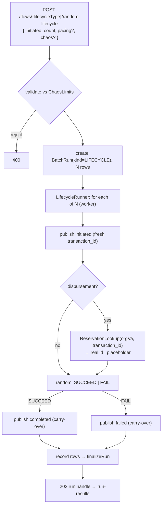

# Task 004 - RANDOM unattended lifecycle runner with N-Times (backend)

## Functional Requirements
- Execute a **RANDOM-outcome** lifecycle unattended on the backend: publish `initiated`,
  decide SUCCEED/FAIL at random, publish `completed` or `failed` — for Settlement and
  Disbursement.
- Support **N-Times**: run **count N** distinct lifecycles (each a fresh
  `transaction_id`/`settlement_request_id`), reusing the Phase 013 / Phase 003 async
  runner and run tables behind a new `RunKind.LIFECYCLE`.
- For disbursement, resolve `reservation_id` between steps via `ReservationLookup`
  (task 003), falling back to an autogen placeholder on timeout (ledger ignores it).
- Apply **per-event chaos** when supplied; track progress and roll up run status exactly
  as N-Times/CSV runs. See
  [ADR-017](../../decisions/017-lifecycle-transaction-flows-and-outcome-orchestration.md).

## Acceptance Criteria
- [ ] `POST /api/v0/flows/{lifecycleType}/random-lifecycle` accepts the initiated intent +
      `count` (+ optional pacing/chaos) and returns `202` with a `BatchRunResponse` run
      handle; `{lifecycleType}` is a lifecycle's initiated flow type (or its label).
- [ ] `RunKind` gains `LIFECYCLE`; a `BatchRun(kind=LIFECYCLE)` tracks the run; per-event
      rows record `PUBLISHED`/`FAILED`; status rolls up via the existing `finalizeRun`
      (`COMPLETED`/`COMPLETED_WITH_FAILURES`/`FAILED`).
- [ ] Each of the N lifecycles uses a **distinct** `transaction_id` and shares the
      lifecycle's initiated→secondary carry-over (transaction id, principal, VA, subtype,
      currency) via the `FlowLifecycle.carryOver` map (task 002).
- [ ] Outcome is chosen at random per lifecycle; the published second event is `completed`
      for SUCCEED, `failed` for FAIL.
- [ ] Disbursement lifecycles resolve `reservation_id` via `ReservationLookup`
      (accountId = initiated org VA, ref = `transaction_id`); on timeout an autogen
      placeholder is used and the fallback is recorded. Settlement needs no reservation.
- [ ] `count` is validated against `ChaosLimits` (reuse the N-Times caps + sync/async
      guards); `count = 1` runs as a run of one.
- [ ] The plain `POST /flows/{type}` and the N-Times endpoint are unaffected.

## Technical Design
Target Java 25 / Spring Boot 4; virtual-thread workers (reuse `BatchRunner`).

A new `LifecycleRunner` (in `com.softspark.chaos.flow`) orchestrates one lifecycle:
mint the initiated `FlowRequest` (re-roll the autogen `transaction_id`), publish via the
`FlowEngine`, apply carry-over to build the secondary `FlowRequest`, resolve the
reservation (disbursement), pick the outcome (deterministic-by-index seed so resumes are
stable — no `Math.random()`), and publish the second event. `NTimesRunService`'s pattern
(create `BatchRun` + rows, submit to `BatchRunner`) is reused; pacing for LINEAR/RANDOM is
optional and mirrors N-Times. Per-event chaos labels follow the existing
`"LIFECYCLE:<type>:<i>/<N>:<phase>"` convention.

**Random outcome without `Math.random()`** — derive from a per-run seed + iteration index
(e.g. hash of `runId + index`) so the runner stays resume-safe and testable.

## Implementation Notes
- `batch/enumeration/RunKind.java`: add `LIFECYCLE`. One additive Flyway migration if any
  new nullable column is needed (reuse the existing pacing/mode columns where possible).
- `flow/`: add `LifecycleRunner` + `LifecycleRunService` (mirrors `NTimesRunService`);
  reuse `FlowLifecycle.carryOver` (task 002) to map initiated→secondary fields. Outcome
  decision in a small testable `OutcomeDecider(seed)`.
- `flow/controller/FlowController.java`: add the `random-lifecycle` route (ASYNC →
  `202` run handle). Reject lifecycle requests for non-lifecycle flow types.
- `batch/service/BatchRunner.java`: add an `executeLifecycle(...)` entry (or generalize
  `executeNTimes`) that runs each row as a **two-publish** unit; row status reflects the
  lifecycle outcome (both publishes succeeded → `PUBLISHED`; any failure → `FAILED`).
- Reuse `ReservationLookup` (task 003) in-process; placeholder via `base.Ids` UUID.
- Interrupt-aware sleeps; no `Math.random()`/`Date.now()` in resume-relevant paths.

## Non-Functional Requirements
- Bounded concurrency/backpressure (reuse `chaos.batch.workers` + semaphore); the harness
  stays healthy while stressing the ledger.
- Reservation poll per lifecycle is bounded (task 003 timeout) so a worker never hangs.
- Correlation-id propagation into every published event (per-lifecycle or shared per run).

## Dependencies
- **Task 001** (lifecycle flow types/builders), **Task 002** (`FlowLifecycle` carry-over),
  **Task 003** (reservation lookup for disbursement). Reuses Phase 013/003 batch infra.
- Consumed by task 007 (frontend RANDOM handoff).

## Risks & Mitigations
- **Two-publish row semantics** (partial: initiated ok, second fails) → define row status
  rules explicitly + test; best-effort continue across the N (mirrors batch).
- **Reservation timeout in bulk** → placeholder fallback, recorded; ledger ignores the
  value so the run still completes.
- **Resume safety** → seed-based outcome + no wallclock randomness; covered by a
  deterministic test.
- **Caps** → reuse `ChaosLimits`; reject oversize counts with `400`.

## Testing Strategy
Unit: `OutcomeDecider` deterministic by seed/index; `LifecycleRunner` produces
initiated→completed and initiated→failed with shared `transaction_id` + carry-over;
placeholder fallback on reservation timeout. Integration (Testcontainers Kafka): a RANDOM
run of N yields 2N publishes (N distinct transaction ids), run-tracked to a terminal
status; disbursement resolves the reservation via a stub ledger; cap rejection → `400`.
Folds into Phase 006.

## Deployment Strategy
Additive endpoint + one nullable/defaulted migration column (if needed) + new run kind;
no feature flag. Caps tunable via `chaos.limits.*`. Ships after tasks 001–003.
